<!--
 Licensed to the Apache Software Foundation (ASF) under one
 or more contributor license agreements.  See the NOTICE file
 distributed with this work for additional information
 regarding copyright ownership.  The ASF licenses this file
 to you under the Apache License, Version 2.0 (the
 "License"); you may not use this file except in compliance
 with the License.  You may obtain a copy of the License at

     http://www.apache.org/licenses/LICENSE-2.0

 Unless required by applicable law or agreed to in writing,
 software distributed under the License is distributed on an
 "AS IS" BASIS, WITHOUT WARRANTIES OR CONDITIONS OF ANY
 KIND, either express or implied.  See the License for the
 specific language governing permissions and limitations
 under the License.
-->

# CEP-66: Zero-copy SSTable splitting for anticompaction and partial-range streaming

## Status

**Current state:** Draft

**Discussion thread:** TBD

**JIRA:** [CASSANDRA-21550](https://issues.apache.org/jira/browse/CASSANDRA-21550)

**Released:** Not released (target: Cassandra 7.0/trunk)

Please keep discussion on the mailing list rather than commenting on the wiki (wiki discussions get unwieldy fast).

## Motivation

Anticompaction and range streaming both spend most of their cost repeating work whose result already exists on disk.

Anticompaction currently rewrites every row through multiple writers merely to place each partition into a repaired,
transient, or unrepaired output.

When streaming a subset of an SSTable's ranges, the sender can transmit whole compression chunks, but the receiver
still decompresses, deserializes, serializes, and recompresses every row. It then rebuilds the index, filter, summary,
and metadata even though these components can be derived without rewriting the row data.

This work is avoidable when the required bytes form contiguous runs of the parent's compression chunks. The proposal
combines two distinct optimizations:

- **Encoded-byte reuse:** retain or copy the existing compressed chunks instead of decoding and encoding their rows.
  This works on any supported filesystem, including ext4. It substantially reduces CPU and allocation, although a
  byte-copy fallback still performs storage I/O.
- **Filesystem extent sharing:** when available, use a reflink to let independent files reference the same physical
  extents. This additionally avoids copying the compressed bytes.

A reflink is not a hard link. A hard link is another directory entry for the same inode: both names identify the same
file, it cannot clone only a byte range, and changing the file through either name changes it for both. A reflink
creates a separate inode whose blocks initially reference the same physical extents. The filesystem copies an extent
only if one file is later modified, and frees it after the final reference is removed. This copy-on-write behavior lets
a child SSTable remain independent while retaining only a range of the parent's data.

On Linux, the `FICLONERANGE` interface used by this proposal is supported by filesystems including XFS configured with
reflink support, Btrfs, bcachefs, and OCFS2. Source and destination must be on the same mounted filesystem. ext4 does
not generally support reflinks, so an ext4 deployment uses the compressed-byte copy fallback and still avoids the row
rewrite.

The benchmark also separates results by digest generation. `Digest.crc32` is a whole-file CRC over every physical byte
of `Data.db`. Cassandra currently only reads it with `nodetool verify`; reads do not consult it, and compressed
SSTables independently checksum each compression chunk. Digest calculation is nearly free when a writer is already
passing every byte through memory. After a reflink, however, no data bytes pass through Cassandra, so generating a new
digest requires reading the entire child. The splitter separately authenticates every primary-index position by
reading the partition key through the normal decompressing data reader. For narrow partitions that pass can read and
decompress essentially the entire parent; for wide partitions it can touch far fewer chunks. The practical cost model
is therefore up to roughly two full data reads plus one full decompression pass. The digest read dominated this
particular benchmark and explains the large difference between its final two rows, but it is not the only remaining
cost for every partition shape.

A benchmark splitting one 63 GiB SSTable eight ways with a cold cache produced:

| Configuration | Wall time | CPU time | Device writes | Heap churn |
|---|---:|---:|---:|---:|
| Existing row rewrite | 257.9 s | 148.5 s | 62.64 GiB | 69.6 GiB |
| Encoded-byte copy | 258.6 s | 72.6 s | 54.85 GiB | 257 MiB |
| Reflink with digest enabled | 123.2 s | 46.4 s | 57 MiB | 267 MiB |
| Reflink with digest disabled | 0.77 s | 0.93 s | 57 MiB | 257 MiB |

With digest generation enabled, reflinking was approximately twice as fast, used about one-third of the CPU, and
nearly eliminated device writes. With digest generation disabled, the benchmark was 335 times faster, used 160 times
less CPU, wrote 1,125 times fewer bytes, and allocated 277 times less heap than the existing rewrite.

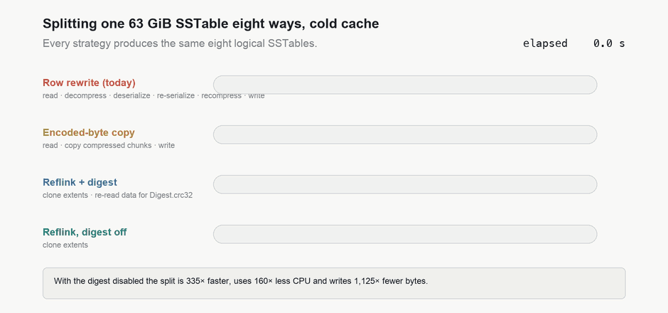

*The same eight logical SSTables, produced four ways. Avoiding row rewriting removes the CPU and allocation cost;
reflinking removes the write cost; disabling the whole-file digest removes one complete raw read. Index
authentication remains and its decompression cost depends on partition shape.*

These results are not a claim that every deployment will see the same improvement. Partition size, compression chunk
size, filesystem support, cache state, storage bandwidth, and digest configuration all affect the result.

## Audience

The intended audience includes:

- Cassandra operators performing repair, bootstrap, rebuild, replacement, topology changes, and offline SSTable
  maintenance.
- Operators of large datasets where anticompaction creates substantial CPU, write amplification, and temporary disk
  pressure.
- Developers maintaining Cassandra repair, streaming, compaction, and SSTable formats.
- Developers of Cassandra tooling that reads or operates on SSTables.

## Goals

This proposal must allow Cassandra to:

- Split eligible compressed SSTables without deserializing, serializing, or recompressing their rows.
- Preserve every partition exactly once across the logical outputs.
- Share byte-range extents through reflinks when the filesystem supports them.
- Copy already-compressed bytes when reflinks are unavailable.
- Rebuild the components needed for each child without rewriting row data.
- Preserve repair state, lifecycle, durability, validation, and corruption-detection guarantees.
- Detect unsupported input before modifying data and retain the existing row-rewrite implementations as safe
  fallbacks.
- Validate the on-disk representation first through an opt-in offline tool.
- Reuse the same splitting machinery for anticompaction and partial-range streaming.
- Version-gate new on-disk and streaming representations so rolling upgrades remain safe.

## Non-Goals

This proposal is not initially designed to:

- Support uncompressed SSTables.
- Support every SSTable format or historical version.
- Support SSTables with SAI or legacy secondary-index components in the first phase.
- Eliminate every read of the parent SSTable.
- Change CQL or the native protocol.
- Change gossip.
- Make reflink support a deployment requirement.
- Purge tombstones or replace ordinary compaction.
- Reconstruct exact per-child statistics that require decoding every row.
- Enable optimized anticompaction or partial-range streaming by default.

## Proposed Changes

### Overview

Introduce reusable machinery for splitting a compressed SSTable into logically independent children while retaining
contiguous runs of its existing compressed chunks. The machinery rebuilds the child's derived components from
index-only passes instead of processing every row.

The initial caller will be an opt-in `sstablesplit --zero-copy` mode on trunk for Cassandra 7.0. Later phases will
integrate the machinery with anticompaction and partial-range streaming.

"Zero-copy" primarily means that rows are not decoded and encoded again. Filesystem extent sharing is an additional,
opportunistic optimization. When a reflink cannot be used, Cassandra copies the compressed bytes and still avoids the
row-rewrite path.

### Chunk-based splitting

For a compressed SSTable, partitions are stored within compression chunks. A requested child range will generally not
begin and end exactly at chunk boundaries.

The splitter will:

1. Select the partitions belonging to each child.
2. Determine the contiguous compression-chunk run containing those partitions.
3. Retain that run verbatim in the child's `Data.db`.
4. Rebase compression metadata and primary-index data positions.
5. Rebuild the primary index, summary, Bloom filter, statistics, TOC, and, when enabled, digest.
6. Validate and make every child durable before publishing it.

A compression chunk intersecting a split boundary may be retained by both adjacent children. Only one child indexes
each partition, so partitions remain logically disjoint even when the physical chunk is shared or duplicated.

A child will not retain an unindexed suffix after its final live chunk.

The figures below follow one split, one step at a time.

**1. Partitions live inside chunks.** A compressed SSTable stores its partitions inside fixed-size compression
chunks. Chunk boundaries and partition boundaries are unrelated.

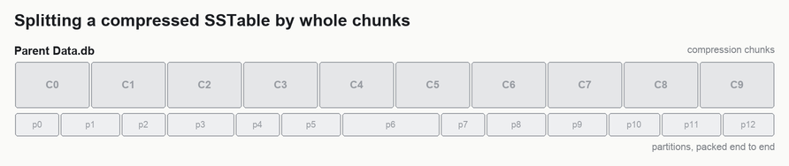

**2. The split point falls inside a chunk.** Partitions p0-p6 belong to one child and p7-p12 to the other, but the
boundary between them lands in the middle of chunk C5, and an individual compressed chunk cannot be sliced.

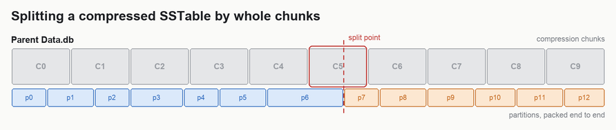

**3. Each child takes a whole chunk run.** Child A keeps the contiguous run covering its partitions, C0-C5.

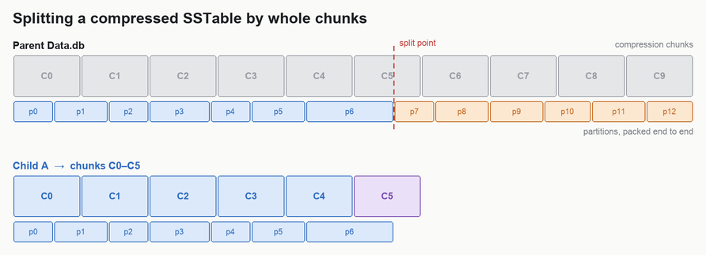

**4. The boundary chunk is retained by both.** Child B keeps C5-C9. C5 appears in both children byte for byte,
either copied or shared through a reflink.

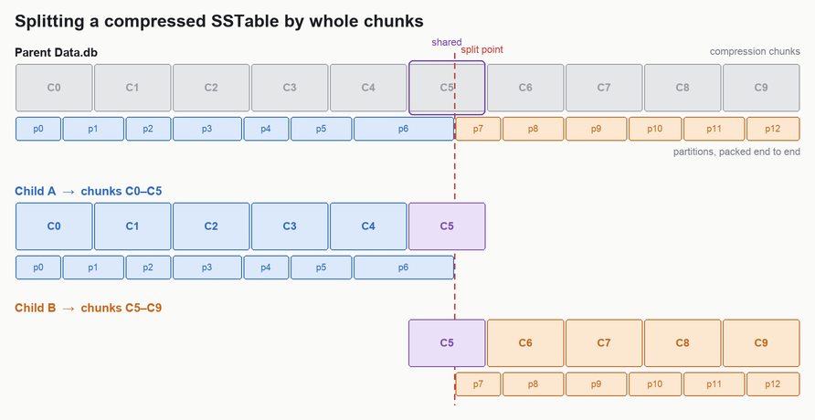

**5. Only the index makes a partition live.** The bytes a child does not own stay on disk but stay out of its index:
child A's copy of C5 carries an unindexed tail, child B's carries a retained prefix. Every partition of the parent is
indexed by exactly one child.

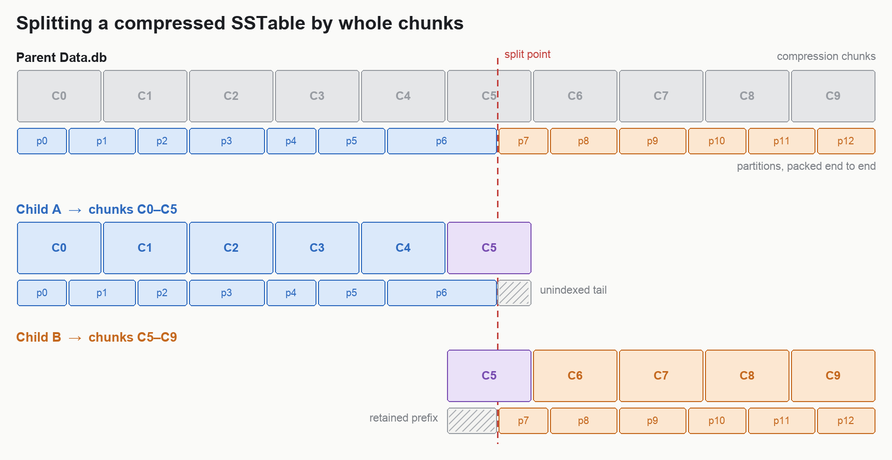

**6. The child records where its own data begins.** Child B stores the logical position of its first indexed
partition, and the derived components are rebuilt from index-only passes while `Data.db` keeps the parent's chunks
untouched.

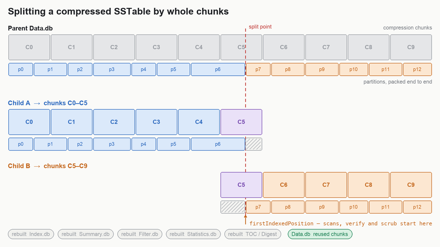

### Retained prefixes and the Cassandra 7.0 SSTable format

A child's first compression chunk may contain bytes belonging to partitions preceding its first indexed partition.
The child must retain these bytes because an individual compressed chunk cannot be sliced.

The Cassandra 7.0 SSTable format will record the logical data position of the first indexed partition in
`Statistics.db`. Full scans, cursors, verification, and scrub will begin at that position instead of assuming the
first partition begins at uncompressed position zero.

This will use a new SSTable major version. Older binaries must reject the new version rather than attempt to scan a
retained prefix using the previous layout.

### Filesystem extent sharing and copy fallback

Where supported, Cassandra will use Linux `FICLONERANGE` to give each child an independent inode that references the
parent's physical extents. This is a metadata operation: nothing is read into Cassandra, nothing is written to new data
blocks, and unlinking the parent leaves the referenced extents owned by the children.

Reflink support is discovered at runtime. A filesystem refusal causes the operation to fall back to ordinary byte
copying. The logical layout of the resulting SSTable is identical in both cases.

The initial implementation supports Linux filesystems implementing `FICLONERANGE`, including XFS with its reflink
feature enabled, Btrfs, bcachefs, and OCFS2. XFS requires the refcount btree created by `mkfs.xfs -m reflink=1`, which
has been the xfsprogs default since version 5.1. The source and destination ranges must be on the same mounted
filesystem. ext4 and other filesystems without this interface remain supported through the copy fallback.

While both parent and children exist:

- `du` may count shared extents once per file and therefore over-report usage.
- `df` reflects the actual allocated space.
- Page-cache contents are associated with individual inodes and may be temporarily duplicated.

The figures below follow the same split at the filesystem level.

**1. A file is a map onto extents.** `Data.db` is a mapping from logical file positions onto physical extents.

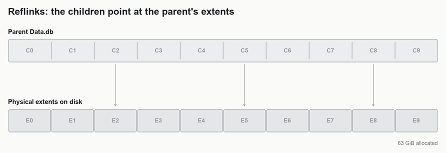

**2. A reflink writes no data.** Cloning the range covering E0-E5 gives child A its own file, referencing the
parent's extents. No data extent is allocated and no bytes are written.

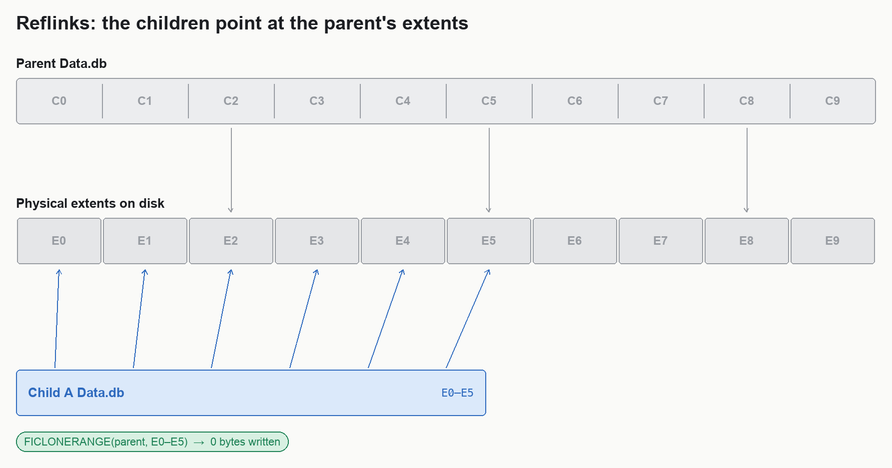

**3. The boundary extent is referenced, not duplicated.** Child B is cloned the same way. E5 is now referenced by
the parent and by both children, and continues to hold exactly one copy of those compressed bytes.

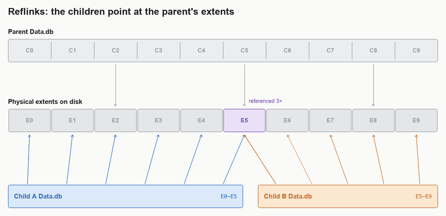

**4. The parent can be released.** When the lifecycle transaction drops the parent, the children's references keep
the extents live; an extent is freed only on its last reference.

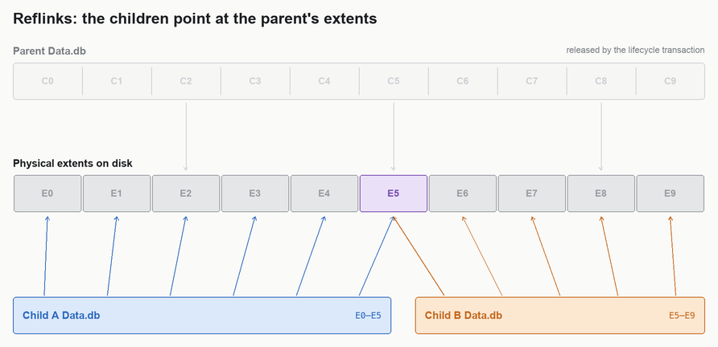

### Derived components and statistics

Components derived from the primary index will be rebuilt for every child.

The splitter can calculate the following without decoding rows:

- First and last keys.
- Partition count and partition-size estimates.
- Compression ratio.
- Bloom filter.
- Index summary.

Statistics requiring row decoding cannot be reconstructed exactly without reintroducing the work this proposal avoids.
Conservative bounds such as timestamp, TTL, deletion-time, and clustering bounds may be inherited from the parent.

Aggregate row, column, and tombstone estimates may be apportioned according to each child's share of the parent's
partitions. They remain estimates and may be inaccurate for data strongly skewed across the token range. A later
ordinary compaction will calculate exact values.

The caller assigns repair state. Offline splitting inherits the parent's repair state. Anticompaction assigns repaired,
transient, or unrepaired state according to the selected ranges.

### SSTable digest generation and configuration

`Digest.crc32` contains the decimal representation of a CRC32 calculated over every physical byte in an SSTable's
`Data.db`, including the inline checksums stored with compressed chunks. It permits `nodetool verify` to perform a
sequential whole-file integrity check without decoding rows.

In practice, this whole-file digest is rarely exercised in production. Operators generally do not run
`nodetool verify` across the thousands of SSTables on a live node, and regular compaction may replace and delete those
SSTables before such a scan would occur. Production deployments more commonly rely on checksums during normal reads
and periodic replica comparison: preview repair detects divergence between replicas, while full repair can reconcile
it. The digest therefore provides a useful offline verification fast path, but it is not the primary protection against
bit rot in most deployed clusters or ever used.

The digest is not consulted on ordinary reads. A compressed SSTable validates the checksum stored with each
compression chunk as that chunk is read. If the digest component is absent, `nodetool verify` falls back to extended
verification of the SSTable's data rather than considering the missing digest a successful check.

During a conventional flush or compaction, calculating the digest adds little cost because every output byte already
passes through the writer. A reflink deliberately avoids passing those bytes through Cassandra. Recreating the digest
therefore requires an additional complete raw read of every child `Data.db`; in the benchmark above, this is the
dominant remaining cost after extent sharing eliminates the data copy. The independent parent-index authentication
pass can instead dominate for narrow partitions because it decompresses every chunk containing a partition start.

Cassandra will gain a general `sstable_digest_enabled` configuration option controlling whether newly written
SSTables include the `Digest.crc32` component. This setting is not specific to zero-copy splitting.

The option defaults to `true`, preserving existing behavior. Setting it to `false` omits the digest from new
SSTables created by flush, compaction, streaming, or splitting. Changing it neither removes digests from existing
SSTables nor adds digests to them.

Disabling digest creation does not disable the per-chunk checksums on compressed SSTables or the integrity checks used
while those chunks are read. Operators may disable it when the additional whole-file read is not worth its I/O cost,
accepting that later verification cannot use the fast whole-file digest path. Preview and full repairs provide an
additional way to discover replica divergence, but do not change the local checksum behavior.

### Validation, durability, and failure handling

Before replacing the parent, the implementation must verify that:

- The parent's metadata and primary index are internally consistent.
- Every selected partition is represented exactly once.
- Child indexes are sorted, complete, and point to valid data positions.
- Compression chunks and their checksums are valid.
- The first and last indexed partitions are readable.
- Every component is durable before the lifecycle transaction removes the parent.

Failure or interruption aborts the lifecycle transaction and removes unpublished children.

When `sstable_digest_enabled` is `true`, a child digest is generated with the same semantics as for other newly
written SSTables. When it is `false`, digest generation is skipped uniformly rather than through a splitter-specific
exception.

### Staged delivery

#### Phase 1: BIG-format offline splitting

Add zero-copy splitting for eligible compressed BIG SSTables and expose it through:

```text
sstablesplit --zero-copy
```

This phase targets Cassandra 7.0 on trunk and is opt-in. It refuses uncompressed SSTables, unsupported BIG versions,
SSTables with attached secondary-index components, and storage compatibility modes that cannot create the Cassandra
7.0 SSTable version. It preserves the existing splitter as the default and retains the existing snapshot-before-split
behavior.

Beginning with an offline tool provides a bounded way to validate loading, querying, verification, scrub, streaming,
upgrade, rollback, and extent-sharing behavior.

#### Phase 2: BTI-format splitting

Add equivalent chunk selection and format-specific index rebuilding for BTI SSTables.

#### Phase 3: Secondary indexes

Support SSTables with SAI or legacy secondary indexes. Each attached component must be rebuilt, safely shared, or
invalidated according to its format. Until then, these SSTables are refused by the optimized path.

#### Phase 4: Anticompaction

Use the splitting machinery to create repaired, transient, and unrepaired SSTables without rewriting every row.

The optimized path will initially be disabled by default. Unsupported inputs or failures detected before publication
use the existing anticompaction writer.

#### Phase 5: Partial-range streaming

Allow a sender to transmit compressed chunk runs and sufficient metadata for the receiver to construct a partial
SSTable without rewriting rows.

Any new streaming representation must be version-negotiated. If either peer lacks support, streaming uses the existing
row-based path.

#### Phase 6: Default enablement

Default enablement will be considered separately after production experience demonstrates correctness, operational
safety, and consistent performance benefits.

These phases describe dependency order rather than calendar commitments. Phase 1 establishes and validates the
on-disk representation before it is used by online repair or streaming paths.

## New or Changed Public Interfaces

| Compatibility surface | Change |
|---|---|
| Native protocol and CQL | No change. |
| Gossip | No change. |
| Messaging service | Partial-range streaming may add version-negotiated stream metadata or messages. Older peers use the existing row-based path. |
| Pluggable components and SPIs | No change. |
| Commit log, hints, and cache files | No change. |
| SSTable components | The Cassandra 7.0 SSTable format adds the first indexed partition position to `Statistics.db`. Split children may retain an unindexed prefix in `Data.db`. |
| Configuration | Add `sstable_digest_enabled: true`. Later online phases add separate, initially disabled controls for zero-copy anticompaction and partial-range streaming. |
| JMX, metrics, and monitoring | Online phases should report attempts, successes, fallbacks, failures, bytes reflinked, compressed bytes copied, row-rewrite bytes, and phase timings. Exact names are determined during implementation review. |
| Client tool classes | No API change is currently proposed. |
| Command-line tools | `sstablesplit` adds `--zero-copy`. |
| Operational routines | Operators must observe storage compatibility restrictions, downgrade requirements, and reflink disk-accounting behavior. |

## Compatibility, Deprecation, and Migration Plan

Zero-copy splitting is an optimization rather than a correctness requirement.

- Existing SSTables remain readable by Cassandra 7.0.
- Existing row-rewrite paths remain available and are not removed by this CEP.
- Unsupported formats, versions, components, filesystems, or peers use a safe fallback or are rejected before
  modification.
- New-format children are not created while the configured storage compatibility mode requires older-version
  SSTables.
- The offline tool snapshots the parent by default.
- Rolling back to software that cannot read the Cassandra 7.0 SSTable format requires restoring the snapshot or
  rewriting the SSTables into a compatible format before downgrade.
- Using `--no-snapshot` removes that rollback copy and must carry a clear warning.
- Partial-range streaming uses the new representation only when both peers support it.
- `sstable_digest_enabled` defaults to `true`, so upgrading preserves existing digest behavior unless an operator
  explicitly changes it.
- Disabling future digest generation does not change the readability of existing SSTables or remove their digest
  components.
- A normal compaction rewrites retained prefixes and replaces inherited or apportioned statistics with exact values.

There is no scheduled removal of the existing splitter, anticompaction writer, or row-based streaming path. Any future
removal requires operational experience and a separate compatibility decision.

## Test Plan

### Phase 1

System and distributed tests will create representative SSTables, split or anticompact them, and compare all query
results before and after the operation. Coverage will include narrow and wide partitions, partitions spanning many
chunks, split boundaries inside chunks, tombstones, TTLs, static rows, range tombstones, repaired and transient state,
and output larger than the requested target because a single partition cannot be divided.

Upgrade tests will prove that new children are not created in an incompatible storage mode, Cassandra 7.0 reads the
new layout, and older binaries reject its major version. Streaming tests will cover both supported peers and fallback
to the existing row path for mixed-version or otherwise ineligible sessions.

Operational tests will exercise `sstablesplit --zero-copy` with reflink success on a reflink-enabled filesystem,
byte-copy fallback on ext4 or another filesystem without reflinks, default snapshots, `--no-snapshot`, interruption,
insufficient space, and injected failures before publication. Generated children will be loaded, queried, streamed,
verified, scrubbed, upgraded, and compacted.

Digest tests will run flush, compaction, streaming, and splitting with `sstable_digest_enabled` both `true` and
`false`. Verification tests will confirm whole-file digest behavior when present and extended verification when it is
absent.

Implementation-level unit, randomized, and property tests will supplement the system tests. They will prove that every
parent partition appears exactly once, chunk and index positions are rebased correctly, corruption is rejected,
unpublished children are cleaned up, and statistics preserve their documented invariants.

Performance tests will measure wall time, CPU, allocations, device reads, device writes, and temporary disk use for
the existing rewrite, compressed-byte copying, and reflinking with digest generation both enabled and disabled.

### Phase 2+

Each later phase will repeat the Phase 1 correctness, failure, compatibility, and performance coverage for its format
or integration.

## Rejected Alternatives

### Continue rewriting every row

This preserves the existing layout but retains the CPU, allocation, write-amplification, and temporary-space costs
motivating the proposal.

### Require reflink support

This would exclude otherwise supported filesystems. Copying existing compressed bytes still avoids row decoding,
encoding, recompression, and most heap allocation.

### Clone or hard-link the complete `Data.db`

A hard link cannot represent a byte range and does not create an independent file: it gives the same inode another
name. Truncating, replacing, or otherwise changing the file through either name affects both. Each child instead needs
its own file length, lifecycle, and key range. Cloning the complete file into an independent inode would retain all
unrelated data and make lifecycle and accounting behavior substantially worse. A range reflink provides independent
inodes while sharing only the extents each child needs.

### Decode rows to reconstruct exact statistics

This defeats the central purpose of the feature. Conservative bounds and apportioned estimates preserve correctness;
ordinary compaction eventually replaces them with exact values.

### Rewrite only boundary chunks

Rewriting boundary chunks could avoid retained prefixes, but it requires maintaining both chunk-copy and row-rewrite
algorithms within one operation and prevents byte-identical reuse of shared boundary chunks. It may remain useful as a
compatibility fallback, but it is not the initial design.

### Make digest behavior specific to zero-copy splitting

A splitter-only exception would make component presence depend on which SSTable writer created the file. Digest
creation is an operational integrity-versus-I/O choice applying equally to flush, compaction, streaming, and splitting,
so this CEP proposes one general setting with a compatibility-preserving default.

### Delay component rebuilding until first use

Lazy rebuilding would move failure and latency into reads, complicate SSTable lifecycle rules, and leave partially
constructed SSTables visible. Children must be complete and durable before publication.
