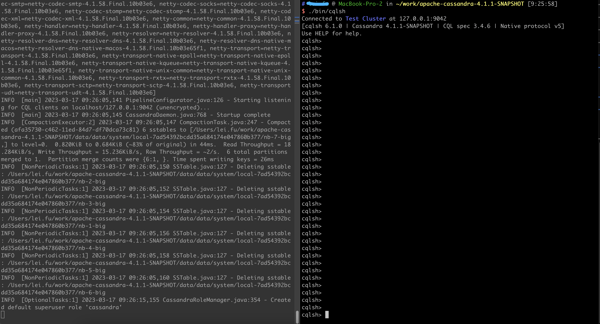

Apache Cassandra
----------------

Apache Cassandra 是一个高度可伸缩的分区行存储。行用必需的主键组织成表.

https://cwiki.apache.org/confluence/display/CASSANDRA2/Partitioners[Partitioning] 的意思是 Cassandra 能在多台机器上分布数据在应用程序透明的情况下. Cassandra当从集群中添加和删除机器时，是否会自动重新分区.

https://cwiki.apache.org/confluence/display/CASSANDRA2/DataModel[Row store] 这就像关系数据库, Cassandra 按行和列组织数据. Cassandra查询语言(CQL)是SQL的近亲.

了解更多信息, see http://cassandra.apache.org/[the Apache Cassandra web site].

安装要求
--------

. Java >= 1.8 (OpenJDK and Oracle JVMS have been tested)
. Python 3.6+ (for cqlsh)

开始
----

这是一个简单的指南，可以指导完成一个单节点的运行和安装，并演示一些简单的读写，获取更完整的文档，请查看 Apache Cassandra website's http://cassandra.apache.org/doc/latest/getting_started/[Getting Started Guide].

首先，解压文件:

$ tar -zxvf apache-cassandra-$VERSION.tar.gz
$ cd apache-cassandra-$VERSION

之后可以开启服务. 使用 -f 参数运行启动脚本将让 Cassandra 保持在前台运行，并输出到控制台; 可以使用 ctrl-C 停止.

$ bin/cassandra -f

现在就可以尝试使用 Cassandra 读取一条数据:

$ bin/cqlsh

命令行客户端是交互式的，所以如果一切正常，显示应该在提示符界面，这是我的运行界面，左边是启动界面，右边是cqlsh运行界面，官方给的例子，版本应该还是基于旧的:

---

Connected to Test Cluster at localhost:9160.
[cqlsh 6.0.0 | Cassandra 4.1 | CQL spec 3.4.6 | Native protocol v5]
Use HELP for help.
cqlsh>
------

CQL 可以使用"help;" 或者 "?" , 将会提供CQL的帮助，可以看看能够做什么。

如果需要退出的话，可以使用"quit;"或者"exit;"。

---

cqlsh> CREATE KEYSPACE schema1
WITH replication = { 'class' : 'SimpleStrategy', 'replication_factor' : 1 };
cqlsh> USE schema1;
cqlsh:Schema1> CREATE TABLE users (
user_id varchar PRIMARY KEY,
first varchar,
last varchar,
age int
);
cqlsh:Schema1> INSERT INTO users (user_id, first, last, age)
VALUES ('jsmith', 'John', 'Smith', 42);
cqlsh:Schema1> SELECT * FROM users;
user_id | age | first | last
---------+-----+-------+-------
jsmith |  42 |  john | smith
cqlsh:Schema1>
--------------

达到这一步就，如果没有其他问题，就已经运行成功了。

CQL 命令的更多信息, 请查看
http://cassandra.apache.org/doc/latest/cql/[the CQL reference].

一个合理的理解是 , "SQL减去连接和子查询，加上集合"。

* 加入 #cassandra 在 https://s.apache.org/slack-invite[ASF Slack] 并且提出问题
* 通过发送邮件到订阅用户邮件列表 user-subscribe@cassandra.apache.org
* 官方网站 http://cassandra.apache.org/community/[community section] 获取更多信息.
* 查看 http://cassandra.apache.org/doc/latest/development/index.html[development section] 更多关于如何向Cassandra参与贡献.
