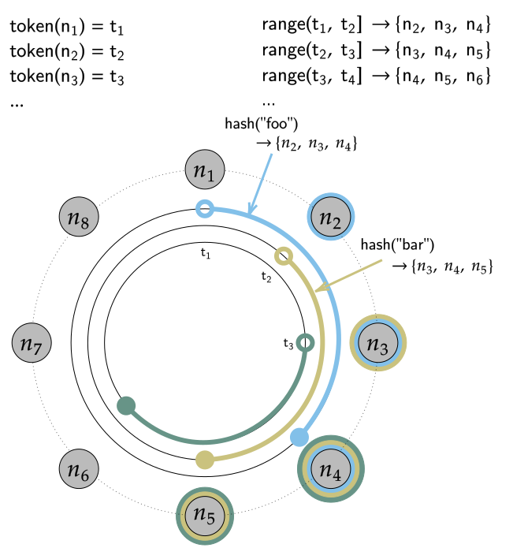

.. Licensed to the Apache Software Foundation (ASF) under one
.. or more contributor license agreements.  See the NOTICE file
.. distributed with this work for additional information
.. regarding copyright ownership.  The ASF licenses this file
.. to you under the Apache License, Version 2.0 (the
.. "License"); you may not use this file except in compliance
.. with the License.  You may obtain a copy of the License at
..
..     http://www.apache.org/licenses/LICENSE-2.0
..
.. Unless required by applicable law or agreed to in writing, software
.. distributed under the License is distributed on an "AS IS" BASIS,
.. WITHOUT WARRANTIES OR CONDITIONS OF ANY KIND, either express or implied.
.. See the License for the specific language governing permissions and
.. limitations under the License.

Dynamo
======

Apache Cassandra relies on a number of techniques from Amazon's `Dynamo
<http://courses.cse.tamu.edu/caverlee/csce438/readings/dynamo-paper.pdf>`_
highly available distributed storage key-value system. In particular, Cassandra
relies on Dynamo style:

- Dataset partitioning using consistent hashing
- Full multi-master replication using versioned data
- Distributed cluster membership and failure detection via a gossip protocol
- Incremental scale-out on commodity hardware rather than scale-up

Cassandra was designed this way to meet large scale (PiB+) storage requirements
that applications demanded. In particular, as applications began to require full
global replication and always available low-latency reads and writes, it became
imperative to design a new kind of database model as the relational database
systems of the time struggled to meet the new requirements of global scale
applications.

Dynamo Style Replication and Clustering
---------------------------------------

Each node in Dynamo has three main components:

1. Request coordination based on the Staged Event-Driven Architecture (`SEDA <https://www.mdw.la/papers/seda-sosp01.pdf>`_).
2. Ring membership and failure detection using a gossip based protocol
3. A storage engine

Cassandra primarily draws from the first two clustering components,
while using a storage engine based on a Log Structured Merge Tree
(`LSM <http://citeseerx.ist.psu.edu/viewdoc/download?doi=10.1.1.44.2782&rep=rep1&type=pdf>`_).

Partitioned Wide-Column Storage
^^^^^^^^^^^^^^^^^^^^^^^^^^^^^^^

Cassandra achieves horizontal scalability by `partitioning <https://en.wikipedia.org/wiki/Partition_(database)>`_
all data stored in the system using a hash function. Each partition is replicated
to multiple physical nodes, often across failure domains such as racks and even
datacenters. As every replica can independently accept mutations to every key
that it owns, every key must be versioned. Unlike in the original Dynamo paper
where deterministic versions and vector clocks were used to reconcile concurrent
updates to a key, Cassandra uses a simpler last write wins model where every
mutation is timestamped (including deletes) and then the latest version of data
is the "winning" value. Formally speaking, Cassandra uses a Last-Write-Wins Element-Set
conflict-free replicated data type, a.k.a a `LWW-Element-Set CRDT
<https://en.wikipedia.org/wiki/Conflict-free_replicated_data_type#LWW-Element-Set_(Last-Write-Wins-Element-Set)>`_
to resolve conflicting mutations on replica sets.

 .. _consistent-hashing-token-ring:

Consistent Hashing using a Token Ring
^^^^^^^^^^^^^^^^^^^^^^^^^^^^^^^^^^^^^

Cassandra partitions data over storage nodes using a special form of hashing
called `consistent hashing <https://en.wikipedia.org/wiki/Consistent_hashing>`_.
In naive data hashing, you typically allocate keys to buckets by taking a hash
of the key modulo the number of buckets. For example, if you want to distribute
data to 100 nodes using naive hashing you might assign every node to a bucket
between 0 and 100, hash the input key modulo 100, and store the data on the
associated bucket. In this naive scheme, however, adding a single node might
invalidate almost all of the mappings.

Cassandra instead maps every node to one or more tokens on a continuous hash
ring, and defines ownership by hashing a key onto the ring and then "walking"
the ring in one direction, similar to the `Chord
<https://pdos.csail.mit.edu/papers/chord:sigcomm01/chord_sigcomm.pdf>`_
algorithm. The main difference of consistent hashing to naive data hashing is
that when the number of nodes (buckets) to hash into changes, consistent
hashing only has to move a small fraction of the keys.

For example, if we have an eight node cluster with evenly spaced tokens, and
a replication factor (RF) of 3, then to find the owning nodes for a key we
first hash that key to generate a token (which is just the hash of the key),
and then we "walk" the ring in a clockwise fashion until we encounter three
distinct nodes, at which point we have found all the replicas of that key.
This example of an eight node cluster with `RF=3` can be visualized as follows:

You can see that in a Dynamo like system, ranges of keys, also known as `token
ranges`, map to the same physical set of nodes. In this example, all keys that
fall in the token range excluding token 1 and including token 2 (`range(t1, t2]`)
are stored on nodes 2, 3 and 4.

Multiple Tokens per Physical Node (a.k.a. `vnodes`)
^^^^^^^^^^^^^^^^^^^^^^^^^^^^^^^^^^^^^^^^^^^^^^^^^^^

Simple single token consistent hashing works well if you have many physical
nodes to spread data over, but with evenly spaced tokens and a small number of
nodes, incremental scaling (adding just a few nodes of capacity) is difficult
because there are no token selections for new nodes that can leave the ring
balanced. In the previous example there is no way to add a ninth token without
causing imbalance. Cassandra seeks to avoid token imbalance because uneven token
ranges mean uneven request load.

The Dynamo system advocates for the use of "virtual nodes" to solve this
imbalance problem. Virtual nodes solve the problem by assigning multiple
tokens in the token ring to each physical node. By allowing a single physical
node to take multiple positions in the ring, we can make small clusters look
larger and therefore even with a single physical node addition we can make it
look like we added many more nodes, effectively taking many smaller pieces of
data from more ring neighbors when we add even a single node.

In Cassandra this is called assigning multiple tokens per endpoint, and it
leads to the `Token Map` where Cassandra keeps track of what ring positions
map to which physical endpoints. For example, in the following figure we can
represent an eight node cluster using only four physical nodes by assigning two
tokens to every node:

.. figure:: images/vnodes.svg
   :scale: 75 %
   :alt: Virtual Tokens Ring

Note that in Cassandra `2.x`, the only token allocation algorithm available was
picking random tokens, which meant that to keep balance the default number of
tokens per node had to be quite high, at `256`. This had the effect of coupling
more nodes together, increasing the liklihood of outage. That is why in `3.x`
the new deterministic token allocator was added which intelligently picks tokens
such that the ring is optimally balanced.

Vnodes provide the following benefits:

1. If a node becomes unavailable the load handled by the node is evenly distributed across other nodes.
2. As the node is repaired or a new node added it accepts approximately equal amount of data from the other nodes resulting in equal distribution of data across the cluster.

While vnodes have advantages they also could be disadvantageous in the following regards:

1. Cluster-wide operations are affected. As the number of nodes are increased so are the number of repairs that need to be performed, increasing the repair cycle time.
2. Performance of operations that span token ranges could be affected.

.. _replication-strategy:

Replication
^^^^^^^^^^^

For reliability, durability and high availability Dynamo replicates data across the cluster.  The coordinator node performs the replication of data that is within its range. 
With a replication factor of N the coordinator replicates each key at N-1 other nodes in addition to the local node. The list of nodes that stores a particular key is called the preference list. 
The preference list is constructed so that it contains distinct physical nodes which is achieved by skipping vnodes if needed. 
Also, the preference list is constructed to include nodes across different data centers so that if an entire data center were to fail data replicas are available.
The replication strategy of a keyspace determines which nodes are replicas for a given token range. The two main
replication strategies are :ref:`simple-strategy` and :ref:`network-topology-strategy`.

.. _simple-strategy:

SimpleStrategy
~~~~~~~~~~~~~~

SimpleStrategy allows a single integer ``replication_factor`` to be defined. This determines the number of nodes that
should contain a copy of each row.  For example, if ``replication_factor`` is 3, then three different nodes should store
a copy of each row.

SimpleStrategy treats all nodes identically, ignoring any configured datacenters or racks.  To determine the replicas
for a token range, Cassandra iterates through the tokens in the ring, starting with the token range of interest.  For
each token, it checks whether the owning node has been added to the set of replicas, and if it has not, it is added to
the set.  This process continues until ``replication_factor`` distinct nodes have been added to the set of replicas.

.. _network-topology-strategy:

NetworkTopologyStrategy
~~~~~~~~~~~~~~~~~~~~~~~

NetworkTopologyStrategy allows a replication factor to be specified for each datacenter in the cluster.  Even if your
cluster only uses a single datacenter, NetworkTopologyStrategy should be prefered over SimpleStrategy to make it easier
to add new physical or virtual datacenters to the cluster later.

In addition to allowing the replication factor to be specified per-DC, NetworkTopologyStrategy also attempts to choose
replicas within a datacenter from different racks.  If the number of racks is greater than or equal to the replication
factor for the DC, each replica will be chosen from a different rack.  Otherwise, each rack will hold at least one
replica, but some racks may hold more than one. Note that this rack-aware behavior has some potentially `surprising
implications <https://issues.apache.org/jira/browse/CASSANDRA-3810>`_.  For example, if there are not an even number of
nodes in each rack, the data load on the smallest rack may be much higher.  Similarly, if a single node is bootstrapped
into a new rack, it will be considered a replica for the entire ring.  For this reason, many operators choose to
configure all nodes on a single "rack".

Transient Replication
~~~~~~~~~~~~~~~~~~~~~

Transient replication allows you to configure a subset of replicas to only replicate data that hasn't been incrementally
repaired. This allows you to decouple data redundancy from availability. For instance, if you have a keyspace replicated
at rf 3, and alter it to rf 5 with 2 transient replicas, you go from being able to tolerate one failed replica to being
able to tolerate two, without corresponding increase in storage usage. This is because 3 nodes will replicate all the data
for a given token range, and the other 2 will only replicate data that hasn't been incrementally repaired.

To use transient replication, you first need to enable it in ``cassandra.yaml``. Once enabled, both SimpleStrategy and
NetworkTopologyStrategy can be configured to transiently replicate data. You configure it by specifying replication factor
as ``<total_replicas>/<transient_replicas`` Both SimpleStrategy and NetworkTopologyStrategy support configuring transient
replication.

Transiently replicated keyspaces only support tables created with read_repair set to NONE and monotonic reads are not currently supported.
You also can't use LWT, logged batches, and counters in 4.0. You will possibly never be able to use materialized views
with transiently replicated keyspaces and probably never be able to use 2i with them.

Transient replication is an experimental feature that may not be ready for production use. The expected audienced is experienced
users of Cassandra capable of fully validating a deployment of their particular application. That means being able check
that operations like reads, writes, decommission, remove, rebuild, repair, and replace all work with your queries, data,
configuration, operational practices, and availability requirements.

It is anticipated that 4.next will support monotonic reads with transient replication as well as LWT, logged batches, and
counters.
 
Incremental Scale Out
^^^^^^^^^^^^^^^^^^^^^

Dynamo scales out to meet the requirements of growth in data set size and request rates. Scaling out means adding additional storage nodes. In contrast scaling up implies adding more capacity to the existing database. 

Dynamo storage system is based on some  requirements and assumptions, which are discussed next.

Simple Query Model
^^^^^^^^^^^^^^^^^^

Dynamo makes use of simple read and write operations on data items identified by a unique primary key and stored as binary blobs. Relational schema is not needed as operations spanning multiple data items are not used.

Transactions
^^^^^^^^^^^^

A transaction is a single logical operation on a data. As ACID (Atomicity, Consistency, Isolation and Durability properties in transactions) guarantees lead to reduced availability Dynamo compromises on “C" (consistency) to achieve high availability. Isolation guarantees are not provided by Dynamo and only single key updates are made. 

Efficiency
^^^^^^^^^^

Efficiency in terms of reduced latencies and high throughput is the highest priority and Dynamo makes use of service level agreements (SLAs) to achieve high efficiency.
Other Design principles include symmetry in cluster nodes, decentralization and heterogeneity in infrastructure. 
Distributed Storage System Architecture  

Dynamo storage system architecture makes use of the following techniques:

- Simple Interface for storing objects
- Partitioning based on consistent hashing
- Replication
- Data Versioning
- Replica synchronization for handling permanent failures
- Dynamo Ring Membership and Failure Detection

We shall discuss these next.

Simple Interface for storing objects
^^^^^^^^^^^^^^^^^^^^^^^^^^^^^^^^^^^^

Dynamo makes use of a simple interface to store and get key/value pairs. Two methods are made available to a user: ``put (key, context)`` and ``get (key)``. The ``put (key, context)`` operation stores object replicas on disk. The ``context`` is the object metadata such as object version and is stored with the object. The ``get (key)`` method returns a stored object replica for the key supplied. Any node in a Dynamo ring is eligible to receive the get/put operations. A load balancer may be used to route a client request to a node. A node that handles read or write operation is called a coordinator.
For consistency among replicas Dynamo makes use of a consistency protocol, a quorum-like system that makes use of two configurable settings ``R`` and ``W``. ``R`` is the minimum number of nodes that must participate in a successful read operation and ``W`` is the minimum number of nodes that must participate in a successful write operation. Setting ``R+W`` to be greater than ``N`` (the total number of nodes) produces a quorum-like system. As the slowest of the ``R/W`` nodes determines the corresponding read/write latency each of ``R`` and ``W`` is typically less than ``N`` for better latency.

.. _gossip:

Gossip
^^^^^^

Gossip is the internode messaging or communication among peers in a Dynamo cluster.   Nodes exchange state information not only about themselves but also about other nodes they know. 
Gossip is run periodically, every 1 second by default.  Gossip messages are versioned so that more recent messages supersede older messages. Seed nodes (one or more) are responsible for bootstrapping the gossip process for new nodes joining a cluster. 
In a multi-datacenter cluster the seed list must include at least one node (preferably more than one node for fault tolerance) from each datacenter so that gossip is able to communicate locally at the datacenter when bootstrapping a node.  
If a datacenter does not include a node in the seed list the gossip process for a new node at the datacenter has to be initiated from a seed node at another datacenter. All nodes in a cluster must be configured with the same seed nodes so avoid issues in gossip. 
For gossip optimization every node at a datacenter must not be made a seed node and an optimal number (three) of nodes   should be made seed nodes.

Dynamo makes use of a distributed failure detection and membership protocol based around gossip. A membership change is a node joining or leaving a Dynamo ring. A gossip-based protocol is used to propagate membership changes and maintain an eventually consistent view of membership. 
Partitioning information is also propagated via the gossip-based protocol. Gossip makes the nodes peer-aware and each storage node knows about the token ranges handled by its peers and as a result the data handled by its peers.  Each node forwards the read/write operations to the appropriate node.

.. _transient-replication:

Data Versioning
^^^^^^^^^^^^^^^

Data versioning is used to guarantee eventual consistency of data. All updates reach all replicas eventually but there could be a period of time during which an older version of data is served by a replica. 
If no failure condition occurs a bound exists on the update propagation time. But if a failure (network partition or outage) occurs updates may not get propagated for a longer period of time. 
With data versioning the data resulting from each update is considered a new version of the data.  Under normal operation a newer version overrides an older version and the two versions are reconciled. However, under conditions of failure and concurrent updates version branching may occur. 
Multiple, divergent versions of the same data may be present at the same time. Under such conditions "vector clocks" are used to establish a causal ordering among the different data versions. A vector clock is a list of (node, counter) pairs and a vector clock is associated with each version of each object. The different versions of data are eventually reconciled.

Failure Handling
^^^^^^^^^^^^^^^^

Next, we shall discuss how failures are handled.

Replica Synchronization
~~~~~~~~~~~~~~~~~~~~~~~

Hinted handoffs are most useful if failure is transient and the hinted replicas are able to be handed off to the nodes they are meant for. But under conditions of extended unavailability of nodes hinted handoffs may not be the best option.  Replica synchronization using Merkel trees is used for rapid replica syncs.  
Merkel trees are able to detect incongruities between data faster and minimize the amount of data transferred.  A Merkel tree is often used for efficient data storage and transfer of large data structures. The leaves of a Merkel tree are hashes of data blocks, which would be values of individual keys in the context of a Dynamo ring. Non-leaf tree nodes higher in the tree are hashes of their respective sub-nodes. Each branch of a Merkel tree may be compared with another Merkel tree branch, perhaps from a different Merkel tree, independently without involving complete Merkel trees. 
In the context of Dynamo each node keeps a separate Merkel tree for each key range it hosts data for.  For replica synchronization two nodes that host replicas of the same data compare the Merkel trees for the key ranges they have in common. 

Ring Membership and Failure Detection
~~~~~~~~~~~~~~~~~~~~~~~~~~~~~~~~~~~~~

A fault-tolerant system such as Dynamo must rely on a failure detection mechanism rather than trying to reach unreachable peers to perform get/put operations, or transfer partitions and hinted replicas. 
As discussed earlier, each node in the cluster is responsible for a range of data based on its hash value.   The complete hash value range of data stored in a Dynamo cluster is represented by a ring with each node being responsible for a specific subset of the hash value range.  Nodes in a ring are members of the ring and membership changes as nodes are added/removed.  A temporary node failure does not require rebalancing of the partitions or replicas repair. 
Only if a node is lost for an extended duration is a new node added by an administrator using nodetool utility.  The ring membership updates on addition/removal of nodes are propagated using a gossip-based protocol so that consistent ring membership information is kept by all the nodes. Each node contacts a peer node chosen randomly periodically (every second) to reconcile the ring membership information.

To prevent a temporary logical partitioning of a Dynamo ring one or more nodes are configured as seed nodes. A seed node is discovered by an external mechanism and is known to all nodes.  
All nodes eventually reconcile their membership with the seed and chances of logical partitioning of the ring are greatly reduced. Seed nodes are the first to be started in a Dynamo ring so that they are available for discovery by other nodes as they join the ring.

Decentralized failure detection mechanism is based on a gossip-style protocol in which a node failure is detected when a node fails to communicate with other nodes while receiving and forwarding requests. 

Tunable Consistency
^^^^^^^^^^^^^^^^^^^

Cassandra supports a per-operation tradeoff between consistency and availability through *Consistency Levels*.
Essentially, an operation's consistency level specifies how many of the replicas need to respond to the coordinator in
order to consider the operation a success.

The following consistency levels are available:

``ONE``
  Only a single replica must respond.

``TWO``
  Two replicas must respond.

``THREE``
  Three replicas must respond.

``QUORUM``
  A majority (n/2 + 1) of the replicas must respond.

``ALL``
  All of the replicas must respond.

``LOCAL_QUORUM``
  A majority of the replicas in the local datacenter (whichever datacenter the coordinator is in) must respond.

``EACH_QUORUM``
  A majority of the replicas in each datacenter must respond.

``LOCAL_ONE``
  Only a single replica must respond.  In a multi-datacenter cluster, this also gaurantees that read requests are not
  sent to replicas in a remote datacenter.

``ANY``
  A single replica may respond, or the coordinator may store a hint. If a hint is stored, the coordinator will later
  attempt to replay the hint and deliver the mutation to the replicas.  This consistency level is only accepted for
  write operations.

Write operations are always sent to all replicas, regardless of consistency level. The consistency level simply
controls how many responses the coordinator waits for before responding to the client.

For read operations, the coordinator generally only issues read commands to enough replicas to satisfy the consistency
level, with one exception. Speculative retry may issue a redundant read request to an extra replica if the other replicas
have not responded within a specified time window.

Picking Consistency Levels
~~~~~~~~~~~~~~~~~~~~~~~~~~

It is common to pick read and write consistency levels that are high enough to overlap, resulting in "strong"
consistency.  This is typically expressed as ``W + R > RF``, where ``W`` is the write consistency level, ``R`` is the
read consistency level, and ``RF`` is the replication factor.  For example, if ``RF = 3``, a ``QUORUM`` request will
require responses from at least two of the three replicas.  If ``QUORUM`` is used for both writes and reads, at least
one of the replicas is guaranteed to participate in *both* the write and the read request, which in turn guarantees that
the latest write will be read. In a multi-datacenter environment, ``LOCAL_QUORUM`` can be used to provide a weaker but
still useful guarantee: reads are guaranteed to see the latest write from within the same datacenter.

If this type of strong consistency isn't required, lower consistency levels like ``ONE`` may be used to improve
throughput, latency, and availability.
