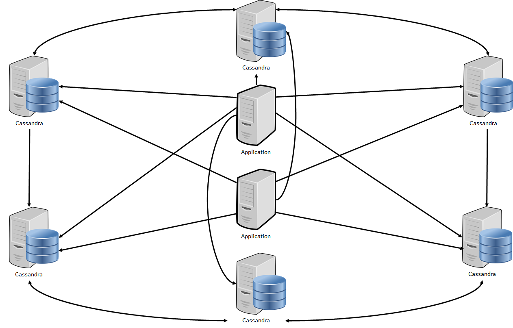

.. Licensed to the Apache Software Foundation (ASF) under one
.. or more contributor license agreements.  See the NOTICE file
.. distributed with this work for additional information
.. regarding copyright ownership.  The ASF licenses this file
.. to you under the Apache License, Version 2.0 (the
.. "License"); you may not use this file except in compliance
.. with the License.  You may obtain a copy of the License at
..
..     http://www.apache.org/licenses/LICENSE-2.0
..
.. Unless required by applicable law or agreed to in writing, software
.. distributed under the License is distributed on an "AS IS" BASIS,
.. WITHOUT WARRANTIES OR CONDITIONS OF ANY KIND, either express or implied.
.. See the License for the specific language governing permissions and
.. limitations under the License.

Overview
--------

Cassandras Architecture is based on a peer-to-peer Model which differs from the Master-Slave principle which is well known as a standard solution for modeling relational databases.
Because of the non-relational properties which are included in Cassandra the standard solution does not work for this database.
To ensure the quality criteria like availability, high scalability, durability and failure tolerance the peer-to-peer Model is necessary.
In the peer-to-peer model every node, which is a single Cassandra server, is equal. This model has no single management server which distribute the work or request.
Advantages of this are that there is no single point of failure and no bottleneck for requests can occur. Also, no backup server for the management server (master) is needed.
Every Cassandra node in the peer-to-peer Model can accept read and write requests to the database.
The entire Data which needs to be stored in the Cassandra Database is splitted and distributed to the number of Cassandra nodes.
To ensure that when a node has a time out or crashes, every splitted data part is stored redundant on other Cassandra nodes.
This mechanism is called replication and is needed to guarantee that not every Cassandra node is a single point of failure as well as the stored data.
Moreover the replication is needed to increase the performance of the whole Database, because requests can be processed from more than one Machine.
One disadvantage of this model and the replication is, that you need a lot more capacity to store the data and that you need an apropriate amount of replicas.

