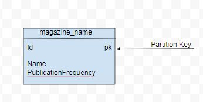
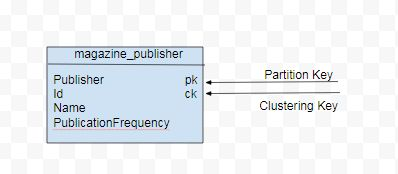

.. Licensed to the Apache Software Foundation (ASF) under one
.. or more contributor license agreements.  See the NOTICE file
.. distributed with this work for additional information
.. regarding copyright ownership.  The ASF licenses this file
.. to you under the Apache License, Version 2.0 (the
.. "License"); you may not use this file except in compliance
.. with the License.  You may obtain a copy of the License at
..
..     http://www.apache.org/licenses/LICENSE-2.0
..
.. Unless required by applicable law or agreed to in writing, software
.. distributed under the License is distributed on an "AS IS" BASIS,
.. WITHOUT WARRANTIES OR CONDITIONS OF ANY KIND, either express or implied.
.. See the License for the specific language governing permissions and
.. limitations under the License.

Introduction
=============

Apache Cassandra stores data in tables, with each table consisting of rows and columns. CQL (Cassandra Query Language) is used to query the data stored in a table. Apache Cassandra data model is based around and optimized for querying. The CQL (Cassandra Query Language)   model is the Cassandra’s data model.  Cassandra does not support relational data modeling, which is typical of relational databases.

What is Data Modeling?
^^^^^^^^^^^^^^^^^^^^^^

Data modeling is identifying the items (entities) that are to be stored in a table and the relationships between the items.  Data modeling’s outcome is the organization and structure of data. Data modeling precedes designing schemas (data definition) and creating the tables.
 
How does Apache Cassandra Model Data?
^^^^^^^^^^^^^^^^^^^^^^^^^^^^^^^^^^^^^^ 
Different databases and types of databases use different approaches to data modeling. Cassandra’s approach to modeling is query-centric and involves identifying:

- Patterns  used to access the data
- Types of queries to be performed

As indexing data has an effect on query performance, it is important to understand indexing and how a specific data is to be indexed. A Cassandra keyspace is a top-level database object that sets some common replication options for all the objects (tables, materialized views) it contains. A keyspace is not significant in data modeling. 

Data is modeled around specific queries.  Queries are best designed to access a single table, which implies that all entities involved in a query must be in the same table.    *Single table-single query* approach results in faster queries.  Data is modeled to best suit a query or a set of queries. A table could have one or more entities as best suits a query.  As entities do typically have relationships among them and queries could involve entities with relationships among them, a single entity may be included in multiple tables.

Selecting Queries to Support
^^^^^^^^^^^^^^^^^^^^^^^^^^^^^ 
Unlike a relational database model in which queries make use of table joins to get data from multiple tables, Cassandra’s data model is query-first and designs the data model around the queries. Factors to consider when selecting what queries to support include:

- Grouping by a specific attribute
- Ordering by an attribute
- Filtering based on some conditions
- Uniqueness in query result

Each query pattern would require one table.  Data duplication and a high write throughput are used to achieve a high read performance. 

Data modeling has some goals and also some non-goals. The goals are:

- Distribute data evenly across the cluster
- Minimize the number of partitions read

To distribute data evenly the choice of the primary key and partition key is important.  And keeping the number of partitions read for a query to the minimum is important because different partitions could be located on different nodes and the coordinator would need to send a request to each node adding to the request overhead and latency. Even if the different partitions involved in a query are on the same node fewer partitions make for a more efficient query. The requirements or goals may need to be optimized as storing all data in one partition may appear to be the best data model, but the data also needs to be spread evenly across the cluster. 

The non-goals for data modeling include:

- Minimizing Data Duplication
- Minimizing the number of writes

Partitions and Data Modeling
^^^^^^^^^^^^^^^^^^^^^^^^^^^^^ 
Apache Cassandra is a distributed database that stores data across a cluster of nodes. A partition key is used to partition data among the nodes. Cassandra partitions data over the storage nodes using a variant of consistent hashing for data distribution. Hashing is a technique used to map data with which given a key a hash function generates a hash value (or simply a hash) that is stored in a hash table. A partition key is generated from the first field of a primary key.   Data partitioned into hash tables using partition keys provides for rapid lookup.  Fewer the partitions used for a query faster is the response time for the query. 

As an example of partitioning, consider table ``t`` in which ``id`` is the only field in the primary key.

::

 CREATE TABLE t (
    id int,
    k int,
    v text,
    PRIMARY KEY (id)
 );

The partition key is generated from the primary key ``id`` for data distribution across the nodes in a cluster. 

Consider a variation of table ``t`` that has two fields constituting the primary key to make a composite or compound primary key.  

::

 CREATE TABLE t (
    id int,
    c text,
    k int,
    v text,
    PRIMARY KEY (id,c)
 );

For the table ``t`` with a composite primary key the first field ``id`` is used to generate the partition key and the second field ``c`` is the clustering key used for sorting within a partition.  Using clustering keys to sort data makes retrieval of adjacent data more efficient.  

In general,  the first field or component of a primary key is hashed to generate the partition key and the remaining fields or components are the clustering keys that are used to sort data within a partition. Partitioning data  improves the efficiency of reads and writes. The other fields that are not primary key fields may be indexed separately to further improve query performance. 

The partition key could be generated from multiple fields if they are grouped as the first component of a primary key.  As another variation of the table ``t``, consider a table with the first component of the primary key made of two fields grouped using parentheses.

::
 
 CREATE TABLE t (
    id1 int,
    id2 int,
    c1 text,
    c2 text
    k int,
    v text,
    PRIMARY KEY ((id1,id2),c1,c2)
 );

For the preceding table ``t`` the first component of the primary key constituting fields ``id1`` and ``id2`` is used to generate the partition key and the rest of the fields ``c1`` and ``c2`` are the clustering keys used for sorting within a partition.  

Comparing with Relational Data Model
^^^^^^^^^^^^^^^^^^^^^^^^^^^^^^^^^^^^^ 
 
Relational databases store data in tables that have relations with other tables using foreign keys.  A relational database’s approach to data modeling is table-centric.  Queries must use table joins to get data from multiple tables that have a relation between them. Apache Cassandra does not have the concept of foreign keys or relational integrity. Apache Cassandra’s data model is based around designing efficient queries;  queries that don’t involve multiple tables. Relational databases normalize data to avoid duplication. Apache Cassandra in contrast de-normalizes data by duplicating data in multiple tables for a query-centric data model.  If a Cassandra data model cannot fully integrate the complexity of relationships between the different entities for a particular query, client-side joins in application code may be used.

Examples of Data Modeling
^^^^^^^^^^^^^^^^^^^^^^^^^
As an example, a ``magazine`` data set consists of data for magazines with attributes such as magazine id, magazine name, publication frequency, publication date, and publisher.  A basic query (Q1) for magazine data is to list all the magazine names including their publication frequency. As not all data attributes are needed for Q1 the data model would only consist of ``id`` ( for partition key), magazine name and publication frequency as shown in Figure 1.

Figure 1. Data Model for Q1

Another query (Q2)  is to list all the magazine names by publisher.  For Q2 the data model would consist of an additional attribute ``publisher`` for the partition key. The ``id`` would become the clustering key for sorting within a partition.   Data model for Q2 is illustrated in Figure 2.

Figure 2. Data Model for Q2

Designing Schema
^^^^^^^^^^^^^^^^^^ 

After the conceptual data model has been created a schema may be  designed for a query. For Q1 the following schema may be used.

::

 CREATE TABLE magazine_name (id int PRIMARY KEY, name text, publicationFrequency text)

For Q2 the schema definition would include a clustering key for sorting.

::

 CREATE TABLE magazine_publisher (publisher text,id int,name text, publicationFrequency text,  
 PRIMARY KEY (publisher, id)) WITH CLUSTERING ORDER BY (id DESC)

Data Model Analysis
^^^^^^^^^^^^^^^^^^^
The data model is a conceptual model that must be analyzed and optimized based on storage, capacity, redundancy and consistency.  A data model may need to be modified as a result of the analysis. Considerations or limitations that are used in data model analysis include:

- Partition Size
- Data Redundancy
- Disk space
- Lightweight Transactions (LWT)

The two measures of partition size are the number of values in a partition and partition size on disk. Though requirements for these measures may vary based on the application a general guideline is to keep number of values per partition to below 100,000 and disk space per partition to below 100MB.

Data redundancies as duplicate data in tables and multiple partition replicates are to be expected in the design of a data model , but nevertheless should be kept in consideration as a parameter to keep to the minimum. LWT transactions (compare-and-set, conditional update) could affect performance and queries using LWT should be kept to the minimum. 

Using Materialized Views
^^^^^^^^^^^^^^^^^^^^^^^^

.. warning::  Materialized views (MVs) are experimental in the latest (4.0) release.  

Materialized views (MVs) could be used to implement multiple queries for a single table. A materialized view is a table built from data from another table, the base table, with new primary key and new properties. Changes to the base table data automatically add and update data in a MV.  Different queries may be implemented using a materialized view as an MV's primary key differs from the base table. Queries are optimized by the primary key definition.
