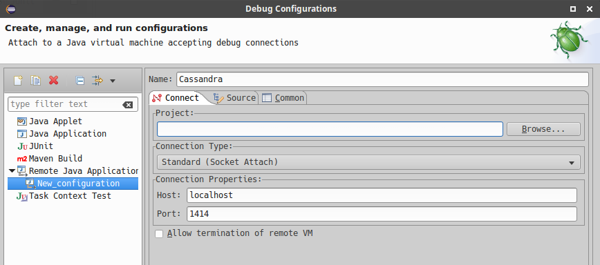

.. Licensed to the Apache Software Foundation (ASF) under one
.. or more contributor license agreements.  See the NOTICE file
.. distributed with this work for additional information
.. regarding copyright ownership.  The ASF licenses this file
.. to you under the Apache License, Version 2.0 (the
.. "License"); you may not use this file except in compliance
.. with the License.  You may obtain a copy of the License at
..
..     http://www.apache.org/licenses/LICENSE-2.0
..
.. Unless required by applicable law or agreed to in writing, software
.. distributed under the License is distributed on an "AS IS" BASIS,
.. WITHOUT WARRANTIES OR CONDITIONS OF ANY KIND, either express or implied.
.. See the License for the specific language governing permissions and
.. limitations under the License.

Building and IDE Integration
****************************

Building From Source
====================

Getting started with Cassandra and IntelliJ IDEA or Eclipse is simple, once you manage to build Cassandra from source using `Java 8 <http://www.oracle.com/technetwork/java/javase/downloads/index.html>`_, `Git <https://git-scm.com/>`_ and `Ant <http://ant.apache.org/>`_.

The source code for Cassandra is shared through the central Apache Git repository and organized by different branches. You can access the code for the current development branch through git as follows::

   git clone http://git-wip-us.apache.org/repos/asf/cassandra.git cassandra-trunk

Other branches will point to different versions of Cassandra. Switching to a different branch requires checking out the branch by its name::

   git checkout cassandra-3.0

You can get a list of available branches with ``git branch``.

Finally build Cassandra using ant::

   ant

This may take a significant amount of time depending on whether artifacts have to be downloaded and the number of classes that need to be compiled.

.. hint::

   You can setup multiple working trees for different Cassandra versions from the same repository using `git-worktree <https://git-scm.com/docs/git-worktree>`_.

.. note::

   `Bleeding edge development snapshots <http://cassci.datastax.com/job/trunk/lastSuccessfulBuild/>`_ of Cassandra are available from Jenkins continuous integration.

Setting up Cassandra in IntelliJ IDEA
=====================================

`IntelliJ IDEA <https://www.jetbrains.com/idea/>`_ by JetBrains is one of the most popular IDEs for Cassandra and Java development in general. The Community Edition is provided as a free download with all features needed to get started developing Cassandra.

Setup Cassandra as a Project (C* 2.1 and newer)
-----------------------------------------------

Since 2.1.5, there is a new ant target: ``generate-idea-files``. Please see our `wiki <https://wiki.apache.org/cassandra/RunningCassandraInIDEA>`_ for instructions for older Cassandra versions.

Please clone and build Cassandra as described above and execute the following steps:

1. Once Cassandra is built, generate the IDEA files using ant:

::

   ant generate-idea-files

2. Start IDEA

3. Open the IDEA project from the checked out Cassandra directory using the menu item Open in IDEA's File menu

The project generated by the ant task ``generate-idea-files`` contains nearly everything you need to debug Cassandra and execute unit tests.

 * Run/debug defaults for JUnit
 * Run/debug configuration for Cassandra daemon
 * License header for Java source files
 * Cassandra code style
 * Inspections

Setting up Cassandra in Eclipse
===============================

Eclipse is a popular open source IDE that can be used for Cassandra development. Various Eclipse environments are available from the `download page <https://www.eclipse.org/downloads/eclipse-packages/>`_. The following guide was created with "Eclipse IDE for Java Developers".

These instructions were tested on Ubuntu 16.04 with Eclipse Neon (4.6) using Cassandra 2.1, 2.2 and 3.x.

Project Settings
----------------

**It is important that you generate the Eclipse files with Ant before trying to set up the Eclipse project.**

 * Clone and build Cassandra as described above.
 * Run ``ant generate-eclipse-files`` to create the Eclipse settings.
 * Start Eclipse.
 * Select ``File->Import->Existing Projects into Workspace->Select git directory``.
 * Make sure "cassandra-trunk" is recognized and selected as a project (assuming you checked the code out into the folder cassandra-trunk as described above).
 * Confirm "Finish" to have your project imported.

You should now be able to find the project as part of the "Package Explorer" or "Project Explorer" without having Eclipse complain about any errors after building the project automatically.

Unit Tests
----------

Unit tests can be run from Eclipse by simply right-clicking the class file or method and selecting ``Run As->JUnit Test``. Tests can be debugged this way as well by defining breakpoints (double-click line number) and selecting ``Debug As->JUnit Test``.

Alternatively all unit tests can be run from the command line as described in :doc:`testing`

Debugging Cassandra Using Eclipse
---------------------------------

There are two ways how to start and debug a local Cassandra instance with Eclipse. You can either start Cassandra just as you normally would by using the ``./bin/cassandra`` script and connect to the JVM through `remotely <https://docs.oracle.com/javase/8/docs/technotes/guides/troubleshoot/introclientissues005.html>`_ from Eclipse or start Cassandra from Eclipse right away.

Starting Cassandra From Command Line
~~~~~~~~~~~~~~~~~~~~~~~~~~~~~~~~~~~~

 * Set environment variable to define remote debugging options for the JVM:
   ``export JVM_EXTRA_OPTS="-agentlib:jdwp=transport=dt_socket,server=y,suspend=n,address=1414"``
 * Start Cassandra by executing the ``./bin/cassandra``

Afterwards you should be able to connect to the running Cassandra process through the following steps:

From the menu, select ``Run->Debug Configurations..``

Create new remote application

.. image:: images/eclipse_debug1.png

Configure connection settings by specifying a name and port 1414

Afterwards confirm "Debug" to connect to the JVM and start debugging Cassandra!

Starting Cassandra From Eclipse
~~~~~~~~~~~~~~~~~~~~~~~~~~~~~~~

Cassandra can also be started directly from Eclipse if you don't want to use the command line.

From the menu, select ``Run->Run Configurations..``

.. image:: images/eclipse_debug3.png

Create new application

.. image:: images/eclipse_debug4.png

Specify name, project and main class ``org.apache.cassandra.service.CassandraDaemon``

.. image:: images/eclipse_debug5.png

Configure additional JVM specific parameters that will start Cassandra with some of the settings created by the regular startup script. Change heap related values as needed.

::

   -Xms1024M -Xmx1024M -Xmn220M -Xss256k -ea -XX:+UseThreadPriorities -XX:ThreadPriorityPolicy=42 -XX:+UseParNewGC -XX:+UseConcMarkSweepGC -XX:+CMSParallelRemarkEnabled -XX:+UseCondCardMark -javaagent:./lib/jamm-0.3.0.jar -Djava.net.preferIPv4Stack=true

Now just confirm "Debug" and you should see the output of Cassandra starting up in the Eclipse console and should be able to set breakpoints and start debugging!

