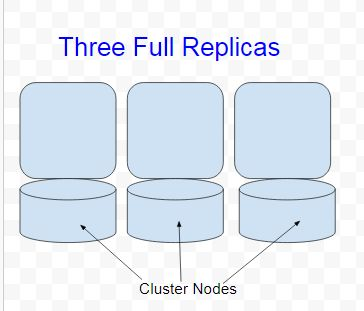
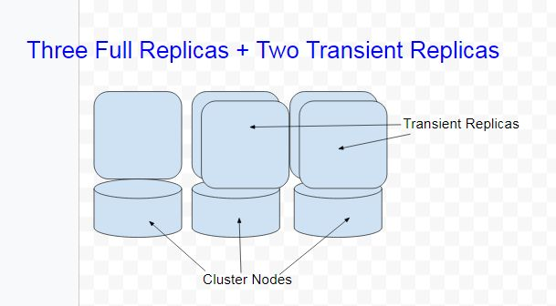

.. Licensed to the Apache Software Foundation (ASF) under one
.. or more contributor license agreements.  See the NOTICE file
.. distributed with this work for additional information
.. regarding copyright ownership.  The ASF licenses this file
.. to you under the Apache License, Version 2.0 (the
.. "License"); you may not use this file except in compliance
.. with the License.  You may obtain a copy of the License at
..
..     http://www.apache.org/licenses/LICENSE-2.0
..
.. Unless required by applicable law or agreed to in writing, software
.. distributed under the License is distributed on an "AS IS" BASIS,
.. WITHOUT WARRANTIES OR CONDITIONS OF ANY KIND, either express or implied.
.. See the License for the specific language governing permissions and
.. limitations under the License.

Transient Replication  
---------------------  

**Note**:

Transient Replication and Cheap Quorums (`CASSANDRA-14404
<https://issues.apache.org/jira/browse/CASSANDRA-14404>`_) is an experimental feature designed for expert Apache Cassandra users who are able to validate every aspect of the database for their application and deployment.  That means being able to check that operations like reads, writes, decommission, remove, rebuild, repair, and replace all work with your queries, data, configuration, operational practices, and availability requirements. Apache Cassandra 4.0 has the initial implementation of transient replication. Future releases of Cassandra will make this feature suitable for a wider audience. It is anticipated that 4.*next* will support monotonic reads with transient replication as well as LWT, logged batches, and counters. Being experimental, Transient replication is not recommended for production use. 

Objective
^^^^^^^^^

The objective of transient replication is to decouple storage requirements from data redundancy (or consensus group size) using incremental repair.  The optimization that is made possible with transient replication is called "Cheap quorums", which implies that data redundancy is increased without corresponding increase in storage usage. Transient replication is useful when sufficient full replicas are unavailable to receive and store all the data. Transient replication allows you to configure a subset of replicas to only replicate data that hasn't been incrementally repaired.  As an example, start with a keyspace replicated at replication factor 3 as illustrated in Figure 1.

  Figure 1. Keyspace with 3 Full Replicas
 
Increase the replication factor to 5, one at a time, with 2 transient replicas as illustrated in Figure 2. The # of nodes is the same and no node is transient replica or full replica per se. All nodes fully replicate some given token ranges on the ring and transiently replicate other. Transient replicas only replicate data that has not been incrementally repaired. 

Figure 2. Replication Factor 5 with 2 Transient Replicas

Transient Replicas serve both reads and writes just like the full replicas do.  In the example, the data redundancy is increased by virtue of being able to tolerate two failed replicas instead of one failed replica, which results in high availability.  The corresponding storage usage stays the same. This is achieved by 3 nodes replicating all the data for a given token range and the 2 transient nodes only replicating data that has not been incrementally repaired.  

When incremental repair is run the transient replicas stream any data they have received to the full replicas making the full replicas consistent with the transient replicas. After the data stored in transient replicas has been fully replicated to the full replicas it is dropped at the transient replicas. 

Enabling Transient Replication
^^^^^^^^^^^^^^^^^^^^^^^^^^^^^^

Transient replication is not enabled by default.  Transient replication must be enabled on each node in a cluster separately by setting the following configuration property in ``cassandra.yaml``.

::

 enable_transient_replication: true

Transient replication may be configured with both ``SimpleStrategy`` and ``NetworkTopologyStrategy``. Transient replication is configured by setting replication factor as ``<total_replicas>/<transient_replicas>``.

As an example, create a keyspace with replication factor (RF) 3. 

::

 CREATE KEYSPACE CassandraKeyspaceSimple WITH replication = {'class': 'SimpleStrategy', 
 'replication_factor' : 3};
 
Alter keyspace to increase replication factor to 4 with 1 transient replicas. 
 
 ::
 
   ALTER KEYSPACE CassandraKeyspaceSimple WITH REPLICATION = {'class' : 'SimpleStrategy', 
   'replication_factor' : '4/1'};

RF cannot be altered while some endpoints are not in a normal state (no range movements). If there is no read traffic there are some extra alterations you can safely make, but this is so atypical that a good default is to not allow unsafe changes. 

Also, you can't add full replicas if there are any transient replicas. You must first remove all transient replicas, then change the # of full replicas, then add back the transient replicas.

You can only safely increase number of transients one at a time with incremental repair run in between each time. 

As another example, ``some_keysopace keyspace`` will have 3 replicas in DC1, 1 of which is transient, and 5 replicas in DC2, 2 of which are transient:

::

 CREATE KEYSPACE some_keysopace WITH replication = {'class': 'NetworkTopologyStrategy', 
 'DC1' : '3/1'', 'DC2' : '5/2'};

Transiently replicated keyspaces only support tables with ``read_repair`` set to ``NONE``. Transient replication cannot be used for:

- Monotonic Reads
- Lightweight Transactions (LWTs)
- Logged Batches
- Counters
- Keyspaces using materialized views
- 2i

Cheap Quorums
^^^^^^^^^^^^^

Cheap quorums are a set of optimizations on the write path to avoid writing to transient replicas unless sufficient full replicas are not available to satisfy the requested consistency level. Hints are never written for transient replicas.  Optimizations on the read path prefer reading from transient replicas. When writing at quorum to a table configured to use transient replication the quorum will always prefer available full replicas over transient replicas so that transient replicas don't have to process writes. Tail latency is reduced by rapid write protection (similar to rapid read protection) when full replicas are slow or unavailable by sending writes to transient replicas. Transient replicas can serve reads faster as they don't have to do anything beyond bloom filter checks if they have no data. With vnodes and large cluster sizes they will not have a large quantity of data even for failure of one or more full replicas where transient replicas start to serve a steady amount of write traffic for some of their transiently replicated ranges.

Speculative Write Option
^^^^^^^^^^^^^^^^^^^^^^^^
The ``CREATE TABLE`` adds an option ``speculative_write_threshold`` for  use with transient replicas. The option is of type ``simple`` with default value as ``99PERCENTILE``. When replicas are slow or unresponsive  ``speculative_write_threshold`` specifies the threshold at which a cheap quorum write will be upgraded to include transient replicas.
 

Pending Ranges and Transient Replicas
^^^^^^^^^^^^^^^^^^^^^^^^^^^^^^^^^^^^^

Pending ranges refers to the movement of token ranges between transient replicas. When a transient range is moved, there will be a period of time where both transient replicas would need to receive any write intended for the logical transient replica so that after the movement takes effect a read quorum is able to return a response. Nodes are *not* temporarily transient replicas during expansion. They stream data like a full replica for the transient range before they can serve reads. A pending state is incurred similar to how there is a pending state for full replicas. Transient replicas also always receive writes when they are pending. Pending transient ranges are sent a bit more data and reading from them is avoided.

Read Repair and Transient Replicas
^^^^^^^^^^^^^^^^^^^^^^^^^^^^^^^^^^

Read repair never attempts to repair a transient replica. Reads should always include at least one full replica. They should also prefer transient replicas where possible. Range scans ensure the entire scanned range performs replica selection that satisfies the requirement that every range scanned includes one full replica. During incremental & validation repair handling, at transient replicas anti-compaction does not output any data for transient ranges as the data will be dropped after repair, and  transient replicas never have data streamed to them.

Transitioning between Full Replicas and Transient Replicas
^^^^^^^^^^^^^^^^^^^^^^^^^^^^^^^^^^^^^^^^^^^^^^^^^^^^^^^^^^
  
The additional state transitions that transient replication introduces requires streaming and ``nodetool cleanup`` to behave differently.  When data is streamed it is ensured that it is streamed from a full replica and not a transient replica.

Transitioning from not replicated to transiently replicated means that a node must stay pending until the next incremental repair completes at which point the data for that range is known to be available at full replicas.

Transitioning from transiently replicated to fully replicated requires streaming from a full replica and is identical to how data is streamed when transitioning from not replicated to replicated. The transition is managed so the transient replica is not read from as a full replica until streaming completes. It can be used immediately for a write quorum.

Transitioning from fully replicated to transiently replicated requires cleanup to remove repaired data from the transiently replicated range to reclaim space. It can be used immediately for a write quorum.

Transitioning from transiently replicated to not replicated requires cleanup to be run to remove the formerly transiently replicated data.

When transient replication is in use ring changes are supported including   add/remove node, change RF, add/remove DC.

Transient Replication supports EACH_QUORUM
^^^^^^^^^^^^^^^^^^^^^^^^^^^^^^^^^^^^^^^^^^

(`CASSANDRA-14727
<https://issues.apache.org/jira/browse/CASSANDRA-14727>`_) adds support for Transient Replication support for ``EACH_QUORUM``. Per (`CASSANDRA-14768
<https://issues.apache.org/jira/browse/CASSANDRA-14768>`_), we ensure we write to at least a ``QUORUM`` of nodes in every DC, regardless of how many responses we need to wait for and our requested consistency level. This is to minimally surprise users with transient replication; with normal writes, we soft-ensure that we reach ``QUORUM`` in all DCs we are able to, by writing to every node; even if we don't wait for ACK, we have in both cases sent sufficient messages.
