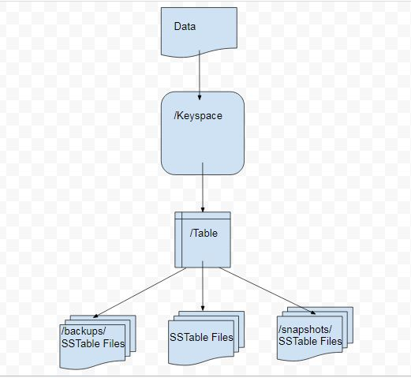

.. Licensed to the Apache Software Foundation (ASF) under one
.. or more contributor license agreements.  See the NOTICE file
.. distributed with this work for additional information
.. regarding copyright ownership.  The ASF licenses this file
.. to you under the Apache License, Version 2.0 (the
.. "License"); you may not use this file except in compliance
.. with the License.  You may obtain a copy of the License at
..
..     http://www.apache.org/licenses/LICENSE-2.0
..
.. Unless required by applicable law or agreed to in writing, software
.. distributed under the License is distributed on an "AS IS" BASIS,
.. WITHOUT WARRANTIES OR CONDITIONS OF ANY KIND, either express or implied.
.. See the License for the specific language governing permissions and
.. limitations under the License.
.. highlight:: none

Backups  
------- 

Apache Cassandra stores data in immutable SSTable files. Backups in Apache Cassandra database are backup copies of the database data that is stored as SSTable files. Backups are used for several purposes including the following:

- To store a data copy for durability
- To be able to restore a table if table data is lost due to node/partition/network failure
- To be able to transfer the SSTable files to a different machine;  for portability

Types of Backups
^^^^^^^^^^^^^^^^
Apache Cassandra supports two kinds of backup strategies.

- Snapshots
- Incremental Backups

A *snapshot* is a copy of a table’s SSTable files at a given time, created via hard links.  The DDL to create the table is stored as well.  Snapshots may be created by a user or created automatically.
The setting (``snapshot_before_compaction``) in ``cassandra.yaml`` determines if snapshots are created before each compaction.
By default ``snapshot_before_compaction`` is set to false.
Snapshots may be created automatically before keyspace truncation or dropping of a table by setting ``auto_snapshot`` to true (default) in ``cassandra.yaml``.
Truncates could be delayed due to the auto snapshots and another setting in ``cassandra.yaml`` determines how long the coordinator should wait for truncates to complete.
By default Cassandra waits 60 seconds for auto snapshots to complete.

An *incremental backup* is a copy of a table’s SSTable files created by a hard link when memtables are flushed to disk as SSTables.
Typically incremental backups are paired with snapshots to reduce the backup time as well as reduce disk space.
Incremental backups are not enabled by default and must be enabled explicitly in ``cassandra.yaml`` (with ``incremental_backups`` setting) or with the Nodetool.
Once enabled, Cassandra creates a hard link to each SSTable flushed or streamed locally in a ``backups/`` subdirectory of the keyspace data. Incremental backups of system tables are also created.

Data Directory Structure
^^^^^^^^^^^^^^^^^^^^^^^^
The directory structure of Cassandra data consists of different directories for keyspaces, and tables with the data files within the table directories.  Directories  backups and snapshots to store backups and snapshots respectively for a particular table are also stored within the table directory. The directory structure for Cassandra is illustrated in Figure 1. 

Figure 1. Directory Structure for Cassandra Data

Setting Up Example Tables for Backups and Snapshots
****************************************************
In this section we shall create some example data that could be used to demonstrate incremental backups and snapshots. We have used a three node Cassandra cluster.
First, the keyspaces are created. Subsequently tables are created within a keyspace and table data is added. We have used two keyspaces ``CQLKeyspace`` and ``CatalogKeyspace`` with two tables within each.
Create ``CQLKeyspace``:

::

 cqlsh> CREATE KEYSPACE CQLKeyspace
   ... WITH replication = {'class': 'SimpleStrategy', 'replication_factor' : 3};

Create table ``t`` in the ``CQLKeyspace`` keyspace.

::

 cqlsh> USE CQLKeyspace;
 cqlsh:cqlkeyspace> CREATE TABLE t (
               ...     id int,
               ...     k int,
               ...     v text,
               ...     PRIMARY KEY (id)
               ... );

Add data to table ``t``:

::

 cqlsh:cqlkeyspace>
 cqlsh:cqlkeyspace> INSERT INTO t (id, k, v) VALUES (0, 0, 'val0');
 cqlsh:cqlkeyspace> INSERT INTO t (id, k, v) VALUES (1, 1, 'val1');

A table query lists the data:

::

 cqlsh:cqlkeyspace> SELECT * FROM t;

 id | k | v
 ----+---+------
  1 | 1 | val1
  0 | 0 | val0

  (2 rows)

Create another table ``t2``:

::

 cqlsh:cqlkeyspace> CREATE TABLE t2 (
               ...     id int,
               ...     k int,
               ...     v text,
               ...     PRIMARY KEY (id)
               ... );

Add data to table ``t2``:

::

 cqlsh:cqlkeyspace> INSERT INTO t2 (id, k, v) VALUES (0, 0, 'val0');
 cqlsh:cqlkeyspace> INSERT INTO t2 (id, k, v) VALUES (1, 1, 'val1');
 cqlsh:cqlkeyspace> INSERT INTO t2 (id, k, v) VALUES (2, 2, 'val2');

A table query lists table data:

::

 cqlsh:cqlkeyspace> SELECT * FROM t2;

 id | k | v
 ----+---+------
  1 | 1 | val1
  0 | 0 | val0
  2 | 2 | val2

  (3 rows)

Create a second keyspace ``CatalogKeyspace``:

::

 cqlsh:cqlkeyspace> CREATE KEYSPACE CatalogKeyspace
               ... WITH replication = {'class': 'SimpleStrategy', 'replication_factor' : 3};

Create a table called ``journal`` in ``CatalogKeyspace``:

::

 cqlsh:cqlkeyspace> USE CatalogKeyspace;
 cqlsh:catalogkeyspace> CREATE TABLE journal (
                   ...     id int,
                   ...     name text,
                   ...     publisher text,
                   ...     PRIMARY KEY (id)
                   ... );

Add data to table ``journal``:

::

 cqlsh:catalogkeyspace> INSERT INTO journal (id, name, publisher) VALUES (0, 'Apache
 Cassandra Magazine', 'Apache Cassandra');
 cqlsh:catalogkeyspace> INSERT INTO journal (id, name, publisher) VALUES (1, 'Couchbase
 Magazine', 'Couchbase');

Query table ``journal`` to list its data:

::

 cqlsh:catalogkeyspace> SELECT * FROM journal;

 id | name                      | publisher
 ----+---------------------------+------------------
  1 |        Couchbase Magazine |        Couchbase
  0 | Apache Cassandra Magazine | Apache Cassandra

  (2 rows)

Add another table called ``magazine``:

::

 cqlsh:catalogkeyspace> CREATE TABLE magazine (
                   ...     id int,
                   ...     name text,
                   ...     publisher text,
                   ...     PRIMARY KEY (id)
                   ... );

Add table data to ``magazine``:

::

 cqlsh:catalogkeyspace> INSERT INTO magazine (id, name, publisher) VALUES (0, 'Apache
 Cassandra Magazine', 'Apache Cassandra');
 cqlsh:catalogkeyspace> INSERT INTO magazine (id, name, publisher) VALUES (1, 'Couchbase
 Magazine', 'Couchbase');

List table ``magazine``’s data:

::

 cqlsh:catalogkeyspace> SELECT * from magazine;

 id | name                      | publisher
 ----+---------------------------+------------------
  1 |        Couchbase Magazine |        Couchbase
  0 | Apache Cassandra Magazine | Apache Cassandra

  (2 rows)

Snapshots
^^^^^^^^^
In this section including sub-sections we shall demonstrate creating snapshots.  The command used to create a snapshot is ``nodetool snapshot`` and its usage is as follows:

::

 [ec2-user@ip-10-0-2-238 ~]$ nodetool help snapshot
 NAME
        nodetool snapshot - Take a snapshot of specified keyspaces or a snapshot
        of the specified table

 SYNOPSIS
        nodetool [(-h <host> | --host <host>)] [(-p <port> | --port <port>)]
                [(-pp | --print-port)] [(-pw <password> | --password <password>)]
                [(-pwf <passwordFilePath> | --password-file <passwordFilePath>)]
                [(-u <username> | --username <username>)] snapshot
                [(-cf <table> | --column-family <table> | --table <table>)]
                [(-kt <ktlist> | --kt-list <ktlist> | -kc <ktlist> | --kc.list <ktlist>)]
                [(-sf | --skip-flush)] [(-t <tag> | --tag <tag>)] [--] [<keyspaces...>]

 OPTIONS
        -cf <table>, --column-family <table>, --table <table>
            The table name (you must specify one and only one keyspace for using
            this option)

        -h <host>, --host <host>
            Node hostname or ip address

        -kt <ktlist>, --kt-list <ktlist>, -kc <ktlist>, --kc.list <ktlist>
            The list of Keyspace.table to take snapshot.(you must not specify
            only keyspace)

        -p <port>, --port <port>
            Remote jmx agent port number

        -pp, --print-port
            Operate in 4.0 mode with hosts disambiguated by port number

        -pw <password>, --password <password>
            Remote jmx agent password

        -pwf <passwordFilePath>, --password-file <passwordFilePath>
            Path to the JMX password file

        -sf, --skip-flush
            Do not flush memtables before snapshotting (snapshot will not
            contain unflushed data)

        -t <tag>, --tag <tag>
            The name of the snapshot

        -u <username>, --username <username>
            Remote jmx agent username

        --
            This option can be used to separate command-line options from the
            list of argument, (useful when arguments might be mistaken for
            command-line options

        [<keyspaces...>]
            List of keyspaces. By default, all keyspaces

Configuring for Snapshots
*************************** 
To demonstrate creating snapshots with Nodetool on the commandline  we have set 
``auto_snapshots`` setting to ``false`` in ``cassandra.yaml``:

::

 auto_snapshot: false

Also set ``snapshot_before_compaction``  to ``false`` to disable creating snapshots automatically before compaction:

::

 snapshot_before_compaction: false

Creating Snapshots
******************* 
To demonstrate creating snapshots start with no snapshots. Search for snapshots and none get listed:

::

 [ec2-user@ip-10-0-2-238 ~]$ find -name snapshots

We shall be using the example keyspaces and tables to create snapshots.

Taking Snapshots of all Tables in a Keyspace
+++++++++++++++++++++++++++++++++++++++++++++ 

To take snapshots of all tables in a keyspace and also optionally tag the snapshot the syntax becomes:

::

 nodetool snapshot --tag <tag>  --<keyspace>

As an example create a snapshot called ``catalog-ks`` for all the tables in the ``catalogkeyspace`` keyspace:

::

 [ec2-user@ip-10-0-2-238 ~]$ nodetool snapshot --tag catalog-ks -- catalogkeyspace
 Requested creating snapshot(s) for [catalogkeyspace] with snapshot name [catalog-ks] and 
 options {skipFlush=false}
 Snapshot directory: catalog-ks

Search for snapshots and  ``snapshots`` directories for the tables ``journal`` and ``magazine``, which are in the ``catalogkeyspace`` keyspace should get listed:

::

 [ec2-user@ip-10-0-2-238 ~]$ find -name snapshots
 ./cassandra/data/data/catalogkeyspace/journal-296a2d30c22a11e9b1350d927649052c/snapshots
 ./cassandra/data/data/catalogkeyspace/magazine-446eae30c22a11e9b1350d927649052c/snapshots

Snapshots of all tables in   multiple keyspaces may be created similarly, as an example:

::

 nodetool snapshot --tag catalog-cql-ks --catalogkeyspace,cqlkeyspace

Taking Snapshots of Single Table in a Keyspace
++++++++++++++++++++++++++++++++++++++++++++++
To take a snapshot of a single table the ``nodetool snapshot`` command syntax becomes as follows:

::

 nodetool snapshot --tag <tag> --table <table>  --<keyspace>

As an example create a snapshot for table ``magazine`` in keyspace ``catalokeyspace``:

::

 [ec2-user@ip-10-0-2-238 ~]$ nodetool snapshot --tag magazine --table magazine  -- 
 catalogkeyspace
 Requested creating snapshot(s) for [catalogkeyspace] with snapshot name [magazine] and 
 options {skipFlush=false}
 Snapshot directory: magazine

Taking Snapshot of Multiple  Tables from same Keyspace
++++++++++++++++++++++++++++++++++++++++++++++++++++++
To take snapshots of multiple tables in a keyspace the list of *Keyspace.table* must be specified with option ``--kt-list``. As an example create snapshots for tables ``t`` and ``t2`` in the ``cqlkeyspace`` keyspace:

::

 nodetool snapshot --kt-list cqlkeyspace.t,cqlkeyspace.t2 --tag multi-table 
 [ec2-user@ip-10-0-2-238 ~]$ nodetool snapshot --kt-list cqlkeyspace.t,cqlkeyspace.t2 --tag 
 multi-table
 Requested creating snapshot(s) for [cqlkeyspace.t,cqlkeyspace.t2] with snapshot name [multi- 
 table] and options {skipFlush=false}
 Snapshot directory: multi-table

Multiple snapshots of the same set of tables may be created and tagged with a different name. As an example, create another snapshot for the same set of tables ``t`` and ``t2`` in the ``cqlkeyspace`` keyspace and tag the snapshots differently:

::

 [ec2-user@ip-10-0-2-238 ~]$ nodetool snapshot --kt-list cqlkeyspace.t,cqlkeyspace.t2 --tag 
 multi-table-2
 Requested creating snapshot(s) for [cqlkeyspace.t,cqlkeyspace.t2] with snapshot name [multi- 
 table-2] and options {skipFlush=false}
 Snapshot directory: multi-table-2

Taking Snapshot of Multiple  Tables from Different Keyspaces
++++++++++++++++++++++++++++++++++++++++++++++++++++++++++++
To take snapshots of multiple tables that are in different keyspaces the command syntax is the same as when multiple tables are in the same keyspace. Each *keyspace.table* must be specified separately in the ``--kt-list`` option. As an example, create a snapshot for table ``t`` in the ``cqlkeyspace`` and table ``journal`` in the catalogkeyspace and tag the snapshot ``multi-ks``.

::

 [ec2-user@ip-10-0-2-238 ~]$ nodetool snapshot --kt-list 
 catalogkeyspace.journal,cqlkeyspace.t --tag multi-ks
 Requested creating snapshot(s) for [catalogkeyspace.journal,cqlkeyspace.t] with snapshot 
 name [multi-ks] and options {skipFlush=false}
 Snapshot directory: multi-ks
 
Listing Snapshots
*************************** 
To list snapshots use the ``nodetool listsnapshots`` command. All the snapshots that we created in the preceding examples get listed:

::

 [ec2-user@ip-10-0-2-238 ~]$ nodetool listsnapshots
 Snapshot Details: 
 Snapshot name Keyspace name   Column family name True size Size on disk
 multi-table   cqlkeyspace     t2                 4.86 KiB  5.67 KiB    
 multi-table   cqlkeyspace     t                  4.89 KiB  5.7 KiB     
 multi-ks      cqlkeyspace     t                  4.89 KiB  5.7 KiB     
 multi-ks      catalogkeyspace journal            4.9 KiB   5.73 KiB    
 magazine      catalogkeyspace magazine           4.9 KiB   5.73 KiB    
 multi-table-2 cqlkeyspace     t2                 4.86 KiB  5.67 KiB    
 multi-table-2 cqlkeyspace     t                  4.89 KiB  5.7 KiB     
 catalog-ks    catalogkeyspace journal            4.9 KiB   5.73 KiB    
 catalog-ks    catalogkeyspace magazine           4.9 KiB   5.73 KiB    

 Total TrueDiskSpaceUsed: 44.02 KiB

Finding Snapshots Directories
****************************** 
The ``snapshots`` directories may be listed with ``find –name snapshots`` command:

::

 [ec2-user@ip-10-0-2-238 ~]$ find -name snapshots
 ./cassandra/data/data/cqlkeyspace/t-d132e240c21711e9bbee19821dcea330/snapshots
 ./cassandra/data/data/cqlkeyspace/t2-d993a390c22911e9b1350d927649052c/snapshots
 ./cassandra/data/data/catalogkeyspace/journal-296a2d30c22a11e9b1350d927649052c/snapshots
 ./cassandra/data/data/catalogkeyspace/magazine-446eae30c22a11e9b1350d927649052c/snapshots
 [ec2-user@ip-10-0-2-238 ~]$

To list the snapshots for a particular table first change directory ( with ``cd``) to the ``snapshots`` directory for the table. As an example, list the snapshots for the ``catalogkeyspace/journal`` table. Two snapshots get listed:

::

 [ec2-user@ip-10-0-2-238 ~]$ cd ./cassandra/data/data/catalogkeyspace/journal- 
 296a2d30c22a11e9b1350d927649052c/snapshots
 [ec2-user@ip-10-0-2-238 snapshots]$ ls -l
 total 0
 drwxrwxr-x. 2 ec2-user ec2-user 265 Aug 19 02:44 catalog-ks
 drwxrwxr-x. 2 ec2-user ec2-user 265 Aug 19 02:52 multi-ks

A ``snapshots`` directory lists the SSTable files in the snapshot. ``Schema.cql`` file is also created in each snapshot for the schema definition DDL that may be run in CQL to create the table when restoring from a snapshot:

::

 [ec2-user@ip-10-0-2-238 snapshots]$ cd catalog-ks
 [ec2-user@ip-10-0-2-238 catalog-ks]$ ls -l
 total 44
 -rw-rw-r--. 1 ec2-user ec2-user   31 Aug 19 02:44 manifest.jsonZ

 -rw-rw-r--. 4 ec2-user ec2-user   47 Aug 19 02:38 na-1-big-CompressionInfo.db
 -rw-rw-r--. 4 ec2-user ec2-user   97 Aug 19 02:38 na-1-big-Data.db
 -rw-rw-r--. 4 ec2-user ec2-user   10 Aug 19 02:38 na-1-big-Digest.crc32
 -rw-rw-r--. 4 ec2-user ec2-user   16 Aug 19 02:38 na-1-big-Filter.db
 -rw-rw-r--. 4 ec2-user ec2-user   16 Aug 19 02:38 na-1-big-Index.db
 -rw-rw-r--. 4 ec2-user ec2-user 4687 Aug 19 02:38 na-1-big-Statistics.db
 -rw-rw-r--. 4 ec2-user ec2-user   56 Aug 19 02:38 na-1-big-Summary.db
 -rw-rw-r--. 4 ec2-user ec2-user   92 Aug 19 02:38 na-1-big-TOC.txt
 -rw-rw-r--. 1 ec2-user ec2-user  814 Aug 19 02:44 schema.cql

Clearing Snapshots
******************
Snapshots may be cleared or deleted with the ``nodetool clearsnapshot`` command.  Either a specific snapshot name must be specified or the ``–all`` option must be specified.
As an example delete a snapshot called ``magazine`` from keyspace ``cqlkeyspace``:

::

 nodetool clearsnapshot -t magazine – cqlkeyspace
 Delete all snapshots from cqlkeyspace with the –all option.
 nodetool clearsnapshot –all -- cqlkeyspace

Incremental Backups
^^^^^^^^^^^^^^^^^^^
In the following sub-sections we shall discuss configuring and creating incremental backups.

Configuring for Incremental Backups
***********************************

To create incremental backups set ``incremental_backups`` to ``true`` in ``cassandra.yaml``.

::

 incremental_backups: true

This is the only setting needed to create incremental backups.  By default ``incremental_backups`` setting is  set to ``false`` because a new set of SSTable files is created for each data flush and if several CQL statements are to be run the ``backups`` directory could  fill up quickly and use up storage that is needed to store table data.
Incremental backups may also be enabled on the command line with the Nodetool command ``nodetool enablebackup``. Incremental backups may be disabled with ``nodetool disablebackup`` command. Status of incremental backups, whether they are enabled may be found with ``nodetool statusbackup``.

Creating Incremental Backups
******************************
After each table is created flush the table data with ``nodetool flush`` command. Incremental backups get created.

::

 [ec2-user@ip-10-0-2-238 ~]$ nodetool flush cqlkeyspace t
 [ec2-user@ip-10-0-2-238 ~]$ nodetool flush cqlkeyspace t2
 [ec2-user@ip-10-0-2-238 ~]$ nodetool flush catalogkeyspace journal magazine

Finding Incremental Backups
***************************

Incremental backups are created within the Cassandra’s ``data`` directory within a table directory. Backups may be found with following command.

::

 [ec2-user@ip-10-0-2-238 ~]$ find -name backups

 ./cassandra/data/data/cqlkeyspace/t-d132e240c21711e9bbee19821dcea330/backups
 ./cassandra/data/data/cqlkeyspace/t2-d993a390c22911e9b1350d927649052c/backups
 ./cassandra/data/data/catalogkeyspace/journal-296a2d30c22a11e9b1350d927649052c/backups
 ./cassandra/data/data/catalogkeyspace/magazine-446eae30c22a11e9b1350d927649052c/backups

Creating an Incremental Backup
******************************
This section discusses how incremental backups are created in more detail starting with when a new keyspace is created and a table is added.  Create a keyspace called ``CQLKeyspace`` (arbitrary name).

::

 cqlsh> CREATE KEYSPACE CQLKeyspace
   ... WITH replication = {'class': 'SimpleStrategy', 'replication_factor' : 3}

Create a table called ``t`` within the ``CQLKeyspace`` keyspace:

::

 cqlsh> USE CQLKeyspace;
 cqlsh:cqlkeyspace> CREATE TABLE t (
               ...     id int,
               ...     k int,
               ...     v text,
               ...     PRIMARY KEY (id)
               ... );

Flush the keyspace and table:

::

 [ec2-user@ip-10-0-2-238 ~]$ nodetool flush cqlkeyspace t

Search for backups and a ``backups`` directory should get listed even though we have added no table data yet.

::

 [ec2-user@ip-10-0-2-238 ~]$ find -name backups

 ./cassandra/data/data/cqlkeyspace/t-d132e240c21711e9bbee19821dcea330/backups

Change directory to the ``backups`` directory and list files and no files get listed as no table data has been added yet:

::

 [ec2-user@ip-10-0-2-238 ~]$ cd ./cassandra/data/data/cqlkeyspace/t-
 d132e240c21711e9bbee19821dcea330/backups
 [ec2-user@ip-10-0-2-238 backups]$ ls -l
 total 0

Next, add a row of data to table ``t`` that we created:

::

 cqlsh:cqlkeyspace> INSERT INTO t (id, k, v) VALUES (0, 0, 'val0');

Run the ``nodetool flush`` command to flush table data:

::

 [ec2-user@ip-10-0-2-238 ~]$ nodetool flush cqlkeyspace t

List the files and directories in the ``backups`` directory and SSTable files for an incremental backup get listed:

::

 [ec2-user@ip-10-0-2-238 ~]$ cd ./cassandra/data/data/cqlkeyspace/t-
 d132e240c21711e9bbee19821dcea330/backups
 [ec2-user@ip-10-0-2-238 backups]$ ls -l
 total 36
 -rw-rw-r--. 2 ec2-user ec2-user   47 Aug 19 00:32 na-1-big-CompressionInfo.db
 -rw-rw-r--. 2 ec2-user ec2-user   43 Aug 19 00:32 na-1-big-Data.db
 -rw-rw-r--. 2 ec2-user ec2-user   10 Aug 19 00:32 na-1-big-Digest.crc32
 -rw-rw-r--. 2 ec2-user ec2-user   16 Aug 19 00:32 na-1-big-Filter.db
 -rw-rw-r--. 2 ec2-user ec2-user    8 Aug 19 00:32 na-1-big-Index.db
 -rw-rw-r--. 2 ec2-user ec2-user 4673 Aug 19 00:32 na-1-big-Statistics.db
 -rw-rw-r--. 2 ec2-user ec2-user   56 Aug 19 00:32 na-1-big-Summary.db
 -rw-rw-r--. 2 ec2-user ec2-user   92 Aug 19 00:32 na-1-big-TOC.txt

Add another row of data:

::

 cqlsh:cqlkeyspace> INSERT INTO t (id, k, v) VALUES (1, 1, 'val1');

Again, run the ``nodetool flush`` command:

::

 [ec2-user@ip-10-0-2-238 backups]$  nodetool flush cqlkeyspace t

A new incremental backup gets created for the new  data added. List the files in the ``backups`` directory for table ``t`` and two sets of SSTable files get listed, one for each incremental backup. The SSTable files are timestamped, which distinguishes the first incremental backup from the second:

::

 [ec2-user@ip-10-0-2-238 backups]$ ls -l
 total 72
 -rw-rw-r--. 2 ec2-user ec2-user   47 Aug 19 00:32 na-1-big-CompressionInfo.db
 -rw-rw-r--. 2 ec2-user ec2-user   43 Aug 19 00:32 na-1-big-Data.db
 -rw-rw-r--. 2 ec2-user ec2-user   10 Aug 19 00:32 na-1-big-Digest.crc32
 -rw-rw-r--. 2 ec2-user ec2-user   16 Aug 19 00:32 na-1-big-Filter.db
 -rw-rw-r--. 2 ec2-user ec2-user    8 Aug 19 00:32 na-1-big-Index.db
 -rw-rw-r--. 2 ec2-user ec2-user 4673 Aug 19 00:32 na-1-big-Statistics.db
 -rw-rw-r--. 2 ec2-user ec2-user   56 Aug 19 00:32 na-1-big-Summary.db
 -rw-rw-r--. 2 ec2-user ec2-user   92 Aug 19 00:32 na-1-big-TOC.txt
 -rw-rw-r--. 2 ec2-user ec2-user   47 Aug 19 00:35 na-2-big-CompressionInfo.db
 -rw-rw-r--. 2 ec2-user ec2-user   41 Aug 19 00:35 na-2-big-Data.db
 -rw-rw-r--. 2 ec2-user ec2-user   10 Aug 19 00:35 na-2-big-Digest.crc32
 -rw-rw-r--. 2 ec2-user ec2-user   16 Aug 19 00:35 na-2-big-Filter.db
 -rw-rw-r--. 2 ec2-user ec2-user    8 Aug 19 00:35 na-2-big-Index.db
 -rw-rw-r--. 2 ec2-user ec2-user 4673 Aug 19 00:35 na-2-big-Statistics.db
 -rw-rw-r--. 2 ec2-user ec2-user   56 Aug 19 00:35 na-2-big-Summary.db
 -rw-rw-r--. 2 ec2-user ec2-user   92 Aug 19 00:35 na-2-big-TOC.txt
 [ec2-user@ip-10-0-2-238 backups]$

The ``backups`` directory for table ``cqlkeyspace/t`` is created within the ``data`` directory for the table:

::

 [ec2-user@ip-10-0-2-238 ~]$ cd ./cassandra/data/data/cqlkeyspace/t-
 d132e240c21711e9bbee19821dcea330
 [ec2-user@ip-10-0-2-238 t-d132e240c21711e9bbee19821dcea330]$ ls -l
 total 36
 drwxrwxr-x. 2 ec2-user ec2-user  226 Aug 19 02:30 backups
 -rw-rw-r--. 2 ec2-user ec2-user   47 Aug 19 02:30 na-1-big-CompressionInfo.db
 -rw-rw-r--. 2 ec2-user ec2-user   79 Aug 19 02:30 na-1-big-Data.db
 -rw-rw-r--. 2 ec2-user ec2-user   10 Aug 19 02:30 na-1-big-Digest.crc32
 -rw-rw-r--. 2 ec2-user ec2-user   16 Aug 19 02:30 na-1-big-Filter.db
 -rw-rw-r--. 2 ec2-user ec2-user   16 Aug 19 02:30 na-1-big-Index.db
 -rw-rw-r--. 2 ec2-user ec2-user 4696 Aug 19 02:30 na-1-big-Statistics.db
 -rw-rw-r--. 2 ec2-user ec2-user   56 Aug 19 02:30 na-1-big-Summary.db
 -rw-rw-r--. 2 ec2-user ec2-user   92 Aug 19 02:30 na-1-big-TOC.txt

The incremental backups for the other keyspaces/tables get created similarly. As an example the ``backups`` directory for table ``catalogkeyspace/magazine`` is created within the data directory:

::

 [ec2-user@ip-10-0-2-238 ~]$ cd ./cassandra/data/data/catalogkeyspace/magazine-
 446eae30c22a11e9b1350d927649052c
 [ec2-user@ip-10-0-2-238 magazine-446eae30c22a11e9b1350d927649052c]$ ls -l
 total 36
 drwxrwxr-x. 2 ec2-user ec2-user  226 Aug 19 02:38 backups
 -rw-rw-r--. 2 ec2-user ec2-user   47 Aug 19 02:38 na-1-big-CompressionInfo.db
 -rw-rw-r--. 2 ec2-user ec2-user   97 Aug 19 02:38 na-1-big-Data.db
 -rw-rw-r--. 2 ec2-user ec2-user   10 Aug 19 02:38 na-1-big-Digest.crc32
 -rw-rw-r--. 2 ec2-user ec2-user   16 Aug 19 02:38 na-1-big-Filter.db
 -rw-rw-r--. 2 ec2-user ec2-user   16 Aug 19 02:38 na-1-big-Index.db
 -rw-rw-r--. 2 ec2-user ec2-user 4687 Aug 19 02:38 na-1-big-Statistics.db
 -rw-rw-r--. 2 ec2-user ec2-user   56 Aug 19 02:38 na-1-big-Summary.db
 -rw-rw-r--. 2 ec2-user ec2-user   92 Aug 19 02:38 na-1-big-TOC.txt

Restoring from  Incremental Backups and Snapshots
^^^^^^^^^^^^^^^^^^^^^^^^^^^^^^^^^^^^^^^^^^^^^^^^^

The two main tools/commands for restoring a table after it has been dropped are:

- sstableloader
- nodetool import

A snapshot contains essentially the same set of SSTable files as an incremental backup does with a few additional files. A snapshot includes a ``schema.cql`` file for the schema DDL to create a table in CQL. A table backup does not include DDL which must be obtained from a snapshot when restoring from an incremental backup. 

  
