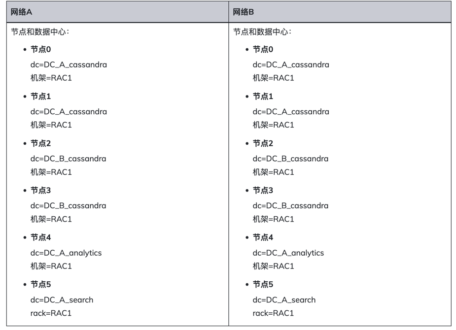

# 多网络接口配置

本文档暂未在生产环境验证，请谨慎使用。

多个网络或在云环境使用不同区域的时候配置Cassandra。

必须在cassandra.yaml文件和属性文件（cassandra-rackdc.properties或cassandra-topology.properties）中配置。

### 在云环境中为多个网络或跨区域配置cassandra.yaml

在多网络或跨区域的云环境下，数据中心之间的通信只能通过外部IP地址进行通信。外部IP地址使用 broadcast_address 设置在cassandra.yaml 文件中配置。

以下是cassandra.yaml 文件内的内容
----
# Address to broadcast to other Cassandra nodes
# Leaving this blank will set it to the same value as listen_address
# broadcast_address: 1.2.3.4
----
大概意思就是这是个多播地址的配置，如果留空，就是和listen_address的配置相同。

每个节点配置如下：

. 在cassandra.yaml中，将listen_address设置为节点的私有IP地址，将broadcast_address设置为节点公有地址。这允许Cassandra节点绑定到另一个网络或区域中的节点，从而支持多个数据中心。对于网内或区域流量。Cassandra在建立连接后会自动切换到私有IP。
+
. 在cassandra.yaml文件配置seeds为公网IP。私有IP在互联网不可以路由。举例：
+
----
seeds: 公网ip1，公网ip2
----

. 确保storage_port或ssl_storage_port在防火墙上打开

### 如果是非亚马逊EC2的附加cassandra.yaml配置

如果在非EC2实现使用多个网络接口，需要启用listen_on_broadcast_address
+
----
# When using multiple physical network interfaces, set this
# to true to listen on broadcast_address in addition to
# the listen_address, allowing nodes to communicate in both
# interfaces.
# Ignore this property if the network configuration automatically
# routes  between the public and private networks such as EC2.
listen_on_broadcast_address: true
----
+
当使用多个物理网络接口时，设置此参数为true将监听broadcast_address和listen_address两个接口。在非EC2环境中，不会自动启用公有地址到私有地址的路由。

### 为多个网络配置snitch
数据中心之间通信只能使用 broadcast_address(公网IP)。
建议将GossipingPropertyFileSnitch用于生产。cassandra-rackdc.properties 文件定义了这个snitch使用的数据中心。启用该选项prefer_local以确保到的流量broadcast_address将重新路由到 listen_address。
+
对于网络中的每个节点，在 cassandra-rackdc.properties文件中指定其数据中心。
+
在下面的示例中，有两个 cassandra 数据中心，每个数据中心都以其工作负载命名。本示例中的数据中心命名约定基于工作负载。您可以使用其他约定，例如 DC1、DC2 或 100、200。（数据中心名称区分大小写。）
+
官方举例:

### 为云环境跨区域通信配置snitch
在云部署中，区域名称被视为数据中心名称，可用性区域被视为数据中心内的机架。例如，如果节点位于us-east-1区域，则us-east是数据中心名称，1是机架位置。（机架对于分发副本很重要，但对于数据中心命名并不重要。）
+
在下面的示例中，有两个 cassandra 数据中心，每个数据中心都以其工作负载命名。本示例中的数据中心命名约定基于工作负载。您可以使用其他约定，例如 DC1、DC2 或 100、200。（数据中心名称区分大小写。）
+
对于每个节点，在 cassandra-rackdc.properties中指定其数据中心。dc_suffix选项 定义了告密者使用的数据中心。忽略任何其他行。

官方举例：

### 节点加密

因为使用的互联网的公网IP，所以必须要启用加密和身份认证。另一种方法是可以考虑在两个区域使用VPN。

节点到节点的加密使用SSL(安全套接字) 保护集群中节点之间传输的数据，包括gossip通信。

. 准备证书

. 配置
+
在每个节点启用server_encryption_options

修改 cassandra.yaml 的如下设置：

对于生产集群:
----
server_encryption_options:
    internode_encryption: all
    keystore: /usr/local/lib/cassandra/conf/server-keystore.jks
    keystore_password: myKeyPass
    truststore: /usr/local/lib/cassandra/conf/server-truststore.jks
    truststore_password: truststorePass
    # More advanced defaults below:
    protocol: TLS
    algorithm: SunX509
    store_type: JKS
    cipher_suites: [TLS_RSA_WITH_AES_256_CBC_SHA]
    require_client_auth: true
----

此项设置使用自签名CA准备的证书。

对于开发集群：
----
server_encryption_options:
    internode_encryption: all
    keystore: /conf/keystore.node0
    keystore_password: cassandra
    truststore: /conf/truststore.node0
    truststore_password: cassandra
    # More advanced defaults below:
    protocol: TLS
    algorithm: SunX509
    store_type: JKS
    cipher_suites: [TLS_RSA_WITH_AES_256_CBC_SHA]
    require_client_auth: true
----

. 重启Cassandra ，让更改生效。

. 检查日志查看是否已经启动SSL加密,在linux上，使用grep命令：
----
grep SSL install_location /logs/system.log
----

可以看到类似的日志：
----
INFO  [main] 2016-09-12 18:34:14,478 MessagingService.java:511 - Starting Encrypted Messaging Service on SSL port 7001
----

