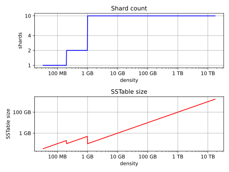

<!--
# Licensed to the Apache Software Foundation (ASF) under one
# or more contributor license agreements.  See the NOTICE file
# distributed with this work for additional information
# regarding copyright ownership.  The ASF licenses this file
# to you under the Apache License, Version 2.0 (the
# "License"); you may not use this file except in compliance
# with the License.  You may obtain a copy of the License at
#
#     http://www.apache.org/licenses/LICENSE-2.0
#
# Unless required by applicable law or agreed to in writing, software
# distributed under the License is distributed on an "AS IS" BASIS,
# WITHOUT WARRANTIES OR CONDITIONS OF ANY KIND, either express or implied.
# See the License for the specific language governing permissions and
# limitations under the License.
-->

# Unified compaction strategy (UCS)

This is a new compaction strategy that unifies tiered and leveled compaction strategies, adds sharding, lends itself to
be reconfigured at any time and forms the basis for future compaction improvements including automatic adaptation to the
workload.

The strategy is based on two observations:

- that tiered and levelled compaction can be generalized as the same thing if one observes that both form
  exponentially-growing levels based on the size of sstables (or non-overlapping sstable runs) and trigger a
  compaction when more than a given number of sstables are present on one level;
- that instead of "size" in the description above we can use "density", i.e. the size of an sstable divided by
  the width of the token range it covers, which permits sstables to be split at arbitrary points when the output
  of a compaction is written and still produce a levelled hierarchy.

UCS groups sstables in levels based on the logarithm of the sstable density, with
the fanout factor $f$ as the base of the logarithm, and with each level triggering a compaction as soon as it has
$t$ overlapping sstables. The choice of the parameters $f$ and $t$, and of a minimum sstable size, determines the
behaviour of the strategy. This allows users to choose a levelled strategy by setting $t=2$, or a tiered strategy by
choosing $t=f$. Because the two options are mutually exclusive, meet at $f=2$ and form a space of options for choosing
different ratios of read amplification (RA) vs write amplification (WA) (where levelled compaction improves reads at
the expense of writes and approaches a sorted array as $f$ increases, and tiered compaction favors writes at the
expense of reads and approaches an unsorted log as $f$ increases), we combine the two parameters into one integer
value, $w$, and set them to be:

* If $w < 0$ then $f = 2 - w$ and $t = 2$. This means leveled compactions, high WA but low RA.
  We write this as L*f* (e.g. L10 for $w = -8$).
* If $w > 0$ then $f = 2 + w$ and $t = f$. This means tiered compactions, low WA but high RA.
  We write this as T*f* (e.g. T4 for $w = 2$).
* If $w = 0$ then $f = t = 2$. This is the middle ground, leveled and tiered compactions behave identically.
  We write this as N.

Further, UCS permits the value of $w$ to be defined separately for each level, and thus levels can have different
behaviours. For example level zero could use tiered compaction (STCS-like) but higher levels could switch to levelled
(LCS-like) with increasing levels of read optimization.

The strategy splits sstables at specific shard boundaries whose number grows with the density of an sstable, and
uses the non-overlap between sstables created by this splitting to be able to perform compactions concurrently.

## Size-based levels

Let's ignore density and splitting for a while and explore more closely how sstables are grouped into levels if
they are never split.

For a fixed fanout factor $f$ and a memtable flush size $m$, calculated as the average size of the runs of sstables
written when a memtable is flushed and intended to form a base of the hierarchy where all newly-flushed sstables end
up, the level $L$ for an sstable of size $s$ is calculated as follows:

$$
L = 
\begin{cases}
\left \lfloor \log_f {\frac s m} \right \rfloor & \text{if } s \ge m \\
0 & \text{otherwise}
\end{cases}
$$

This means that sstables are assigned to levels as follows:

| Level | Min sstable size | Max sstable size  |
| ----- | ---------------- | ----------------- |
| 0     | 0                | $m \cdot f$       |
| 1     | $m \cdot f$      | $m \cdot f^2$     |
| 2     | $m \cdot f^2$    | $m \cdot f^3$     |
| 3     | $m \cdot f^3$    | $m \cdot f^4$     |
| ...   | ...              | ...               |
| n     | $m \cdot f^n$    | $m \cdot f^{n+1}$ |

If we define $t$ as the number of sstables in a level that triggers a compaction, then:

* $t = 2$ means the strategy is using a leveled merged policy. An sstable enters level $n$ with size $\ge mf^n$.
  When another sstable enters (also with size $\ge mf^n$) they compact and form a new table with size
  $\sim 2mf^n$, which keeps the result in the same level for $f > 2$. After this repeats at least $f-2$
  more times (i.e. $f$ tables enter the level altogether), the compaction result grows to $\ge  mf^{n+1}$
  and enters the next level.
* $t = f$ means the strategy is using a tiered merge policy. After $f$ sstables enter level $n$, each of size
  $\ge mf^n$, they are compacted together, resulting in an sstable of size $\ge mf^{n+1}$ which belongs to the next
  level.

Note that the above ignores overwrites and deletions. Given knowledge of the expected proportion of overwrites/deletion,
they can also be accounted for (this is implemented but not exposed at this time).

For leveled strategies, the write amplification will be proportional to $f-1$ times the number of levels whilst
for tiered strategies it will be proportional only to the number of levels. On the other hand, the read
amplification will be proportional to the number of levels for leveled strategies and to $f-1$ times the number
of levels for tiered strategies.

The number of levels for our size based scheme can be calculated by substituting the maximal dataset size $D$ in our
equation above, giving a maximal number of levels inversely proportional to the logarithm of $f$.

Therefore when we try to control the overheads of compaction on the database, we have a space of choices for the strategy
that range from:

* leveled compaction ( $t=2$ ) with high $f$ &mdash; low number of levels, high read efficiency, high write cost,
  moving closer to the behaviour of a sorted array as $f$ increases;
* compaction with $t = f = 2$ where leveled is the same as tiered and we have a middle ground with logarithmically
  increasing read and write costs;
* tiered compaction ( $t=f$ ) with high $f$ &mdash; very high number of sstables, low read efficiency and low write cost,
  moving closer to an unsorted log as $f$ increases.

This can be easily generalised to varying fan factors, by replacing the exponentiation with the product of the fan
factors for all lower levels:

| Level | Min sstable size            | Max sstable size                  |
| ----- | --------------------------- | --------------------------------- |
| 0     | 0                           | $m \cdot f_0$                     |
| 1     | $m \cdot f_0$               | $m \cdot f_0 \cdot f_1$           |
| 2     | $m \cdot f_0 \cdot f_1$     | $m \cdot f_0 \cdot f_1 \cdot f_2$ |
| ...   | ...                         | ...                               |
| n     | $m \cdot \prod_{i < n} f_i$ | $m \cdot \prod_{i\le n} f_i$      |

## Density levelling

If we replace the size $s$ in the previous paragraph with the density measure $d = s / v$ where $v$ is the fraction of
the token space that the sstable covers, all formulae and conclusions remain valid. However, we can now split the
output at arbitrary points and still make use of the results. For example, if we start with four sstables each spanning
a shard that covers 1/10 of the token space on a T4 level and compact them, splitting the output equally into four
sstables, the resulting sstables (provided no overwrite/deletion) will be of the same size as the input sstables, but
will now cover 1/40 of the token share each. As a result, they will now be interpreted to be four times as dense and
thus fall on the next level of the hierarchy (recall that the upper density limit for a level is $f$ times the lower).
If we can ensure that the split points are fixed (see below), when this repeats enough times for the next level to
receive sufficiently many sstables, we can start 4 independent compactions concurrently.

It is important to account for locally-owned token share when calculating $v$. Because vnodes mean that the local
token ownership of a node is not contiguous, the difference between the first and last token is not sufficient to
calculate token share &mdash; any non-locally-owned ranges must be excluded.

Using the density measure allows us to control the size of sstables through sharding, as well as to execute
compactions in parallel. With size levelling we could achieve parallelisation by pre-splitting the data in a fixed
number of compaction arenas (e.g. by using the data directories mechanism), but this requires the number of shards to be
predetermined and equal for all levels of the hierarchy, which still permits sstables to become too small or too large.
Large sstables complicate streaming and repair and increase the duration of compaction operations, pinning resources to
long-running operations and making it more likely that too many sstables will accumulate on lower levels of the
hierarchy.

Density levelling permits a much wider variety of splitting options including ones where the size of sstables can
be kept close to a selected target, and also allows UCS to understand the levelling structure of STCS (where size grows
with each level) as well as LCS (where token share shrinks with each level).

## Basic sharding scheme

Once density levelling is in place, we have a range of choices for splitting sstables. One is to simply split
when a certain output size is reached (like LCS), forming non-overlapping sstable runs instead of individual
sstables. Another is to split the token space into shards at predefined boundary points. A third hybrid option is
to split at predefined boundaries, but only if a certain minimum size has been reached.

Splitting only by size has the problem that individual sstables start at positions that vary, and if we need to
compact sstables split in this way we must either always start from the beginning and proceed to process the whole
level sequentially, or have some part of the data compacted/copied more times than necessary as any smaller selection
of sstables has to exclude some overlapping sstable. The other side of the latter problem is that some section of the
compacted token range will include fewer inputs, and will thus be sparser than the rest of the compaction output;
this will skew the density of the result, or need to be controlled by further splitting of the output. In the hybrid
option the same problem occurs less frequently but is still present.

To avoid these and permit concurrent compactions of all levels of the compaction hierarchy, we choose to predefine
boundary points for every compaction and always split sstables on these points. The number of the boundaries is
determined based on the density of the inputs and the estimated density of the result &mdash; as it grows higher
the number of boundaries is increased to keep the size of individual sstables close to a predefined target. By
only using power-of-two multiples of a specified base count (in other words, by only splitting shards in the
middle), we also ensure that any boundary that applies to a given output density also applies to all higher
densities.

More precisely, the user specifies two sharding parameters:

- base shard count $b$
- target sstable size $t$

At the start of every compaction, we estimate the density of the output $d$ and calculate a number of shards
$S$ to split the local token space into to be

$$
S = 
\begin{cases}
b 
  & \text{if } d < t b\\
2^{\left\lfloor \log_2 \left( {\frac d t \cdot \frac 1 b}\right)\right\rceil} \cdot b
  & \text{otherwise}
\end{cases}
$$

(where $\lfloor x \rceil$ stands for $x$ rounded to the nearest integer, i.e. $\lfloor x + 0.5 \rfloor$)

That is, we divide the density by the target size and round this to a power-of-two multiple of $b$.
We then generate $S - 1$ boundaries that split the local token space equally into $S$ shards, and split the result
of the compaction on these boundaries to form a separate sstable for each shard. This aims to produce sstable sizes that
fall between $t/\sqrt 2$ and $t\cdot \sqrt 2$.

For example, for a target sstable size of 100MiB and 4 base shards, a 200 MiB memtable will be split in four L0 shards
of roughly 50 MiB each, because ${\frac{200}{100} \cdot \frac 1 4} < 1$ and thus we get
the minimum of 4 shards, each spanning 1/4 of the token space. If in one of these shards we compact 6 of these 50 MiB
sstables, the estimated density of the output would be 1200 MiB $({6 \cdot 50 \mathrm{MiB}} / (1/4))$, which results in
a target ratio of $\frac{1200}{100} \cdot \frac 1 4 = 2^{\log_2 3}$, rounded to $2^2 \cdot 4$ shards for the whole
local token space, thus 4 for the 1/4 span that the compaction covers. Assuming no overwrites and
deletions, the resulting sstables will be of size 75 MiB, token share 1/16 and density 1200 MiB.

This sharding mechanism is independent of the compaction specification.

## Full sharding scheme

This sharding scheme easily admits extensions. In particular, when the size of the data set is expected to grow very
large, to avoid having to pre-specify a high enough target size to avoid problems with per-sstable overhead, we can
apply an "SSTtable growth" parameter, which determines what part of the density growth should be assigned to increased
SSTable size, reducing the growth of the number of shards (and hence non-overlapping sstables).

Additionally, to allow for a mode of operation with a fixed number of shards, and splitting conditional on reaching
a minimum size, we provide for a "minimum SSTable size" that reduces the base shard count whenever that would result
in SSTables smaller than the provided minimum.

Generally, the user can specify four sharding parameters:

- base shard count $b$
- target sstable size $t$
- minimum sstable size $m$
- sstable growth component $\lambda$

The number of shards $S$ for a given density $d$ is then calculated as

$$
S =
\begin{cases}
1
    & \text{if } d < m \\
min(2^{\left\lfloor \log_2 \frac d m \right\rfloor}, x)
    & \text{if } d < mb \text{, where } x \text{ is the largest power of 2 divisor of } b \\
b
    & \text{if } d < tb \\
2^{\left\lfloor (1-\lambda) \cdot \log_2 \left( {\frac d t \cdot \frac 1 b}\right)\right\rceil} \cdot b
    & \text{otherwise}
\end{cases}
$$

Some useful combinations of these parameters:

- The basic scheme above uses a sstable growth $\lambda=0$, and a minimum sstable size $m=0$. The graph below
  illustrates it for base shard count $b=4$ and target sstable size $t=1\mathrm{GB}$:

- Using $\lambda = 0.5$ makes the strategy grow the shard count and sstable size evenly. When the density
  quadruples, both the shard count and the expected sstable size for that density band will double. The example
  below uses $b=8$, $t=1\mathrm{GB}$ and also applies a minimal size $m=100\mathrm{MB}$:

- Similarly, $\lambda = 1/3$ makes the sstable growth the cubic root of the density growth, i.e. the sstable size
  grows with the square root of the growth of the shard count. The graph below uses $b=1$ and $t = 1\mathrm{GB}$
  (note: when $b=1$ the minimal size has no effect):

- A growth component of 1 constructs a hierarchy with exactly $b$ shards at every level. Combined with a minumum
  sstable size, this defines a mode of operation where we use a pre-specified
  number of shards, but split only after reaching a minimum size. Illustrated below for $b=10$ and $m=100\mathrm{MB}$
  (note: the target sstable size is irrelevant when $\lambda=1$):

## Choosing sstables to compact

The density levelling lets us separate sstables in levels defined by the compaction configuration's fan factors.
However, unlike in the size levelling case where sstables are expected to cover the full token space, we cannot use the
number of sstables on a level as a trigger as many of these sstables may be non-overlapping, i.e. not making read
queries less efficient. To deal with this, take advantage of sharding to perform multiple compactions on a level
concurrently, and reduce the size of individual compaction operations, we also need to separate non-overlapping
sections in different buckets, and decide what to do based on the number of overlapping sstables in a bucket.

To do this, we first form a minimal list of overlap sets that satisfy the following requirements:

- two sstables that do not overlap are never put in the same set;
- if two sstables overlap, there is a set in the list that contains both;
- sstables are placed in consecutive positions in the list.

The second condition can also be rephrased to say that for any point in the token range, there is a set in the list
that contains all sstables whose range covers that point. In other words, the overlap sets give us the maximum number
of sstables that need to be consulted to read any key, i.e. the read amplification that our trigger $t$ aims to
control. We don't calculate or store the exact spans the overlapping sets cover, only the participating sstables.
The sets can be obtained in $O(n\log n)$ time.

For example, if sstables A, B, C and D cover, respectively, tokens 0-3, 2-7, 6-9 and 1-8, the overlap sets we compute
are ABD and BCD. A and C don't overlap, so they must be in separate sets. A, B and D overlap at token 2 and must thus
be present in at least one set, and similarly for B, C and D at 7. Only A and D overlap at 1, but the set ABD already
includes this combination.

These overlap sets are sufficient to decide whether or not a compaction should be carried out &mdash; if and only if the
number of elements in a set is at least as large as $t$. However, we may need to include more sstables in the compaction
than this set alone.

It is possible for our sharding scheme to end up constructing sstables spanning differently-sized shards for the same
level. One clear example is the case of levelled compaction, where, for example, sstables enter at some density, and
after the first compaction the result &mdash; being 2x bigger than that density &mdash; is split in the middle because 
it has double the density. As another sstable enters the same level, we will have separate overlap sets for the first 
and second half of that older sstable; to be efficient, the compaction that is triggered next needs to select both.

To deal with this and any other cases of partial overlap, the compaction strategy will transitively extend
the overlap sets with all neighboring ones that share some sstable, constructing the set of all sstables that have some
chain of overlapping ones that connects it to the initial set[^1]. This extended set forms the compaction bucket.

In normal operation we compact all sstables in the compaction bucket. If compaction is very late we may apply a limit
on the number of overlapping sources we compact; in that case we use the collection of oldest sstables that would
select at most limit-many in any included overlap set, making sure that if an sstable is included in this compaction,
all older ones are also included to maintain time order.

## Selecting the compaction to run

Compaction strategies aim to minimize the read amplification of queries, which is defined by the number of sstables
that overlap on any given key. In order to do this most efficiently in situations where compaction is late, we select
a compaction bucket whose overlap is the highest among the possible choices. If there are multiple such choices, we 
choose one uniformly randomly within each level, and between the levels we prefer the lowest level (as this is expected 
to cover a larger fraction of the token space for the same amount of work).

Under sustained load, this mechanism prevents the accumulation of sstables on some level that could sometimes happen 
with legacy strategies (e.g. all resources consumed by L0 and sstables accumulating on L1) and can lead to a 
steady state where compactions always use more sstables than the assigned threshold and fan factor and maintain a tiered
hierarchy based on the lowest overlap they are able to maintain for the load.

## Major compaction

Under the working principles of UCS, a major compaction is an operation which compacts together all sstables that have
(transitive) overlap, and where the output is split on shard boundaries appropriate for the expected result density.

In other words, it is expected that a major compaction will result in $b$ concurrent compactions, each containing all
sstables covered in each of the base shards, and that the result will be split on shard boundaries whose number 
depends on the total size of data contained in the shard.

## Differences with STCS and LCS

Note that there are some differences between the tiered flavors of UCS (UCS-tiered) and STCS, and between the leveled
flavors of UCS (UCS-leveled) and LCS.

#### UCS-tiered vs STCS

SizeTieredCompactionStrategy is pretty close to UCS. However, it defines buckets/levels by looking for sstables of
similar size rather than a predefined banding of sizes. This can result in some odd selections of buckets, possibly
spanning sstables of wildly different sizes, while UCS's selection is more stable and predictable.

STCS triggers a compaction when it finds at least `min_threshold` sstables on some bucket, and it compacts between
`min_threshold` and `max_threshold` sstables from that bucket at a time. `min_threshold` is equivalent to UCS's
$t = f = w + 2$. UCS drops the upper limit as we have seen that compaction is still efficient with very large numbers of
sstables.

UCS makes use of the density measure to split results in order to keep the size of sstables and the length of
compactions low. Within a level it will only consider overlapping sstables when deciding whether the threshold is hit, 
and will independently compact sets of sstables that do not overlap.

If there are multiple choices to pick SSTables within a bucket, STCS groups them by size while UCS groups them by
timestamp. Because of that, STCS easily loses time order which makes whole table expiration less efficient.

#### UCS-leveled vs LCS

On a first glance LeveledCompactionStrategy looks very different in behaviour compared to UCS.

LCS keeps multiple sstables per level which form a sorted run of non-overlapping sstables of small fixed size. So
physical sstables on increasing levels increase in number (by a factor of `fanout_size`) instead of size. LCS does that
to reduce space amplification and to ensure shorter compaction operations. When it finds that the combined size of a
run on a level is higher than expected, it selects some sstables to compact with overlapping ones from the next level
of the hierarchy. This eventually pushes the size of the next level over its size limit and triggers higher-level
operations.

In UCS sstables on increasing levels increase in density (by a factor of $f$, see the **Size based levels** section
above). UCS-leveled triggers a compaction when it finds a second overlapping sstable on some sharded level. It compacts
the overlapping bucket on that level, and the result most often ends up on that level too, but eventually it reaches
sufficient size for the next level. Given an even data spread, this is the same time as a run in LCS would outgrow its
size, thus compactions are in effect triggered at the same time as LCS would trigger them.

The two approaches end up with a very similar effect, with the added benefits for UCS that compactions cannot affect
other levels like e.g. L0-to-L1 compactions in LCS can prevent any concurrent L1-to-L2 compactions, and that sstables
are structured in a way that can be easily switched to UCS-tiered or a different set of values for the UCS parameters.

Because the split positions of LCS sstables are based on size only and thus vary, when LCS selects sstables on the next
level to compact with, it must include some that only partially overlap, which tends to cause these sstables to be
compacted more often than strictly necessary. This is not acceptable if we need tight write amplification control (i.e.
this solution suits UCS-leveled, but not UCS-tiered and is thus not general enough for UCS). UCS deals with this by
splitting the run on specific boundaries selected before the compaction starts based on a file's density. As the
boundaries for a specific density are also boundaries for the next ones, whenever we select sstables to compact some
shard boundaries are shared, which guarantees that we can efficiently select higher-density sstables that exactly match
the span of the lower-density ones.

## Configuration

UCS accepts these compaction strategy parameters:

* **scaling_parameters**. A list of per-level scaling parameters, specified as L*f*, T*f*, N, or an integer value
  specifying $w$ directly. If more levels are present than the length of this list, the last value is used for all
  higher levels. Often this will be a single parameter, specifying the behaviour for all levels of the
  hierarchy.  
  Levelled compaction, specified as L*f*, is preferable for read-heavy workloads, especially if bloom filters are
  not effective (e.g. with wide partitions); higher levelled fan factors improve read amplification (and hence latency,
  as well as throughput for read-dominated workloads) at the expense of increased write costs.  
  Tiered compaction, specified as T*f*, is preferable for write-heavy workloads, or ones where bloom filters or
  time order can be exploited; higher tiered fan factors improve the cost of writes (and hence throughput) at the
  expense of making reads more difficult.  
  N is the middle ground that has the features of levelled (one sstable run per level) as well as tiered (one
  compaction to be promoted to the next level) and a fan factor of 2. This can also be specified as T2 or L2.  
  The default value is T4, matching the default STCS behaviour with threshold 4. To select an equivalent of LCS
  with its default fan factor 10, use L10.
* **target_sstable_size**. The target sstable size $t$, specified as a human-friendly size in bytes (e.g. 100 MiB =
  $100\cdot 2^{20}$ B or (10 MB = 10,000,000 B)). The strategy will split data in shards that aim to produce sstables
  of size between $t / \sqrt 2$ and $t \cdot \sqrt 2$.  
  Smaller sstables improve streaming and repair, and make compactions shorter. On the other hand, each sstable
  on disk has a non-trivial in-memory footprint that also affects garbage collection times.  
  Increase this if the memory pressure from the number of sstables in the system becomes too high.  
  The default value is 1 GiB.
* **base_shard_count**. The minimum number of shards $b$, used for levels with the smallest density. This gives the
  minimum compaction concurrency for the lowest levels. A low number would result in larger L0 sstables but may limit
  the overall maximum write throughput (as every piece of data has to go through L0). The base shard count only applies after `min_sstable_size` is reached. 
  The default value is 4 for all tables
* **sstable_growth** The sstable growth component $\lambda$, applied as a factor in the shard exponent calculation.
  This is a number between 0 and 1 that controls what part of the density growth should apply to individual sstable
  size and what part should increase the number of shards. Using a value of 1 has the effect of fixing the shard
  count to the base value. Using 0.5 makes the shard count and sstable size grow with the square root of the density
  growth.
  This is useful to decrease the sheer number of sstables that will be created for very large data sets. For
  example, without growth correction a data set of 10TiB with 1GiB target size would result in over 10k sstables,
  which may present as too much overhead both as on-heap memory used by per-sstable structures as well as time to look
  for intersecting sstables and tracking overlapping sets during compaction. Applying $\lambda=0.5$
  in this scenario (with base count 4) will reduce the potential number of sstables to ~160 of ~64GiB, which is still
  manageable both as memory overhead and individual compaction duration and space overhead. The balance between the
  two can be further tweaked by increasing $\lambda$ to get fewer but bigger sstables on the top level, and decreasing
  it to favour a higher count of smaller sstables. The default value is 0.333 meaning the sstable size
  grows with the square root of the growth of the shard count.
* **min_sstable_size** The minimum sstable size $m$, applicable when the base shard count will result is sstables
  that are considered too small. If set, the strategy will split the space into fewer than the base count shards, to
  make the estimated sstables size at least as large as this value. A value of 0 disables this feature.
  The default value is 100MiB.
* **expired_sstable_check_frequency_seconds**. Determines how often to check for expired SSTables.  
  The default value is 10 minutes.

In **cassandra.yaml**:

* **concurrent_compactors**. The number of compaction threads available. Higher values increase compaction performance
  but may increase read and write latencies.

[^1]: Note: in addition to TRANSITIVE, "overlap inclusion methods" of NONE and SINGLE are also implemented for
    experimentation, but they are not recommended for the UCS sharding scheme.
