<!---
 Licensed to the Apache Software Foundation (ASF) under one
 or more contributor license agreements.  See the NOTICE file
 distributed with this work for additional information
 regarding copyright ownership.  The ASF licenses this file
 to you under the Apache License, Version 2.0 (the
 "License"); you may not use this file except in compliance
 with the License.  You may obtain a copy of the License at
 
     http://www.apache.org/licenses/LICENSE-2.0
 
 Unless required by applicable law or agreed to in writing, software
 distributed under the License is distributed on an "AS IS" BASIS,
 WITHOUT WARRANTIES OR CONDITIONS OF ANY KIND, either express or implied.
 See the License for the specific language governing permissions and
 limitations under the License.
-->

# InMemoryTrie Design

The `InMemoryTrie` is one of the main components of the trie infrastructure, a mutable in-memory trie built for fast
modification and reads executing concurrently with writes from a single mutator thread.

The main features of its implementation are:
- full support of the `Trie` interface
- using nodes of several different types for efficiency
- support for content on any node, including intermediate (prefix)
- support for writes from a single mutator thread concurrent with multiple readers
- maximum trie size of 2GB

## Memory layout

One of the main design drivers of the memtable trie is the desire to avoid on-heap storage and Java object management.
The trie thus implements its own memory management for the structure of the trie (content is, at this time, still given
as Java objects in a content array). The structure resides in one `UnsafeBuffer` (which can be on or off heap as
desired) and is broken up in 32-byte "cells" (also called "blocks" in the code), which are the unit of allocation,
update and reuse.

Like all tries, `InMemoryTrie` is built from nodes and has a root pointer. The nodes reside in cells, but there is no
1:1 correspondence between nodes and cells - some node types pack multiple in one cell, while other types require
multiple cells.

### Pointers and node types

A "pointer" is an integer that points to a node in the trie buffer. A pointer specifies the location of the node
(its starting cell), but also defines the type of node in its 5 lowest-order bits (i.e. the offset within the cell).
If a pointer has a negative value, it refers to a value in the content array, and implies a leaf node with the specified
content. Additionally, the special pointer value `NONE` (0) is used to specify "no child". We use 32-bit integers as
pointers, therefore the size of the trie structure is limited to a little less than 2GB.

For example, the pointer `0x0109E` specifies a node residing in the cell at bytes `0x01080`-`0x0109F` in the buffer
(specified by the pointers' 27 leading bits), where the node type is `Sparse` (specified by `0x1E` in the last 5 bits).

The pointer `0xFFFFFFF0` specifies a leaf node (being negative), where the content's index is `0xF` (obtained by
negating all bits of the pointer).

To save space and reduce pointer chasing, we use several different types of nodes that address different common patterns
in a trie. It is common for a trie to have one or a couple of top levels which have many children, and where it is
important to make decisions with as few if-then-else branches as possible (served by the `Split` type), another one or
two levels of nodes with a small number of children, where it is most important to save space as the number of these
nodes is high (served by the `Sparse` type), and a lot of sequences of single-child nodes containing the trailing bytes
of the key or of some common key prefix (served by the `Chain` type). Most of the payload/content of the trie resides
at the leaves, where it makes sense to avoid taking any space for a node (the `Leaf` type), but we must also allow the
possibility for values to be present in intermediate nodes &mdash; because this is rare, we support it with a special
`Prefix` type instead of reserving a space for payload in all other node types.

The Split-Sparse-Chain-Leaf/Prefix pattern may repeat several times. For example, we could have these four layers for
the partition key with some metadata associated with the partition, then for the first component of the clustering key,
then for the second component etc.

The sections below specify the layout of each supported node type.

#### Leaf nodes

Leaf nodes do not have a corresponding cell in the buffer. Instead, they reference a value (i.e. a POJO in the
`InMemoryTrie`'s content type) in the content array. The index of the value is specified by `~pointer` (unlike `-x`,
`~x` allows one to also encode 0 in a negative number).

Leaf nodes have no children, and return the specified value for `content()`.

Example: -1 is a leaf cell with content `contentArray[0]`.

#### `Chain` nodes - single path, multiple transitions in one cell

Chain nodes are one-child nodes. Multiple chain nodes, forming a chain of transitions to one target, can reside in a
single cell. Chain nodes are identified by the lowest 5 bits of a pointer being between `0x00` and `0x1B`. In addition
to the type of node, in this case the bits also define the length of the chain &mdash; the difference between
`0x1C` and the pointer offset specifies the number of characters in the chain.

The simplest chain node has one transition leading to one child and is laid out like this:

offset|content|example
---|---|---
00 - 1A|unused|
1B     |character|41 A
1C - 1F|child pointer|FFFFFFFF

where the pointer points to the `1B` line in the cell.

Example: The cell `xxxxxxxx xxxxxxxx xxxxxxxx xxxxxxxx xxxxxxxx xxxxxxxx xxxxxx41 FFFFFFFF` at bytes `0x120`-`0x13F` and
pointer `0x13B` point to a node with one child with transition `0x41` `A` to a leaf node with content `contentArray[0]`.

Another chain cell, which points to this one, can be added in the same cell by placing a character at offset `1A`. This
new node is effectively laid out as

offset|content|example
---|---|---
00 - 19|unused|
1A     |character|48 H
1B - 1F|unused|

where the pointer points to line `1A`. This node has one transition, and the child pointer is implicit as the node's
pointer plus one.

This can continue until all the bytes in the "unused" area are filled.

Example: The cell `xxxxxxxx xxxxxxxx xxxxxxxx xxxxxxxx xxxxxxxx xxxxxxxx xx434841 FFFFFFFF` at bytes `0x120`-`0x13F` and
pointer `0x139` point to a node with one child with transition `0x43` `C` to a node with one child with transition
`0x48` `H` to a node with one child with transition `0x41` `A` to a leaf node with content `contentArray[0]`.

offset|content|example
---|---|---
00 - 18|unused|
19     |character|43 C
1A     |character|48 H
1B     |character|41 A
1C - 1F|child pointer|FFFFFFFF

In this example `0x13A` and `0x13B` are also valid pointers to the respective chains and could be referenced from other
nodes (an example will be given below). In any case, the byte pointed directly by the node pointer contains the
transition byte. The child pointer is either `pointer + 1` (if the lowest 5 pointer bits are less than `0x1B`), or the
integer stored at `pointer + 1` (if the pointer's last 5 bits are `0x1B`).

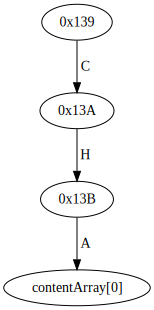

Note: offset `0x00` also specifies a chain node, but the pointer 0 is a special case and care must be taken to ensure no
28-byte chain node is placed in the cell at bytes `0x00`-`0x1F`.

#### `Sparse` nodes - between 2 and 6 children in one cell

Sparse nodes are used when a node has at least two children, and all pointers and transition characters can fit in one
cell, which limits the maximum number of children to 6. Their layout is:

offset|content|
---|---|
00 - 03|child pointer 0|
04 - 07|child pointer 1|
08 - 0B|child pointer 2|
0C - 0F|child pointer 3|
10 - 13|child pointer 4|
14 - 17|child pointer 5|
18     |character 0|
19     |character 1|
1A     |character 2|
1B     |character 3|
1C     |character 4|
1D     |character 5|
1E - 1F|order word|

where the pointer points to the line `1E` (i.e. the type identifier for a sparse node is `0x1E`).

It is important to note that the pointers and characters are not in order. This is done so that an update to a sparse
node where a new child is inserted can be done while the previous state of the node is still valid and readable for
any concurrent readers. Instead, new children are appended, and the order is maintained in the "order word". This word
is a number whose digits specify the order of the children's transition characters (where higher-order digits specify
bigger characters) encoded, to be able to fit into a 16-bit word, in base 6. Its number of digits also specifies the
number of children of the node.

To explain this better, we will give an example of the evolution of a sparse node. Suppose we had the `0x139` node from
the previous section, and some update needs to attach a second child to that, e.g. with the character `A` and child
`0x238`.

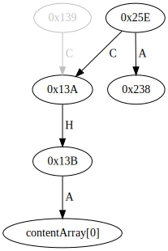

To do this, the mutating thread will have to convert the chain node into a sparse by allocating a new cell
(e.g. `0x240`-`0x25F`) and filling in the sparse node `00000238 0000013A 00000000 00000000 00000000 00000000 41430000
00000006` with pointer `0x25E`:

offset|content|example
---|---|---
00 - 03|child pointer 0| 00000238
04 - 07|child pointer 1| 0000013A
08 - 17|unused|
18     |character 0| 41 A
19     |character 1| 43 C
1A - 1D|unused|
1E - 1F|order word, always 10| 0006 = 10 (base 6)

This is the smallest kind of sparse node, with just two children. Two-children sparse nodes always
put their two children in order (we can do this as this does not happen in response to an addition of a new child to
an existing sparse node, but this is constructed directly) and thus their order word is always 10 (if they were
not in order, the order word would have to be 01, which would be misinterpreted as the single-digit 1).

This node has two (the number of digits in the order word) children. The first child is at the position specified by the
least significant digit of the order word, 0. The second child is specified by the second least significant digit, 1.

Suppose we then need to add a new child, using character `0x35` `5` and child `0x33B`. The node will change to `00000238
0000013A 0000033B 00000000 00000000 00000000 41433500 00000026` and the pointer to it stays the same.

offset|content|example
---|---|---
00 - 03|child pointer 0| 00000238
04 - 07|child pointer 1| 0000013A
08 - 0B|child pointer 2| 0000033B
0C - 17|unused|
18     |character 0| 41 A
19     |character 1| 43 C
1A     |character 2| 35 5
1B - 1D|unused|
1E - 1F|order word| 0026 = 102 (base 6)

This node has three (the number of digits in the order word) children. The first child is at the position specified by
the least significant digit of the order word, 2. The second child is specified by the second least significant digit,
0, and the last child is specified by the leading digit, 1.

Note that because of the ordering of the two children in the smallest sparse node, the digit 0 is always preceded by a
more-significant 1 in the order word in base 6. Therefore the leading digit of the order word can never be 0 and thus we
cannot miscount the number of children.

The addition of children can continue until we have 6, for example `00000238 0000013A 0000033B 0000035C 0000037A
0000041B 41433542 50338129` (pointer `0x25E`) for

offset|content|example
---|---|---
00 - 03|child pointer 0| 00000238
04 - 07|child pointer 1| 0000013A
08 - 0B|child pointer 2| 0000033B
0C - 0F|child pointer 3| 0000035C
10 - 13|child pointer 4| 0000037A
14 - 17|child pointer 5| 0000041B
18     |character 0| 41 A
19     |character 1| 43 C
1A     |character 2| 35 5
1B     |character 3| 42 B
1C     |character 4| 50 P
1D     |character 5| 33 3
1E - 1F|order word| 8129 = 413025 (base 6)

Beyond 6 children, a node needs to be converted to split.

#### `Split` nodes - up to 256 children in multiple cells

Split nodes are used to handle the nodes with a large number of children. We can only allocate cells of 32 bytes, thus
we have to distribute the child transitions among cells in some way that is efficient for reading and updating. The
method we chose is to construct a "mini-trie" with 2-3-3 bit transitions.

A split node is identified by the `0x1C` offset. The starting cell of a split node has this layout:

offset|content|
---|---|
00 - 0F|unused|
10 - 13|mid-cell for leading 00|
14 - 17|mid-cell for leading 01|
18 - 1B|mid-cell for leading 10|
1C - 1F|mid-cell for leading 11|

(pointers to this node point to the `1C` line) and where each mid-cell contains:

offset|content|
---|---|
00 - 03|end-cell for middle 000|
04 - 07|end-cell for middle 001|
08 - 0B|end-cell for middle 010|
0C - 0F|end-cell for middle 011|
10 - 13|end-cell for middle 100|
14 - 17|end-cell for middle 101|
18 - 1B|end-cell for middle 110|
1C - 1F|end-cell for middle 111|

and end-cell:

offset|content|
---|---|
00 - 03|pointer to child for ending 000|
04 - 07|pointer to child for ending 001|
08 - 0B|pointer to child for ending 010|
0C - 0F|pointer to child for ending 011|
10 - 13|pointer to child for ending 100|
14 - 17|pointer to child for ending 101|
18 - 1B|pointer to child for ending 110|
1C - 1F|pointer to child for ending 111|

In any of the cell or pointer positions we can have `NONE`, meaning that such a child (or block of children) does not
exist. At minimum, a split node occupies 3 cells (one leading, one mid and one end), and at maximum &mdash;
`1 + 4 + 4*8 = 37` cells i.e. `1184` bytes. If we could allocate contiguous arrays, a full split node would use `1024`
bytes, thus this splitting can add ~15% overhead. However, real data often has additional structure that this can make
use of to avoid creating some of the blocks, e.g. if the trie encodes US-ASCII or UTF-encoded strings where some
character ranges are not allowed at all, and others are prevalent. Another benefit is that to change a transition while
preserving the previous state of the node for concurrent readers we have to only copy three blocks and not the entire
range of children (applications of this will be given later).

As an example, suppose we need to add a `0x51` `Q` transition to `0x455` to the 6-children sparse node from the previous
section. This will generate the following structure:

Leading cell (e.g. `0x500`-`0x51F` with pointer `0x51C`)

offset|content|example
---|---|---
00 - 0F|unused|
10 - 13|mid-cell for leading 00|0000053C
14 - 17|mid-cell for leading 01|0000057C
18 - 1B|mid-cell for leading 10|00000000 NONE
1C - 1F|mid-cell for leading 11|00000000 NONE

Mid cell `00` at `0x520`-`0x53F`:

offset|content|example
---|---|---
00 - 03|end-cell for middle 000|00000000 NONE
04 - 07|end-cell for middle 001|00000000 NONE
08 - 0B|end-cell for middle 010|00000000 NONE
0C - 0F|end-cell for middle 011|00000000 NONE
10 - 13|end-cell for middle 100|00000000 NONE
14 - 17|end-cell for middle 101|00000000 NONE
18 - 1B|end-cell for middle 110|0000055C
1C - 1F|end-cell for middle 111|00000000 NONE

End cell `00 110` at `0x540`-`0x55F`:

offset|content|example
---|---|---
00 - 03|pointer to child for ending 000|00000000 NONE
04 - 07|pointer to child for ending 001|00000000 NONE
08 - 0B|pointer to child for ending 010|00000000 NONE
0C - 0F|pointer to child for ending 011|0000041B
10 - 13|pointer to child for ending 100|00000000 NONE
14 - 17|pointer to child for ending 101|0000033B
18 - 1B|pointer to child for ending 110|00000000 NONE
1C - 1F|pointer to child for ending 111|00000000 NONE

Mid cell `01` at `0x560`-`0x57F`:

offset|content|example
---|---|---
00 - 03|end-cell for middle 000|0000059C
04 - 07|end-cell for middle 001|00000000 NONE
08 - 0B|end-cell for middle 010|000005BC
0C - 0F|end-cell for middle 011|00000000 NONE
10 - 13|end-cell for middle 100|00000000 NONE
14 - 17|end-cell for middle 101|00000000 NONE
18 - 1B|end-cell for middle 110|00000000 NONE
1C - 1F|end-cell for middle 111|00000000 NONE

End cell `01 000` at `0x580`-`0x59F`:

offset|content|example
---|---|---
00 - 03|pointer to child for ending 000|00000000 NONE
04 - 07|pointer to child for ending 001|00000238
08 - 0B|pointer to child for ending 010|0000035C
0C - 0F|pointer to child for ending 011|0000013A
10 - 13|pointer to child for ending 100|00000000 NONE
14 - 17|pointer to child for ending 101|00000000 NONE
18 - 1B|pointer to child for ending 110|00000000 NONE
1C - 1F|pointer to child for ending 111|00000000 NONE

End cell `01 010` at `0x5A0`-`0x5BF`:

offset|content|example
---|---|---
00 - 03|pointer to child for ending 000|0000037A
04 - 07|pointer to child for ending 001|00000455
08 - 0B|pointer to child for ending 010|00000000 NONE
0C - 0F|pointer to child for ending 011|00000000 NONE
10 - 13|pointer to child for ending 100|00000000 NONE
14 - 17|pointer to child for ending 101|00000000 NONE
18 - 1B|pointer to child for ending 110|00000000 NONE
1C - 1F|pointer to child for ending 111|00000000 NONE

To find a child in this structure, we follow the transitions along the bits of the mini-trie. For example, for `0x42`
`B` = `0b01000010` we start at `0x51C`, take the `01` pointer to `0x57C`, then the `000` pointer to `0x59C` and finally
the `010` index to retrieve the node pointer `0x35C`. Note that the intermediate cells (dashed in the diagram) are not
reachable with pointers, they only make sense as substructure of the split node.

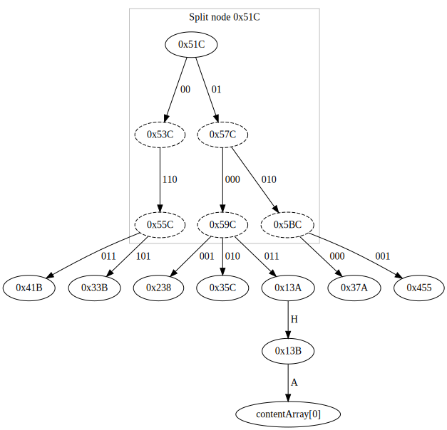

#### Content `Prefix`

Prefix nodes are not nodes in themselves, but they add information to the node they lead to. Specifically, they
encode an index in the content array, and a pointer to the node to which this content is attached. In anything other
than the content, they are equivalent to the linked node &mdash; i.e. a prefix node pointer has the same children as
the node it links to (another way to see this is as a content-carrying node is one that has an _ε_ transition to the
linked node and no other features except added content). We do not allow more than one prefix to a node (i.e. prefix
can't point to another prefix), and the child of a prefix node cannot be a leaf.

There are two types of prefixes:
- standalone, which has a full 32-bit pointer to the linked node
- embedded, which occupies unused space in `Chain` or `Split` nodes and specifies the 5-bit offset within the same cell
of the linked node

Standalone prefixes have this layout:

offset|content|example
---|---|---
00 - 03|content index|00000001
04|standalone flag, 0xFF|FF
05 - 1B|unused|
1C - 1F|linked node pointer|0000025E

and pointer offset `0x1F`. The sample values above will be the ones used to link a prefix node to our `Sparse`
example, where a prefix cannot be embedded as all the bytes of the cell are in use.

If we want to attach the same prefix to the `Split` example, we will place this

offset|content|example
---|---|---
00 - 03|content index|00000001
04|embedded offset within cell|1C
05 - 1F|unused|

_inside_ the leading split cell, with pointer `0x1F`. Since this is an embedded node, the augmented one resides within
the same cell, and thus we need only 5 bits to encode the pointer (the other 27 are the same as the prefix's).
The combined content of the cell at `0x500-0x51F` will then be `00000001 1C000000 00000000 00000000 00000520 00000560
00000000 00000000`:

offset|content|example
---|---|---
00 - 03|content index|00000001
04|embedded offset within cell|1C
05 - 0F|unused|
10 - 13|mid-cell for leading 00|00000520
14 - 17|mid-cell for leading 01|00000560
18 - 1B|mid-cell for leading 10|00000000 NONE
1C - 1F|mid-cell for leading 11|00000000 NONE

Both `0x51C` and `0x51F` are valid pointers in this cell. The former refers to the plain split node, the latter to its
content-augmented version. The only difference between the two is the result of a call to `content()`.

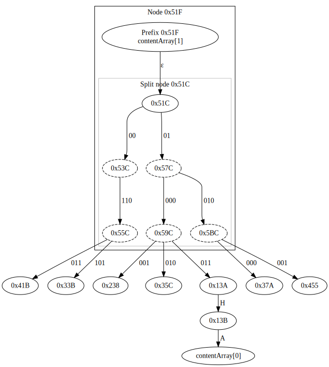

## Reading a trie

`InMemoryTrie` is mainly meant to be used as an implementation of `Trie`. As such, the main method of retrieval of
information is via some selection (i.e. intersection) of a subtrie followed by a walk over the content in this
subtrie. Straightforward methods for direct retrieval of data by key are also provided, but they are mainly for testing.

The methods for iterating over and transforming tries are provided by the `Trie` interface and are built on the cursor
interface implemented by `InMemoryTrie` (see `Trie.md` for a description of cursors).

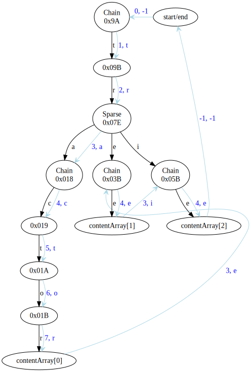

(Edges in black show the trie's structure, and the ones in light blue the path the cursor walk takes.)

### Cursors over `InMemoryTrie`

`InMemoryTrie` implements cursors using arrays of integers to store the backtracking state (as the simplest
possible structure that can be easily walked and garbage collected). No backtracking state is added for `Chain` or 
`Leaf` nodes and any prefix. For `Sparse` we store the node address, depth and the remainder of the sparse order word.
That is, we read the sparse order word on entry, peel off the next index to descend and store the remainder. When we 
backtrack to the node we peel off another index -- if the remainder becomes 0, there are no further children and the 
backtracking entry can be removed.

For `Split` nodes we store one entry per split node cell. This means:
- one entry for the head cell with address, depth and next child bits `0bHH000000` where HH is between 1 and 3
- one entry for the mid cell with address, depth and next child bits `0bHHMMM000` where MMM is between 1 and 7
- one entry for the tail cell with address, depth and next child bits `0bHHMMMTTT` where TTT is between 1 and 7

On backtracking we recognize the sublevel by the position of the lowest non-zero bit triple. For example, if the last
three are not `0b000`, this is a tail cell, we can advance in it and use the HHMMM bits to form the transition byte.

This substructure is a little more efficient than storing only one entry for the split node (the head-to-mid and 
mid-to-tail links do not need to be followed for every new child) and also allows us to easily get the precise next 
child and remove the backtracking entry when a cell has no further children.

`InMemoryTrie` cursors also implement `advanceMultiple`, which jumps over intermediate nodes in `Chain` blocks:

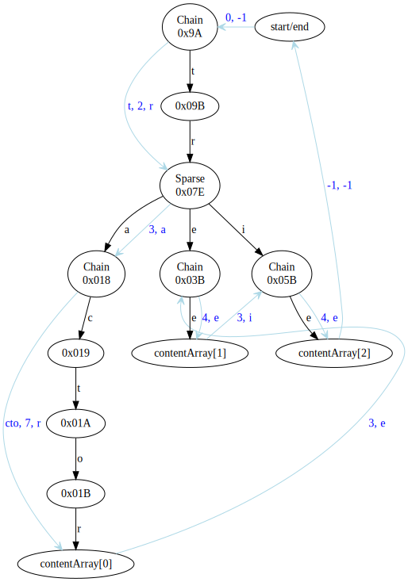

## Mutation

Mutation of `InMemoryTrie` must be done by one thread only (for performance reasons we don't enforce it, the user must
make sure that's the case), but writes may be concurrent with multiple reads over the data that is being mutated. The
trie is built to support this by making sure that any modification of a node is safe for any reader that is operating
concurrently.

The main method for mutating a `InMemoryTrie` is `apply`, which merges the structure of another `Trie` in. 
`InMemoryTrie` also provides simpler recursive method of modification, `putRecursive`, which creates a single 
`key -> value` mapping in the trie. We will describe the mutation process starting with a `putRecursive` example.

### Adding a new key -> value mapping using `putRecursive`

Suppose we want to insert the value `traverse` into the trie described in the previous paragraph. The recursive
insertion process walks the trie to find corresponding existing nodes for the ones in the path to be inserted.
When it has to leave the existing trie, because it has no entries for the path, the process continues using `NONE` as
the trie node.

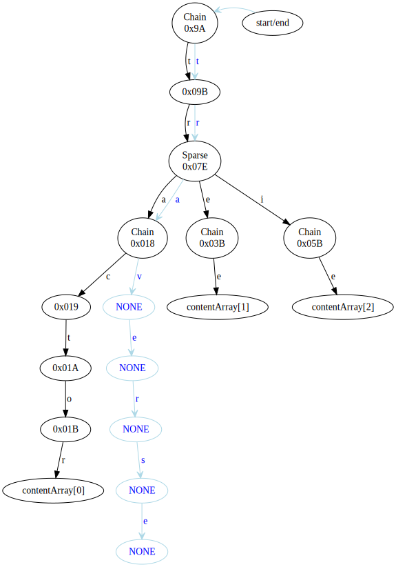

When it reaches the end of the path, it needs to attach the value. Unless this is a prefix of an existing entry, the 
matching trie node will either be `NONE` or a leaf node. Here it's `NONE`, so we create a item in the
content array, `contentArray[3]`, put the value in it, and thus form the leaf node `~3` (`0xFFFFFFFC`). The recursive
process returns this to the previous step.

The previous step must attach a child with the transition `e` to the node `NONE`. Since this is a new node, we do this
by creating a new `Chain` node at address `0x0BB` mapping `e` to `~3` and return that. For the node above, we again
need to attach a child to `NONE`, but this time the child is a `Chain` node, so we can do this by expanding it, i.e.
writing the new character at the address just before the child pointer, and returning that address (note that the
child chain node is newly created, so we can't be overwriting any existing data there). We can do this several more
times.

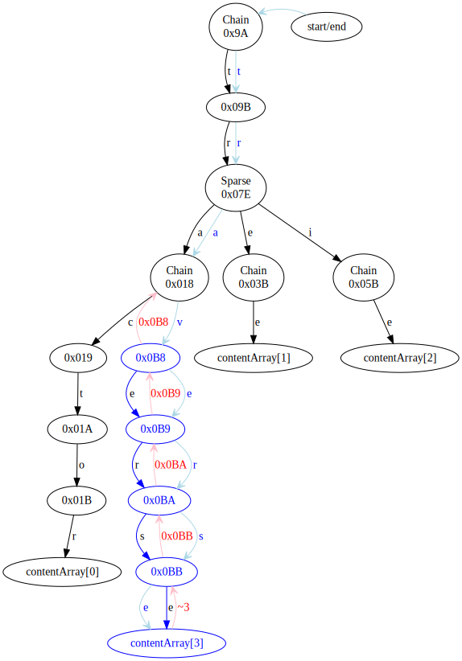

(Light blue specifies the descent path, pink
the values returned, blue stands for newly-created nodes and links, and
light gray for obsoleted nodes and links.)

In the next step we must attach the child `0x0B8` with transition `v` to the existing `Chain` node `0x018`. This is a
different transition from the one that node already has, so the change cannot be accommodated by a node of type `Chain`,
thus we need to copy this into a new `Sparse` node `0x0DE` with two children, the existing `c -> 0x019` and the new
`v -> 0x0B8` and return `0x0DE` to the parent step.

The parent step must then change its existing pointer for the character `a` from `0x018` to `0x0DE` which it can do in
place by writing the new value in its pointer cell for `a`. This is the attachment point for the newly created
substructure, i.e. before this, the new nodes were not reachable, and now become reachable; before this, the node
`0x018 ` was reachable, and now becomes unreachable. The attachment is done by a volatile write, to enforce a 
happens-before relationship that makes sure that all the new substructure (all written by this thread) is fully readable
by all readers who pass through the new pointer (which is the only way they can reach it). The same happens-before also 
ensures that any new readers cannot reach the obsoleted nodes (there may be existing reader threads that are already in 
them).

It can then return its address `0x07E` unchanged up, and no changes need to be done in any of the remaining steps. The
process finishes in a new value for `root`, which in this case remains unchanged.

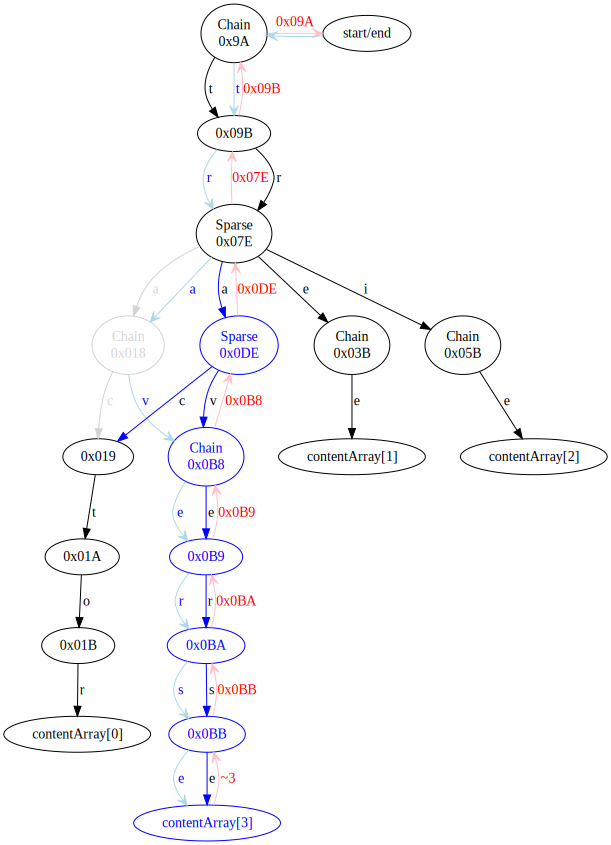

The process created a few new nodes (in blue), and made one obsolete (in grey). What concurrent readers can see depends
on where they are at the time the attachment point write is done. Forward traversals, if they are in the path below
`0x07E`, will continue working with the obsoleted data and will not see any of the new changes. If they are above
`0x07E`, they will see the updated content. If they are _at_ the `0x07E` node, they may see either, depending on the
time they read the pointer for `a`. Reverse traversals that happen to be in the region to the right of the new nodes
_will_ see the updated content, as they will read the pointer after it has been updated.

In any case, the obsolete paths remain correct and usable for any thread that has already reached them, and the new
paths are correct and usable from the moment they become reachable.

Note that if we perform multiple mutations in sequence, and a reader happens to be stalled between them (in iteration
order), such reader may see only the mutation that is ahead of it _in iteration order_, which is not necessarily the
mutation that happened first. For the example above, if we also inserted `trespass`, a reader thread that was paused
at `0x018` in a forward traversal and wakes up after both insertions have completed will see `trespass`, but _will not_
see `traverse` even though it was inserted earlier.

### In-place modifications

When the backtracking process returns with a new mapping, there are several cases when we can apply a change in place
(creating an attachment point for the new path). We will explain these in detail, as it is important to understand what
exactly happens from concurrent readers' point of view in all of them.

Note that if a modification cannot be done in place, we copy the content to a new node. The copied node is always
unreachable and there will always be an attachment point that makes it reachable somewhere in the parent chain.

#### Changing the child pointer of the last `Chain` node in a chain

This happens when the existing transition matches the transition of the new character, but the pointer is different,
and only applies to `Chain` nodes whose offset is `0x1B`. In this case the child pointer is written at offset `0x1C`,
and we can put in the new value by performing a volatile write.

For example, updating `N -> 0x39C` is accomplished by making the volatile write:

offset|content|before|after
---|---|---|---
00-1A|irrelevant||
1B|character|N|N
1C-1F|pointer|0000031E|_**0000039C**_

(Here and below normal writes are in bold and volatile writes in bold italic.)

Readers have to read the pointer to reach the child (old or new), so this achieves the happens-before guarantees we
seek. Readers either see the old value (where none of the branch's data has been modified in any way), or the new value
(where the happens-before guarantees all writes creating the attached substructure are fully visible).

Note that if the node is not the last in the chain, the pointer is implicit and we cannot change it. Thus we have
to copy, i.e. create a new node, which in this case will also be a `Chain` node, because there is nothing else in the
original node that needs to be preserved (the only existing transition is replaced by the update).

#### Changing the child pointer of a `Sparse` or `Split` node

Similarly to above, in this case the transition matches an existing one, and thus we already have a 4-byte location
where the pointer to the old child is written, and we can update it by doing a volatile write.

For example, updating `C -> 0x51E` in a sparse node can be:

offset|content|before|after
---|---|---|---
00 - 03|child pointer 0| 00000238|00000238
04 - 07|child pointer 1| 0000013A|_**0000051E**_
08 - 0B|child pointer 2| 0000033B|0000033B
0C - 17|unused|
18     |character 0| 41 A|41 A
19     |character 1| 43 C|43 C
1A     |character 2| 35 5|35 5
1B - 1D|unused|
1E - 1F|order word| 0026 = 102 (base 6)

#### Adding a new child to `Split`

If we already have the substructure that leads to the pointer for the new transition (i.e. a mid- and end-cell for the
transition's first 2-3 bits already exists), the situation is as above, where the existing pointer is `NONE`, and we can
simply perform a volatile write.

If an end-cell mapping does not exist, we allocate a new cleared cell (so that all pointers are `NONE`), write the new
pointer at its position using a non-volatile write, and then create a mapping to this end-cell in the mid cell by
volatile writing its pointer over the `NONE` in the correct offset. Similarly, if there's no mid-cell either, we create
empty end-cell and mid-cell, write pointer in end-cell and mapping in mid-cell non-volatile, and write the mapping in
the leading cell volatile.

In any of these cases, readers have to pass through the volatile update to reach any of the new content.

For example, to add `x -> 0x71A` (`x` is `0x78` or `0b01111000`) to the split node example needs a new end cell for
`01 111` (for example at `0x720-0x73F`) (these writes can be non-volatile):

offset|content|before|after
---|---|---|---
00 - 03|pointer to child for ending 000|n/a|**0000071A**
04 - 07|pointer to child for ending 001|n/a|**00000000** NONE
08 - 0B|pointer to child for ending 010|n/a|**00000000** NONE
0C - 0F|pointer to child for ending 011|n/a|**00000000** NONE
10 - 13|pointer to child for ending 100|n/a|**00000000** NONE
14 - 17|pointer to child for ending 101|n/a|**00000000** NONE
18 - 1B|pointer to child for ending 110|n/a|**00000000** NONE
1C - 1F|pointer to child for ending 111|n/a|**00000000** NONE

and this volatile write to the mid cell `0x520`:

offset|content|before|after
---|---|---|---
00 - 03|end-cell for middle 000|00000000 NONE|00000000 NONE
04 - 07|end-cell for middle 001|00000000 NONE|00000000 NONE
08 - 0B|end-cell for middle 010|00000000 NONE|00000000 NONE
0C - 0F|end-cell for middle 011|00000000 NONE|00000000 NONE
10 - 13|end-cell for middle 100|00000000 NONE|00000000 NONE
14 - 17|end-cell for middle 101|00000000 NONE|00000000 NONE
18 - 1B|end-cell for middle 110|0000055C|0000055C
1C - 1F|end-cell for middle 111|00000000 NONE|_**0000073C**_

The start cell, and the other mid and end cells remain unchanged.

#### Adding a new child to `Sparse` with 5 or fewer existing children

The need to maintain a correct view for concurrent readers without blocking is the reason why we cannot keep the
children in a `Sparse` cell ordered (if we insert ordered, we open ourselves to readers possibly seeing the same pointer
or child twice, or even going back in the iteration order). Instead we always add new characters and pointers at the
next free position and then update the order word to include it. More precisely:
- we find the smallest index `i < 6` for which the pointer is `NONE`
- we write the transition character at position `i`
- we write the pointer at position `i` over `NONE` volatile
- we compile a new order word by inserting `i` after all indexes with greater transition and before all indexes with
  smaller in the base-6 representation (e.g. to insert `j` in sparse node that has `a@4 f@0 g@2 k@1 q@3` we change the
  order word `31204` to `315204`) and write it volatile

This ensures that any reader that iterates over children (i.e. one that needs the order word) will have to pass through
the volatile order word update and will see the correct character and pointer values. Readers who have read the order
word at some earlier time will not include the new pointer or character in the iteration.

Readers that directly select the child for a given transition must read the pointer for each index _before_ reading the
character to ensure they can see the properly updated value (otherwise they could match e.g. a `00` transition to the
new branch because the real character was not written when they read the byte, but the pointer was when they got to it)
and stop searching when they find a `NONE` pointer.

For example, adding `x -> 0x71A` to the sparse example above is done by:

offset|content|before|after
---|---|---|---
00 - 03|child pointer 0| 00000238|00000238
04 - 07|child pointer 1| 0000051E|0000051E
08 - 0B|child pointer 2| 0000033B|0000033B
0C - 0F|child pointer 3|any|_**0000071A**_
10 - 17|unused|NONE|NONE
18     |character 0| 41 A|41 A
19     |character 1| 43 C|43 C
1A     |character 2| 35 5|35 5
1B     |character 3| any |**78** x
1C - 1D|unused|00 00|00 00
1E - 1F|order word|0026 = 102 (base 6)|_**02AE**_ = 3102 (base 6)

where we first write the character, then volatile write the pointer, and finally the order word.

#### Changing the root pointer

If an update propagates with copying modifications all the way to the root, we must update the root pointer. The latter
is a volatile variable, so this also enforces the happens-before relationship we need.

### Merging a branch using `apply`

This is a generalization of the mutation procedure above, which applies to more complex branches, where each node may
potentially need multiple updates to attach more than one child. The process proceeds following the nodes that a cursor
of the mutation trie produces and we maintain full (i.e. for all nodes in the parent chain) backtracking information in
an array of integers that contains
- `existingNode`, the corresponding pointer in the memtable trie,
- `updatedNode`, the current corresponding pointer in the memtable trie, which may be different from the above if the
  mutation node is branching and one or more of its children have been already added,
- `transition`, the incoming edge we took to reach the node.

When we descend, we follow the transitions in the memtable trie corresponding to the ones from an iteration over the
structure of the mutation trie to obtain the `existingNode` pointers, and initialize `updatedNode` to the same. When the
iteration processes a child, we apply the update to the node, which may happen in place, or may require copying
&mdash; in the latter case `updatedNode` will change to the new value. Note that if `updatedNode` was different from
the original `existingNode`, it was pointing to an unreachable copied node which will remain unreachable as we will only
attach the newer version.

After all modifications coming as the result of application of child branches have been applied, we have an
`updatedNode` that reflects all. As we ascend we apply that new value to the parent's `updatedNode`.

For example (adding a trie containing "traverse, truck" to the "tractor, tree, trie" one):

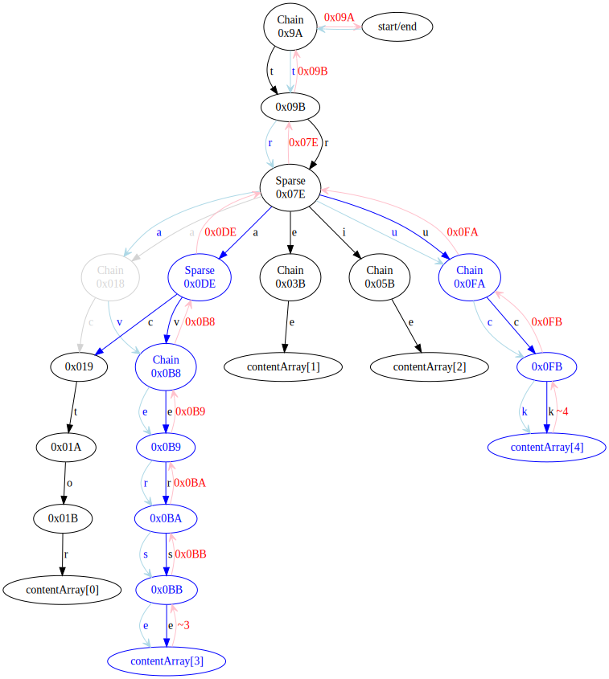

In this diagram `existingNode`s are the ones reached through the light blue arrows during the descent phase (e.g.
`0x018` for the `ApplyState` at `tra`, or `NONE` for `tru`), and `updatedNode`s are the ones ascent (pink arrows)
returns with (e.g . `0x0DE` and `0x0FA` for the respective states).

During this process, readers can see any modifications made in place (each in-place modification is an attachment point
which makes part of the new nodes reachable). The update mechanism above makes sure both that the state before the
update is preserved, and that the state after the update is fully visible for readers that can reach it, but it does not
guarantee that the mutation is seen atomically by the readers if it contains multiple separate branches.
It is possible for a reader to see only a part of the update, for example:
- a reading thread racing with the mutator can iterate over `traverse` but finish iterating before the mutator
manages to attach `truck`;
- a reading thread that iterated to `tree` (while `traverse` was not yet attached) and paused, will see `truck` if the
mutating thread applies the update during the pause.

### Handling prefix nodes

The descriptions above were given without prefix nodes. Handling prefixes is just a little complication over the update
process where we must augment `updatedNode` with any applicable content before applying the change to the parent.
To do this we expand the state tracked to:
- `existingPreContentNode` which points to the existing node including any prefix,
- `existingPostContentNode` which is obtained by skipping over the prefix (for simplicity we also treat leaf
  nodes like a prefix with no child) and is the base for all child updates (i.e. it takes the role of
  `existingNode` in the descriptions above),
- `updatedPostContentNode` which is the node as changed/copied after children modifications are applied,
- `contentIndex` which is the index in the content array for the result of merging existing and newly introduced 
  content, (Note: The mutation content is only readable when the cursor enters the node, and we can only attach it when
  we ascend from it.)
- `transition` remains as before.

and we then attach `contentIndex` to compile an `updatedPreContentNode` which the parent is made to link to. This will
be equal to `updatedPostContentNode` if no content applies, i.e. `contentIndex == -1`.

("Pre-" and "post-" refer to descent/iteration order, not to construction order; e.g. `updatedPreContentNode` is
constructed after `updatedPostContentNode` but links above it in the trie.)

As an example, consider the process of adding `trees` to our sample trie:

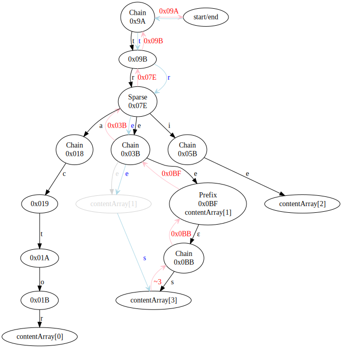

When descending at `tree` we set `existingPreContentNode = ~1`, `existingPostContentNode = NONE` and `contentIndex = 1`.
Ascending back to add the child `~3`, we add a child to `NONE` and get `updatedPostContentNode = 0x0BB`. To then apply
the existing content, we create the embedded prefix node `updatedPreContentNode = 0x0BF` with `contentIndex = 1` and
pass that on to the recursion.
