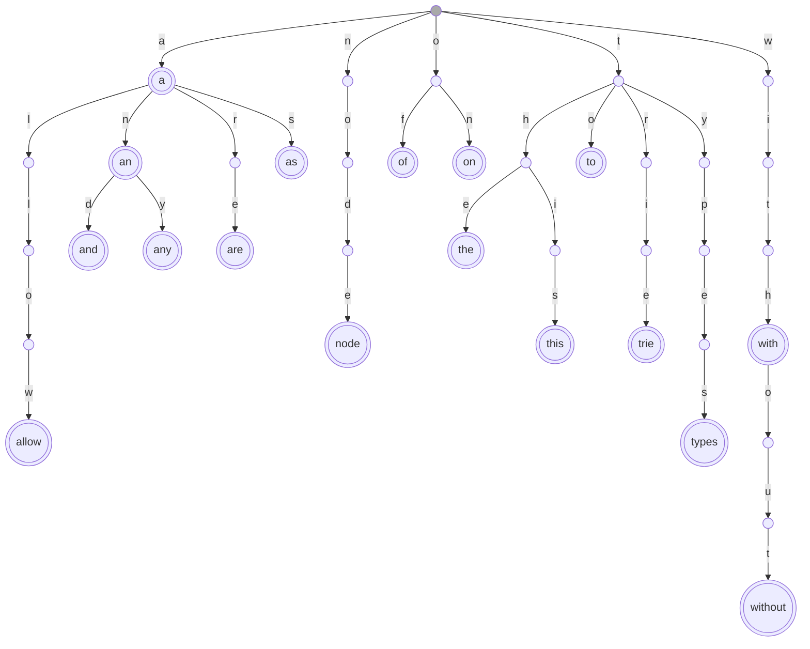
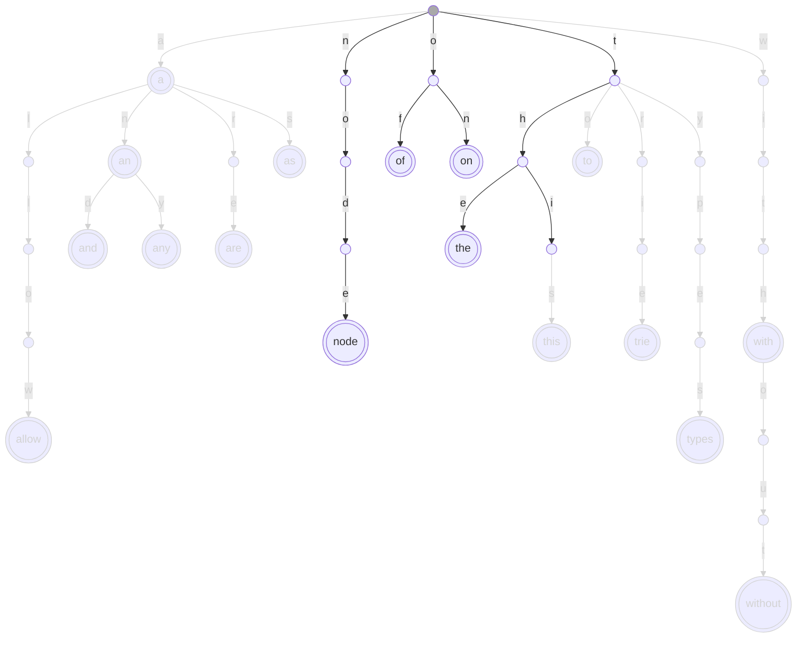
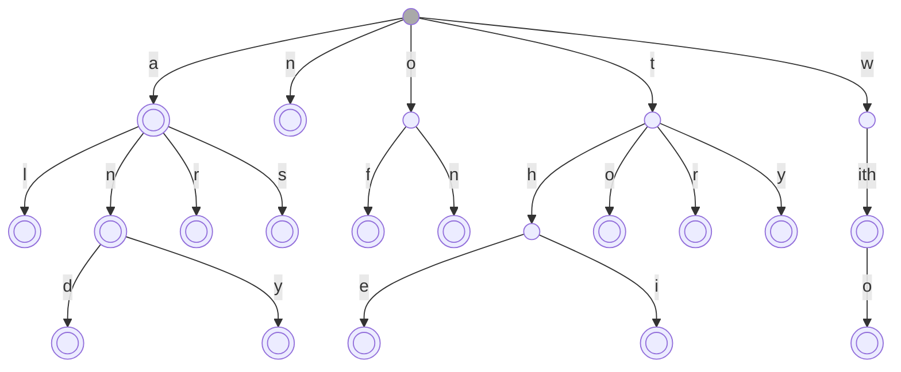
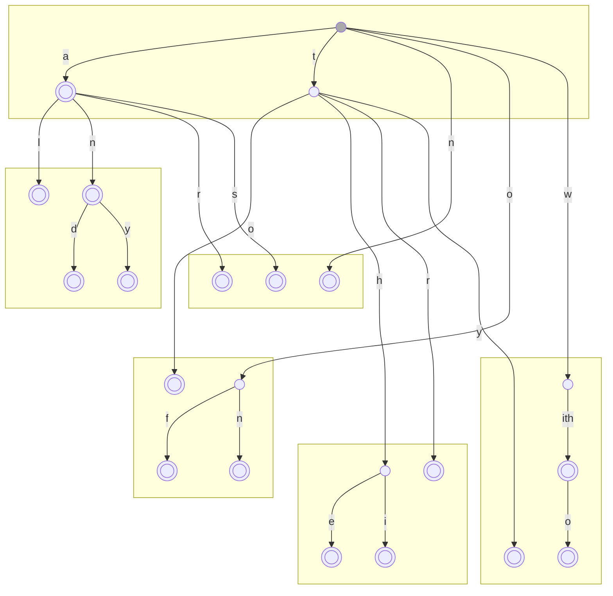

<!---
 Licensed to the Apache Software Foundation (ASF) under one
 or more contributor license agreements.  See the NOTICE file
 distributed with this work for additional information
 regarding copyright ownership.  The ASF licenses this file
 to you under the Apache License, Version 2.0 (the
 "License"); you may not use this file except in compliance
 with the License.  You may obtain a copy of the License at
 
     http://www.apache.org/licenses/LICENSE-2.0
 
 Unless required by applicable law or agreed to in writing, software
 distributed under the License is distributed on an "AS IS" BASIS,
 WITHOUT WARRANTIES OR CONDITIONS OF ANY KIND, either express or implied.
 See the License for the specific language governing permissions and
 limitations under the License.
-->

# Big Trie-Indexed (BTI) SSTable format

This document describes the BTI SSTable format, which is introduced to
Cassandra with [CEP-25](https://cwiki.apache.org/confluence/display/CASSANDRA/CEP-25%3A+Trie-indexed+SSTable+format).

The format is called BTI, which stands for "Big Trie-Indexed", because it shares
the data format of the existing BIG format and only changes the primary indexes
inside SSTables. The format relies on byte order and tries, and uses a combination
of features to make the indexing structures compact and efficient. The paragraphs
below describe the format's features and mechanisms together with the motivation 
behind them, and conclude with detailed description of the on-disk format.

# Prerequisites

## Byte-comparable types

The property of being byte-comparable (also called byte-ordered) for a
key denotes that there is a serialisation of that key to a sequence of
bytes where the lexicographic comparison of the unsigned bytes produces
the same result as performing a typed comparison of the key.

For Cassandra, such a representation is given by
[CASSANDRA-6936](https://issues.apache.org/jira/browse/CASSANDRA-6936).
Detailed description of the mechanics of the translation are provided in
the [included documentation](../../../../utils/bytecomparable/ByteComparable.md).

## Tries

A trie is a data structure that describes a mapping between sequences
and associated values. It is very similar to a deterministic finite
state automaton, with the main difference that an automaton is allowed
to have cycles, while a trie is not.

Because the theory and main usage of the structure is for encoding words
of a language, the trie terminology talks about "characters", "words"
and "alphabet", which in our case map to bytes of the byte-ordered
representation, the sequence that encodes it, and the possible values of
a byte[^1].

[^1]: For simplicity this description assumes we directly map a byte to
a character. Other options are also possible (e.g. using hex digits
as the alphabet and two transitions per byte).

A trie can be defined as a tree graph in which vertices are states, some
of which can be final and contain associated information, and where
edges are labelled with characters. A valid word in the trie is encoded
by a path starting from the root of the trie where each edge is labelled
with the next character of the word, and ending in a final state which
contains the 'payload' associated with the word.



This means that in a constructed trie finding the payload associated
with a word is a matter of following the edges (also called
"transitions") from the initial state labelled with the consecutive
characters of the word, and retrieving the payload associated with the
state at which we end up. If that's not a final state, or if at any
point in this we did not find a transition in the trie matching the
character, the trie does not have an association for the word. The
complexity of lookup is thus _O_(len(word)) transitions, where the cost of
taking a transition is usually constant, thus this complexity is
theoretically optimal.

From a storage space perspective, one of the main benefits of a trie as
a data structure for storing a map is the fact that it completely avoids
storing redundant prefixes. All words that start with the same sequence
store a representation of that sequence only once. If prefixes are
commonly shared, this can save a great deal of space.

When the items stored in a trie are lexicographically (=byte) ordered, a
trie is also an ordered structure. A trie can be walked in order and it
is also possible to efficiently list the items between two given keys.

In fact, one can efficiently (and lazily) apply set algebra over tries,
and slicing can be seen as a simple application of intersection, where
the intersecting trie is generated on the fly. The set operations
benefit from the same prefix-sharing effect &mdash; we apply union /
intersection / difference to a state, which has the effect of applying
the operation to all words that share the prefix denoted by that state.



(An example of slicing the trie above with the range "bit"-"thing".
Processing only applies on boundary nodes (root, "t", "th", "thi"),
where we throw away the transitions outside the range. Subtries like the
ones for "n" and "o" fall completely between "b" and "t" thus are fully
inside the range and can be processed without any further restrictions.)

A trie can be used as a modifiable in-memory data structure where one
can add and remove individual elements. It can also be constructed from
sorted input, incrementally storing the data directly to disk and
building an efficient read-only on-disk data structure.

For more formal information about the concept and applications of tries
and finite state automata, try [Introduction to Automata Theory,
Languages, and Computation](https://books.google.com/books?id=dVipBwAAQBAJ).
There are many variations of the concept, and of the implementation of
states and transitions that can be put to use to achieve even further
efficiency gains; some of these will be detailed below.

# Indexing with tries

Since a trie is generally an ordered byte source to payload map, we can
apply the concept directly to the components of Cassandra that are most
affected by the inefficiency of using comparison-based structures: the
indices.

This can be done in the following way:

-   When we write the index, we map each key into its byte-ordered
    representation and create an on-disk trie of byte-ordered
    representations of keys mapping into positions in the data file.

-   When we need an exact match for a key, we create a (lazily
    generated) byte-ordered representation of the key and look for it
    in the trie.

    -   If we find a match, we know the data file position.

    -   If there is no match, there is no data associated with the key.

-   When we need a greater-than/greater-or-equal match, we use the
    byte-ordered representation to create a path that leads to the
    first matching data position in the sstable.

    -   We can then use this path to iterate the greater keys in the
        sstable.

This works, but isn't very efficient. Lookup in it is _O_(len(key)), 
which can even mean that many seeks on disk, and we have to store
a transition (which defines the size of the structure) for every
non-prefix character in the dataset.

We can do much better.

## Trimming the fat

The primary purpose of the index is to find a position in the data file
for the given key. It needs to be able to find the correct position for
any existing key, but there is no need for it to be exact on keys that
are not present in the file &mdash; since our data files contain a copy of
the key at the start of each partition, we can simply check if the key
we are searching for matches the key at the position returned by the
index.

This allows us to use a simple optimization: instead of storing the full
key in the index trie, we can store only a prefix of the key that is
unique among all partitions in the table. This means that we have
intermediate nodes in the trie only if a prefix is shared by multiple
keys, which normally reduces the number of nodes and transitions in the
trie to about 2*n*.



This also reduces the number of steps we need to take in the trie. In a
well-balanced key set (such as the one where the byte-ordered key starts
with a hash as in Murmur or Random-partitioned primary keys) the lookup
complexity becomes _O_(log _n_) transitions[^2].

[^2]: For comparison, the complexity of binary search in a sorted
primary index is also _O_(log _n_), but in key comparisons whose
complexity on average in a well-balanced key set is another _O_(log _n_)
for a total _O_(log<sup>2</sup> _n_).

## Taking hardware into account

The point above improves the number of transitions significantly, but
the out-of-cache efficiency is still pretty bad if we have to read a new
disk page every time we examine a node. Fortunately we can take some
extra care during construction to make sure we make the most of every
disk page brought up during lookup.

The idea of this is to pack wide sections of the trie in pages, so that
every time we open a page we can be certain to be able to follow several
transitions before leaving that page.



One way to generate something like this is to start from the root and do
a breadth-first walk, placing the encountered nodes on disk until a page
is filled and their target transitions in a queue for which the process
is repeated to fill other pages.

Another approach, more suitable to our application because it can be
done as part of the incremental construction process, is to do the
packing from the bottom up &mdash; when the incremental construction
algorithm completes a node we do not immediately write it, but wait
until we have formed a branch that is bigger than a page. When this
happens we lay out the node's children (each smaller than a page but
root of a biggest branch that would fit) and let the parent node be
treated like a leaf from there on. In turn it will become part of a
branch that is bigger than a page and will be laid packaged together
with its related nodes, resulting in a picture similar to the above.

In fact the bottom-up process has a little performance benefit over the
top-down: with the top-down construction the root page is full and leaf
pages take combinations of unrelated smaller branches; with the
bottom-up the leaf pages take as much information as possible about a
branch, while the root often remains unfilled. For the best possible
out-of-cache efficiency we would prefer the set of non-leaf pages to be
as small as possible. Having larger leaf page branches means more of the
trie data is in the leaf branches and thus the size of that intermediate
node set is smaller.

See [`IncrementalTrieWriterPageAware`](../../../tries/IncrementalDeepTrieWriterPageAware.java) 
for details on how the page-aware
trie construction is implemented.

## Storing the trie

Another interesting question about the format of the trie is how one
stores the information about the transitions in a node. If we want to
maintain that the size of the structure is proportional to the number of
overall transitions, we need to be able to store node transitions
sparsely. Typically this is done using a list of transition characters
and binary searching among them to make a transition.

This binary search can theoretically be taken to use constant time
(since the alphabet size is small and predefined), but isn't the most
efficient operation in practice due to the unpredictable branch
instructions necessary for its implementation. It is preferable to avoid
it as much as possible.

To do this, and to shave a few additional bytes in common cases, our
implementation of on-disk tries uses typed nodes. A node can be:

-   Final with no transitions (`PAYLOAD_ONLY`).

-   Having one transition (`SINGLE`), which has to store only the
    character and target for that transition.

-   Having a binary-searched list of transitions (`SPARSE`), where the
    number of characters, each character and the targets are stored.

-   Having a consecutive range of transitions (`DENSE`), where the first
    and last character and targets are stored, possibly including some
    null transitions.

We use one byte per node to store four bits of node type as well as four
bits of payload information.

In a well-balanced and populated trie the nodes where lookup spends most
time (the nodes closest to the root) are `DENSE` nodes, where finding the
target for the transition is a direct calculation from the code of the
character. On the other hand, most of the nodes (the ones closest to the
leaves) are `PAYLOAD_ONLY`, `SINGLE` or `SPARSE` to avoid taking any more
space than necessary.

The main objective for the trie storage format is to achieve the
smallest possible packing (and thus smallest cache usage and fewest disk
reads), thus we choose the type that results in the smallest
representation of the node. `DENSE` type gets chosen naturally when its
encoding (which avoids storing the character list but may include null
targets) is smaller than `SPARSE`.

## Pointer Sizes

The next optimization we make in the storage format is based on the fact
that most nodes in the trie are in the lower levels of the tree and thus
close to leaves. As such, the distance between the node and its target
transitions when laid out during the construction process is small and
thus it is a huge win to store pointers as distances with variable size.

This is even more true for the page-aware layout we use &mdash; all internal
transitions within the page (i.e. >99% of all transitions in the trie!)
can be stored using just an offset within the page, using just 12 bits.

This is heavily used via further specialization of the node types: e.g.
we have `DENSE_12`, `DENSE_16` to `DENSE_40` as well as `DENSE_LONG`
subtypes which differ in the size of pointer they use.

# Primary indexing in the BTI format

The purpose of the primary index of an sstable is to be able to map a
key containing partition and clustering components to a position in the
sstable data file which holds the relevant row or the closest row with a
greater key and enables iteration of rows from that point on.

Partition keys are normally fully specified, while clustering keys are
often given partially or via a comparison relation. They are also
treated differently by all the infrastructure and have historically had
different index structures; we chose to retain this distinction for the
time being and implement similar replacement structures using tries.

## Partition index implementation details

The primary purpose of the partition index is to map a specified
partition key to a row index for the partition. It also needs to support
iteration from a (possibly partially specified) partition position. The
description below details mapping only; iteration is a trivial
application of the trie machinery to the described structure.

In addition to wide partitions where a row index is mandatory, Cassandra
is often used for tables where the partitions have only a
couple of rows, including also ones where the partition key is the only
component of the primary key, i.e. where row and partition are the same
thing. For these situations it makes no sense to actually have a row
index and the partition index should point directly to the data.

The application of tries to Cassandra's partition index uses the trie
infrastructure described above to create a trie mapping unique
byte-ordered partition key prefixes to either:

-   A position in the row index file which contains the index of the
    rows within that partition, or

-   A position in the data file containing the relevant partition (if a
    row index for it is not necessary).

A single table can have both indexed and non-indexed rows. For
efficiency the partition index stores the position as a single long,
using its sign bit to differentiate between the two options[^3]. This
value is stored with variable length &mdash; more precisely, we use the four
bits provided in the node type byte to store the length of the pointer.

[^3]: It needs to differentiate between 0 with index and 0 without
index, however, so we use ~pos instead of -pos to encode
direct-to-data mappings. This still allows sign expansion
instructions to be used to convert e.g. `int` to `long`.

Lookup in this index is accomplished by converting the decorated
partition key to its byte-ordered representation and following the
transitions for its bytes while the trie has any. If at any point the
trie does not offer a transition for the next byte but is not a leaf
node, the sstable does not contain a mapping for the given key.

If a leaf of the trie is reached, then the prefix of the partition key
matches some content in the file, but we are not yet sure if it is a
full match for the partition key. The leaf node points to a place in the
row index or data file. In either case the first bytes at the specified
position contain a serialization of the partition key, which we can
compare to the key being mapped. If it matches, we have found the
partition. If not, since the stored prefixes are unique, no data for
this partition exists in this sstable.

### Efficiency

If everything is in cache this lookup is extremely efficient: it follows
a few transitions in `DENSE` nodes plus one or two binary searches in
`SPARSE` or `SINGLE`, and finishes with a direct comparison of a byte buffer
with contents of a file. No object allocation or deserialization is
necessary.

If not all data is in cache, the performance of this lookup most heavily
depends on the number of pages that must be fetched from persistent
storage. The expectation on which this implementation is based, is that
if an sstable is in use all non-leaf pages of the index will tend to
remain cached. If that expectation is met, lookup will only require
fetching one leaf index page and one data/row index page for the full
key comparison. On a match the latter fetch will be required anyway,
since we would want to read the data at that position.

An important consideration in the design of this feature was to make
sure there is no situation in which the trie indices perform worse than
the earlier code, thus we should aim to do at most as many reads. The
number of random accesses for the earlier index implementation where an
index summary is forced in memory is one _seek_ required to start
reading from the partition index (though usually multiple consecutive
pages need to be read), and one seek needed to start reading the actual
data. Since the index summary ends up being of similar size to the
non-leaf pages of the trie index, the memory usage and number of seeks
for the trie index on match ends up being the same but we read less data
and do much less processing.

On mismatch, though, we may be making one additional seek. However, we
can drastically reduce the chance of mismatch, which we currently do in
two ways:

-   By using a bloom filter before lookup. The chance of getting a bloom
    filter hit as well as a prefix match for the wrong key is pretty
    low and gets lower with increasing sstable size.

-   By storing some of the key hash bits that are not part of the token
    at the payload node and comparing them with the mapped key's hash
    bits.

Currently we use a combination of both by default as the best performing
option. The user can disable or choose to have a smaller bloom filter,
and the code also supports indices that do not contain hash bits (though
to reduce configuration complexity we do not have plans to expose that
option).

For fully cold sstables we have to perform more random fetches from disk
than the earlier implementation, but we read less. Testing showed that
having a bloom filter is enough to make the trie index faster; if a
bloom filter is not present, we try going through the byte contents of
the index file on boot to prefetch it which ends up taking not too long
(since it is read sequentially rather than randomly) and boosting cold
performance dramatically.

### Building and early open

The partition index is built using the page-aware incremental
construction described earlier, where we also delay writing each key
until we have seen the next so that we can find the shortest prefix that
is enough to differentiate it from the previous and next keys (this also
differentiates it from all others in the sstable because the contents
are sorted). Only that prefix is written to the trie.

One last complication is the support for early opening of sstables which
allows newly-compacted tables to gradually occupy the page cache. Though
the index building is incremental, the partially-written trie is not
usable directly because the root of the trie as well as the path from it
to the last written nodes is not yet present in the file.

This problem can be easily overcome, though, by dumping these
intermediate nodes to an in-memory buffer (without the need for
page-aware packing) and forming an index by attaching this buffer at the
end of the partially written file using 
[`TailOverridingRebufferer`](../../../util/TailOverridingRebufferer.java).

## Row index implementation details

Unlike the partition index, the main use of the row index is to iterate
from a given clustering key in forward or reverse direction (where exact
key lookup is just a special case).

Rows are often very small (they could contain a single int or no columns
at all) and thus there is a real possibility for the row indices to
become bigger than the data they represent. This is not a desirable
outcome, which is part of the reason why Cassandra's row index has
historically operated on blocks of rows rather than indexing every row
in the partition. This is a concern we also have with the trie-based
index, thus we also index blocks of rows (by default, a block of rows
that is at least 16kb in size &mdash; this will be called the index
_granularity_ below, specified by the `column_index_size`
`cassandra.yaml` parameter).

Our row index implementation thus creates a map from clustering keys or
prefixes to the data position at the start of the index block which is
the earliest that could contain a key equal or greater than the given
one. Additionally, if there is an active deletion at the beginning of
the block, the index must specify it so that it can be taken into
account when merging data from multiple sstables.

Each index block will contain at least one key, but generally it will
have different first and last keys. We don't store these keys, but
instead we index the positions between blocks by storing a "separator",
some key that is greater than the last key of the previous block and
smaller than or equal to the first key of the next[^4]. Then, when we
look up a given clustering, we follow its bytes as long as we can in the
trie and we can be certain that all blocks before the closest
less-than-or-equal entry in the trie cannot contain any data that is
greater than or equal to the given key.

[^4]: Another way to interpret this is that we index the start of each
block only, but for efficiency we don't use the first key of the
block as its beginning, but instead something closer to the last key
of the previous block (but still greater than it).

It may happen that the identified block actually doesn't contain any
matching data (e.g. because the looked-up key ends up between the last
key in the block and the separator), but this only affects efficiency as
the iteration mechanism does not expect the data position returned by
the index to be guaranteed to start with elements that fit the criteria;
it would only have to walk a whole block forward to find the matching
key.

It is important to keep the number of these false positives low, and at
the same time we aim for the smallest possible size of the index for a
given granularity. The choice of separator affects this balance[^5]; the
option we use, as a good tradeoff in the vein of the unique prefix
approach used in the partition index, is to use the shortest prefix of
the next block's beginning key that separates it from the previous
block's end key, adjusted so that the last byte of it is 1 greater than
that end key.

[^5]: For example, the best separator for false positives is the next
possible byte sequence after the previous block's final key, which
is obtained by adding a 00 byte to its end. This, however, means all
the bytes of the byte-ordered representation of this key must be
present in the index, which inflates the index's size and lookup
complexity.

For example, if block 2 covers "something" to "somewhere" and block 3
&mdash; "sorry" to "tease", then the sequence "son" is used as the separator
between blocks 2 and 3. This leaves things like "sommelier" in the area
that triggers false positives, but stores and has to walk just three
bytes to find the starting point for iteration.

### Efficiency

Finding the candidate block in the trie involves walking the byte
ordered representation of the clustering key in the trie and finding the
closest less-than-or-equal value. The number of steps is proportional to
the length of the separators &mdash; the lower their number the shorter that
sequence is, though we can't expect _O_(log _n_) complexity since there may
be many items sharing the same long prefixes (e.g. if there are long
strings in the components of the clustering keys before the last). Even
so, such repeating prefixes are addressed very well by the page-packing
and `SINGLE_NOPAYLOAD_4` node type, resulting in very efficient walks.

After this step we also perform a linear walk within the data file to
find the actual start of the matching data. This is usually costlier and
may involve object allocation and deserialization.

The tradeoff between the size of the index and the time it takes to find
the relevant rows is controlled by the index granularity. The lower it
is, the more efficient lookup (especially exact match lookup) becomes at
the expense of bigger index size. The 16kb default is chosen pretty
conservatively[^6]; if users don't mind bigger indices something like 4,
2 or 1kb granularity should be quite a bit more efficient. It is also
possible to index every row by choosing a granularity of 0kb; at these
settings in-cache trie-indexed sstables tend to outperform
`ConcurrentSkipListMap` memtables for reads.

[^6]: This was chosen with the aim to match the size of the trie index
compared to the earlier version of the row index at its default
granularity of 64kb.

### Reverse lookup

To perform a reverse lookup, we can use the same mechanism as above
(with greater-than-or-equal) to find the initial block for the
iteration. However, in the forward direction we could simply walk the
data file to find the next rows, but this isn't possible going
backwards.

To solve this problem the index helps the iteration machinery by
providing an iterator of index blocks in reverse order. For each index
block the iteration walks it forward and creates a stack of all its row
positions, then starts issuing rows by popping and examining rows from
that stack. When the stack is exhausted it requests the previous block
from the index and applies the same procedure there.

# Code structure

The implementation is mostly in two packages, `o.a.c.io.tries` contains
the generic code to construct and read on-disk tries, and 
`o.a.c.io.sstable.format.bti`, which implements the specifics of the
format and the two indexes.

## Building tries

Tries are built from sorted keys using an [`IncrementalTrieWriter`](../../../tries/IncrementalTrieWriter.java). 
The code contains three implementations with increasing complexity:
- [`IncrementalTrieWriterSimple`](../../../tries/IncrementalTrieWriterSimple.java)
  implements simple incremental construction of tries from sorted input,
- [`IncrementalTrieWriterPageAware`](../../../tries/IncrementalTrieWriterPageAware.java)
  adds packing of nodes to disk pages,
- [`IncrementalDeepTrieWriterPageAware`](../../../tries/IncrementalDeepTrieWriterPageAware.java)
  adds the ability to transition to on-heap recursion for all stages of the construction
  process to be able to handle very large keys.

Only the latter is used, but we provide (and test) the other two as a form of
documentation.

The builders take a `TrieSerializer` as parameter, which determines how the nodes
are written. The indexes implement this using `TrieNode`, writing any payload they
need immediately after the node serialization.

## Reading tries

The BTI format tries are used directly in their on-disk format. To achieve this,
all node types are implemented as static objects in `TrieNode`. Reading nodes in
a file is encapsulated in [`Walker`](../../../tries/Walker.java), 
which provides a method to `go` to a specific node and use it, i.e. 
get any associated data, search in the children list and
follow transitions to children. It also provides functionality to find the
mapping for a given key, floors and ceilings as well as some combinations.
Iterating the payloads between two key bounds is implemented by 
[`ValueIterator`](../../../tries/ValueIterator.java),
and [`ReverseValueIterator`](../../../tries/ReverseValueIterator.java).

Special care is given to prefixes to make sure the semantics of searches matches
what the format needs.

## SSTable format implementation

The two indexes are implemented, respectively, by [`PartitionIndex`](PartitionIndex.java)
/[`PartitionIndexBuilder`](PartitionIndexBuilder.java)
and [`RowIndexReader`](RowIndexReader.java)/[`RowIndexWriter`](RowIndexWriter.java). 
The format implementation extends the filtered
base class and follows the structure of the BIG implementation, where
all references to the primary index are replaced with calls to these two 
classes.

# Index file format in BTI

## Trie nodes
Implemented in [`TrieNode.java`](../../../tries/TrieNode.java)

Nodes start with four bits of node type, followed by 4 payload bits
(_pb_), which are 0 if the node has no associated payload; otherwise the
node type gives an option to compute the starting position for the
payload (_ppos_) from the starting position of the node (_npos_).
The layout of the node depends on its type.

`PAYLOAD_ONLY` nodes:

-   4 type bits, 0

-   4 payload bits

-   payload if _pb_ &ne; 0, _ppos_ is _npos_ + 1

`SINGLE_NOPAYLOAD_4` and `SINGLE_NOPAYLOAD_12` nodes:

-   4 type bits

-   4 pointer bits

-   8 pointer bits (for `SINGLE_NOPAYLOAD_12`)

-   8 bits transition byte

-   _pb_ is assumed 0

`SINGLE_8/16`:

-   4 type bits

-   4 payload bits

-   8 bits transition byte

-   8/16 pointer bits

-   payload if _pb_ &ne; 0, _ppos_ is _npos_ + 3/4

`SPARSE_8/12/16/24/40`:

-   4 type bits

-   4 payload bits

-   8 bit child count

-   8 bits per child, the transition bytes

-   8/12/16/24/40 bits per child, the pointers

-   payload if _pb_ &ne; 0, _ppos_ is _npos_ + 2 + (2/2.5/3/4/6)*(_child
    count_) (rounded up)

`DENSE_12/16/24/32/40/LONG`:

-   4 type bits

-   4 payload bits

-   8 bit start byte value

-   8 bit _length_-1

-   _length_ * 12/16/24/32/40/64 bits per child, the pointers

-   payload if _pb_ &ne; 0, _ppos_ is _npos_ + 3 + (1.5/2/3/4/5/8)*(_length_)
    (rounded up)

This is the space taken by each node type (_CS_ stands for child span,
i.e. largest - smallest + 1, _CC_ is child count):

|Type                 | Size in bytes excl. payload |Size for 1 child|Size for 9 dense children (01-08, 10)|Size for 10 sparse children (01 + i*10)|Why the type is needed          |
|:--------------------|:----------------------------|---------------:|-------------------:|-------------------:|:-------------------------------|
|`PAYLOAD_ONLY`       | 1                           | -              | -                  | -                  |  Leaves dominate the trie      |
|`SINGLE_NOPAYLOAD_4` | 2                           |2               | -                  | -                  |  Single-transition chains      |
|`SINGLE_8`           | 3                           |3               | -                  | -                  |  Payload within chain          |
|`SPARSE_8`           | 2 + _CC_ * 2                |4               | 20                 | 22                 |  Most common type after leaves |
|`SINGLE_NOPAYLOAD_12`| 3                           |3               | -                  | -                  |  12 bits cover all in-page transitions    | 
|`SPARSE_12`          | 2 + _CC_ * 2.5              |5               | 25                 | 27                 |  Size of sparse is proportional to number of children |
|`DENSE_12`           | 3 + _CS_ * 1.5              |5               | 18                 | 140                |  Lookup in dense is faster, size smaller if few holes    | 
|`SINGLE_16`          | 4                           |4               | -                  | -                  |                                |    
|`SPARSE_16`          | 2 + _CC_ * 3                |5               | 29                 | 32                 |                                |     
|`DENSE_16`           | 3 + _CS_ * 2                |5               | 23                 | 185                |                                |     
|`SPARSE_24`          | 2 + _CC_ * 4                |6               | 38                 | 42                 |                                |     
|`DENSE_24`           | 3 + _CS_ * 3                |6               | 33                 | 276                |                                |     
|`DENSE_32`           | 3 + _CS_ * 4                |7               | 43                 | 367                |  Nodes with big subtrees are usually dense   | 
|`SPARSE_40`          | 2 + _CC_ * 6                |8               | 56                 | 62                 |                                |     
|`DENSE_40`           | 3 + _CS_ * 5                |8               | 53                 | 458                |                                |     
|`DENSE_LONG`         | 3 + _CS_ * 8                |11              | 83                 | 731                |  Catch-all                     |

All pointers are stored as distances, and since all tries are written
from the bottom up (and hence a child is always before the parent in the
file), the distance is subtracted from the position of the current node
to obtain the position of the child node.

Note: All nodes are placed in such a way that they do not cross a page
boundary. I.e. if a reader (e.g. [`Walker`](../../../tries/Walker.java)) 
is positioned at a node, it is
guaranteed that all reads of the node's data can complete without
requiring a different page to be fetched from disk.

## Partition index
Implemented in [`PartitionIndex.java`](PartitionIndex.java)

Layout:
```
[nodes page, 4096 bytes]
...
[nodes page, 4096 bytes]
[nodes page including root node, ≤4096 bytes]
[smallest key, with short length]
[largest key, with short length]
[smallest key pos, long]
[key count, long]
[root pos, long]
```

The SSTable's partition index is stored in the -Partitions.db file. The
file itself is written from the bottom up, and its "header" is at the
end of the file.

More precisely, the last 3 longs in the file contain:

-   A file position where the smallest and greatest key are written.

-   The exact number of keys in the file.

-   A file position for the root node of the index.

These three longs are preceded by the serialization of the first and
last key, and before that are the trie contents.

To find a match for the key, start at the root position, decode the node
(see the "Trie nodes" section above) and follow the transitions
according to the bytes of the byte-ordered representation of the key
while the node has children and there are bytes left in the key.

If a leaf node is reached, that node contains the following payload:

-   If _pb_ < 8, let

    -   _idxpos_ be the sign-extended integer value of length _pb_ at
        _ppos_

-   If _pb_ &ge; 8 (always the case in Cassandra 5 files), let

    -   _hash_ be the byte at _ppos_

    -   _idxpos_ be the sign-extended integer value of length _pb-7_ at
        _ppos+1_

If at any step there is no transition corresponding to the byte of the
key, or if _hash_ is present and the lowest-order byte of the key's hash
value does not match it, the index and sstable have no mapping for the
given key.

Otherwise _idxpos_ specifies:

-   if _idxpos_ &ge; 0, the row index file contains an index for the
    given key (see row index section below) at position _idxpos_

-   otherwise, the data associated with the key starts at position
    ~_idxpos_ in the data file

In either case the content in the respective file starts with the
serialization of the partition key, which must be compared with the key
requested to ensure they match.

## Row index
Implemented in [`RowIndexReader.java`](RowIndexReader.java)

Layout:
```
[row index, padded to page boundary]
...
[row index, padded to page boundary]
```
Where each row index contains:
```
[nodes page, 4096 bytes]
...
[nodes page, 4096 bytes]
[nodes page including root node, ≤4096 bytes]
[partition key, with short length]
[position of the partition in the data file, unsigned vint]
[position of the root node, vint encoding the difference between the
start of the data file position and the position of the root node]
[number of rows in the partition, unsigned vint]
[partition deletion time, 12 bytes]
```

The entries in the partition index point to the position at the start of
the partition key.

The payload reachable at the end of a traversal contains:

-   Integer of _pb_&7 bytes specifying the offset within the partition
    where the relevant row is contained

-   If _pb_ &ge; 8, 12 bytes of deletion time active at the start of the
    row index block

